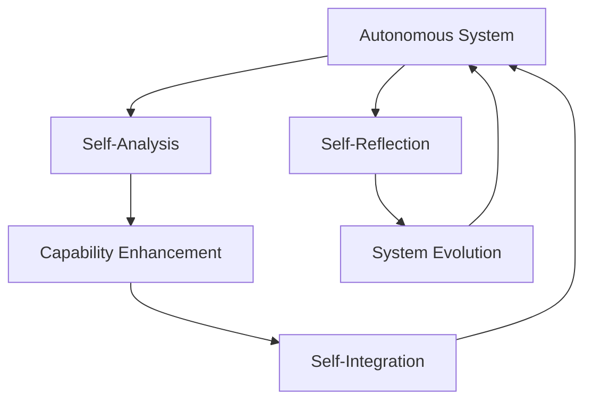
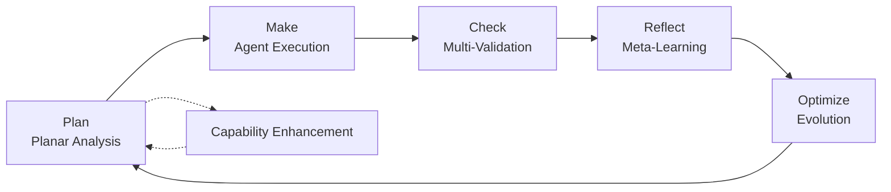

# System Overview with MCP Coordination

The Autonomous Development System represents a fundamental advancement in software development through behavior intent programming, emergent capabilities, and Model Context Protocol (MCP) coordination. This overview explains the architectural foundations that enable true autonomous development with efficient thought transfer between agents.

## Architectural Philosophy

### Strange Loops as the Foundation
The system achieves autonomy through **strange loops** - self-referential structures where the system can analyze, understand, and enhance its own capabilities. This creates emergence through design patterns rather than explicit programming.



### Behavior Intent Programming
Traditional programming specifies *how* to achieve something. Behavior intent programming specifies *what* should be achieved, allowing the system to determine the optimal implementation approach autonomously.

```csharp
// Traditional approach
public void ProcessData(List<Data> data)
{
    foreach(var item in data)
    {
        // Explicit implementation steps
        ValidateItem(item);
        TransformItem(item);
        SaveItem(item);
    }
}

// Behavior intent approach
[KernelFunction]
public async Task<ProcessResult> ProcessDataWithIntent(
    [Description("Data processing behavior intent")] string intent,
    [Description("Data to process")] List<Data> data)
{
    // System autonomously determines implementation
    var analysis = await AnalyzeIntentThroughPlanarDecomposition(intent);
    var capabilities = await GenerateRequiredCapabilities(analysis);
    return await ExecuteWithEmergentCapabilities(data, capabilities);
}
```

## Core Components

### 1. PMCRO Loop Engine
The Plan-Make-Check-Reflect-Optimize loop forms the heart of autonomous processing:



### 2. Agent Orchestration Layer with MCP Coordination
ChatCompletion agents coordinate through multi-intelligence patterns enhanced by MCP thought transfer:

```csharp
public class AgentOrchestrator
{
    private readonly IMcpServerOrchestrator mcpOrchestrator;
    private readonly IMcpClientFactory mcpClientFactory;
    
    public async Task<CoordinatedResult> OrchestrateMutliIntelligence(
        string behaviorIntent,
        List<ChatCompletionAgent> availableAgents)
    {
        // Planar decomposition of intent using MCP-enhanced analysis
        var analysis = await DecomposeIntentWithMcpCoordination(behaviorIntent);
        
        // Spawn specialized agents with dedicated MCP servers
        var specializedAgents = await SpawnSpecializedAgentsWithMcp(analysis);
        
        // Coordinate execution with MCP-based thought transfer
        var results = await ExecuteCoordinatedProcessingWithMcp(specializedAgents);
        
        // Self-referential enhancement through MCP server communication
        var enhancedResult = await EnhanceResultsThroughMcpStrangeLoops(results);
        
        return enhancedResult;
    }
}
```

### 3. Process Framework Integration with MCP Servers
Declarative YAML workflows orchestrate both .NET implementations and AI agents with MCP coordination:

```yaml
workflow:
  id: EmergentProcessing
  nodes:
    - id: PlanarAnalysisStep
      type: dotnet
      description: Decompose intent through planar analysis with MCP coordination
      agent:
        type: Steps.PlanarAnalysisStep, AutonomousSystem
        mcp_configuration:
          server_command: ["dotnet", "run", "--", "stdio"]
          working_directory: "./mcp-servers/planar-analysis"
        
    - id: CapabilityGenerationAgent
      type: declarative
      description: Generate executable capabilities using MCP server coordination
      agent:
        type: chat_completion_agent
        name: CapabilityGenerator
        instructions: |
          Analyze planar decomposition results using C# MCP server tools.
          Generate executable capabilities through MCP server coordination.
          Use [McpServerTool] annotated functions for capability generation.
          Reference MCP server capabilities for continuous improvement.
        mcp_configuration:
          server_command: ["dotnet", "run", "--", "stdio"]
          working_directory: "./mcp-servers/capability-generation"
```

### 4. Capability Evolution System
Runtime capability generation through emergent patterns:

```csharp
[KernelFunction]
public async Task<EvolutionResult> EvolveCapabilities(
    [Description("Current capability gaps")] List<CapabilityGap> gaps)
{
    var evolutionResults = new List<GeneratedCapability>();
    
    foreach (var gap in gaps)
    {
        // Generate new capability through emergent processing
        var newCapability = await GenerateCapabilityFromGap(gap);
        
        // Validate in sandbox environment
        if (await ValidateCapabilityInSandbox(newCapability))
        {
            // Integrate into system through strange loops
            await IntegrateCapabilityWithSelfReference(newCapability);
            evolutionResults.Add(newCapability);
        }
    }
    
    // Self-referential analysis of evolution process
    await AnalyzeEvolutionPatternsForImprovement(evolutionResults);
    
    return new EvolutionResult { GeneratedCapabilities = evolutionResults };
}
```

## Emergent Patterns

### Self-Referential Enhancement
The system continuously improves by analyzing its own patterns:

```csharp
public async Task<EnhancementResult> AnalyzeOwnPatterns()
{
    // Self-analysis through reflection
    var currentPatterns = await IntrospectProcessingPatterns();
    
    // Identify improvement opportunities
    var improvements = await IdentifyPatternImprovements(currentPatterns);
    
    // Generate enhanced patterns through strange loops
    var enhancedPatterns = await GenerateEnhancedPatterns(improvements);
    
    // Apply improvements to self
    await ApplyPatternEnhancements(enhancedPatterns);
    
    return new EnhancementResult { PatternsEnhanced = enhancedPatterns.Count };
}
```

### Planar Decomposition
Complex behavior intents are broken into manageable planar levels:

1. **Level 1**: Primary intent identification and goal clarification
2. **Level 2**: Component decomposition and dependency analysis  
3. **Level 3**: Executable step generation and resource requirements
4. **Enhancement Level**: Strange loop opportunities and self-referential improvements

### Thought Transfer via MCP Servers
Model Context Protocol enables efficient context sharing through C# server implementations:

```csharp
public class ThoughtTransferManager
{
    private readonly IMcpClient mcpClient;
    private readonly IMcpServerOrchestrator mcpOrchestrator;
    
    public async Task<TransferResult> TransferThoughtContext(
        string sourceAgent,
        string targetAgent,
        ThoughtContext context)
    {
        // Start dedicated MCP servers for source and target agents if needed
        await EnsureMcpServersRunning(sourceAgent, targetAgent);
        
        // Compress context using source agent's MCP server
        var compressedContext = await mcpClient.CallToolAsync(
            "compress_thought_context", 
            new { context = context.ToMcpFormat(), target = targetAgent });
        
        // Transfer to target agent's MCP server with minimal overhead
        var transferResult = await mcpClient.CallToolAsync(
            "receive_thought_context",
            new { compressed_context = compressedContext.Result, source = sourceAgent });
        
        return new TransferResult
        {
            Success = transferResult.IsSuccess,
            TransferredBytes = compressedContext.Result.Size,
            TransferMetadata = transferResult.Result
        };
    }
}
```

## Technology Stack Integration

### Semantic Kernel Foundation
- **ChatCompletion Agents** with streaming and function calling
- **KernelFunction** plugins for typed capability exposure
- **Process Framework** for declarative workflow orchestration
- **Plugin Architecture** supporting hot-reloading and runtime generation

### Prompty Template System
- Runtime prompt template loading and execution
- Dynamic model configuration switching
- Template parameter substitution for context adaptation

### MCP Server Integration
- Standardized context protocol for thought transfer through C# implementations
- VS Code integration with .vscode/mcp.json configuration for development environment interaction
- Tool exposure for external system coordination via [McpServerTool] attributes
- Server-to-server communication enabling distributed agent coordination

## Security and Safety

### Controlled Emergence
All emergent capabilities operate within defined security boundaries:

```csharp
public class EmergenceSafetyManager
{
    public async Task<SafetyResult> ValidateEmergentCapability(
        GeneratedCapability capability)
    {
        // Sandbox execution for safety validation
        var sandboxResult = await ExecuteInSandbox(capability);
        
        // Analyze for security boundary compliance
        var securityAnalysis = await AnalyzeSecurity(capability);
        
        // Verify no unauthorized system modifications
        var systemIntegrityCheck = await CheckSystemIntegrity();
        
        return new SafetyResult
        {
            IsSafe = sandboxResult.Success && securityAnalysis.Compliant && systemIntegrityCheck.Valid,
            Concerns = CollectSafetyConcerns(sandboxResult, securityAnalysis, systemIntegrityCheck)
        };
    }
}
```

### Audit Trails
Every emergent behavior and capability generation is logged for observability and analysis.

## Next Steps

- [Understand the PMCRO Loop](pmcro-loop.md)
- [Explore Planar Analysis](planar-analysis.md)
- [Learn about Strange Loops](strange-loops.md)
- [See Agent Orchestration](../agents/orchestration.md)
