# PMCRO Loop

The Plan-Make-Check-Reflect-Optimize (PMCRO) loop is the fundamental processing cycle that enables autonomous development. Each phase builds upon the previous one while incorporating emergent capabilities and self-referential enhancement.

## Loop Overview

```mermaid
graph TB
    Plan[🎯 Plan<br/>Planar Analysis] --> Make[⚡ Make<br/>Agent Execution]
    Make --> Check[✅ Check<br/>Multi-Validation]  
    Check --> Reflect[🔄 Reflect<br/>Meta-Learning]
    Reflect --> Optimize[🚀 Optimize<br/>Evolution]
    Optimize --> Plan
    
    Plan -.-> SelfRef1[Self-Reference]
    Make -.-> SelfRef2[Capability Spawning]
    Check -.-> SelfRef3[Pattern Detection]
    Reflect -.-> SelfRef4[Strange Loops]
    Optimize -.-> SelfRef5[System Enhancement]
    
    SelfRef1 -.-> Plan
    SelfRef2 -.-> Make
    SelfRef3 -.-> Check
    SelfRef4 -.-> Reflect
    SelfRef5 -.-> Optimize
```



## Phase 1: Plan - Planar Analysis

The planning phase decomposes behavior intent through recursive planar analysis, breaking complex requirements into manageable components.

### Implementation Pattern

```csharp
public sealed class PlanarPlannerStep : KernelProcessStep
{
    [KernelFunction]
    public async Task<PlanResult> GeneratePlan(
        [Description("Behavior intent to analyze")] string behaviorIntent,
        [Description("Planning context")] PlanningContext context)
    {
        // Level 1: Primary intent identification
        var primaryComponents = await DecomposePrimaryIntent(behaviorIntent);
        
        // Level 2: Component relationships and dependencies
        var componentRelations = await AnalyzeComponentRelationships(primaryComponents);
        
        // Level 3: Executable step generation
        var executableSteps = await GenerateExecutableSteps(componentRelations);
        
        // Enhancement: Self-referential improvement opportunities
        var enhancementOpportunities = await IdentifyEnhancementOpportunities(
            primaryComponents, componentRelations, executableSteps);
        
        // Strange loop: Reference own planning capabilities
        if (await DetectPlanningEnhancementNeeds(executableSteps))
        {
            var enhancedPlan = await EnhancePlanThroughSelfReference(executableSteps);
            executableSteps = enhancedPlan.Steps;
        }
        
        return new PlanResult
        {
            Intent = behaviorIntent,
            PrimaryComponents = primaryComponents,
            ComponentRelations = componentRelations,
            ExecutableSteps = executableSteps,
            EnhancementOpportunities = enhancementOpportunities,
            PlanningMetadata = await GeneratePlanningMetadata(context)
        };
    }
    
    private async Task<List<IntentComponent>> DecomposePrimaryIntent(string intent)
    {
        // Planar decomposition logic
        var decomposer = new PlanarIntentDecomposer();
        return await decomposer.DecomposeToLevel(intent, level: 1);
    }
}
```

### YAML Workflow Integration

```yaml
- id: PlanarPlanningStep
  type: dotnet
  description: Decompose behavior intent through planar analysis
  agent:
    type: Steps.PlanarPlannerStep, AutonomousSystem
  on_complete:
    - on_condition:
        type: planning_complete
        emits:
          - event_type: PlanarPlanning.Complete
          - event_type: EnhancementOpportunities.Detected
```

## Phase 2: Make - Agent Execution

The make phase executes plans using ChatCompletion agents with function calling, streaming responses, and capability spawning.

### Multi-Agent Execution

```csharp
public sealed class AgentMakerStep : KernelProcessStep
{
    private readonly IAgentOrchestrator orchestrator;
    
    [KernelFunction]
    public async Task<MakeResult> ExecutePlan(
        [Description("Execution plan")] PlanResult plan,
        [Description("Available agents")] List<ChatCompletionAgent> agents)
    {
        var executionResults = new List<ExecutionResult>();
        
        // Spawn specialized agents for complex components
        var specializedAgents = await SpawnSpecializedAgents(plan.ExecutableSteps);
        
        // Coordinate execution across multiple agents
        foreach (var step in plan.ExecutableSteps)
        {
            ChatCompletionAgent selectedAgent;
            
            if (step.RequiresSpecialization)
            {
                selectedAgent = await CreateSpecializedAgent(step);
                specializedAgents.Add(selectedAgent);
            }
            else
            {
                selectedAgent = SelectOptimalAgent(agents, step);
            }
            
            // Execute with streaming for real-time feedback
            var stepResult = await ExecuteStepWithStreaming(selectedAgent, step);
            executionResults.Add(stepResult);
            
            // Check for capability enhancement opportunities
            if (stepResult.IndicatesCapabilityGap)
            {
                var newCapability = await GenerateCapabilityForGap(stepResult.Gap);
                await IntegrateNewCapability(newCapability);
            }
        }
        
        // Self-referential execution analysis
        var executionPatterns = await AnalyzeExecutionPatterns(executionResults);
        await EnhanceExecutionCapabilities(executionPatterns);
        
        return new MakeResult
        {
            ExecutionResults = executionResults,
            SpawnedAgents = specializedAgents,
            GeneratedCapabilities = await ExtractGeneratedCapabilities(executionResults),
            ExecutionMetadata = await GenerateExecutionMetadata()
        };
    }
    
    private async Task<ExecutionResult> ExecuteStepWithStreaming(
        ChatCompletionAgent agent,
        ExecutableStep step)
    {
        var thread = new ChatHistoryAgentThread();
        var message = new ChatMessageContent(AuthorRole.User, step.Instructions);
        
        var streamingResults = new List<string>();
        
        await foreach (var response in agent.InvokeStreamingAsync(message, thread))
        {
            if (!string.IsNullOrEmpty(response.Content))
            {
                streamingResults.Add(response.Content);
                
                // Real-time capability gap detection
                if (await DetectCapabilityGapInStream(response.Content))
                {
                    await TriggerCapabilityGeneration(response.Content);
                }
            }
        }
        
        return new ExecutionResult
        {
            Step = step,
            StreamingOutputs = streamingResults,
            FinalResult = string.Join("", streamingResults),
            ExecutionTime = DateTime.UtcNow
        };
    }
}
```

## Phase 3: Check - Multi-Validation

The check phase validates outputs through multiple perspectives, including emergent pattern detection and quality assessment.

### Multi-Perspective Validation

```csharp
public sealed class MultiValidationChecker : KernelProcessStep
{
    [KernelFunction]
    public async Task<CheckResult> ValidateResults(
        [Description("Execution results to validate")] MakeResult makeResult,
        [Description("Original plan for comparison")] PlanResult originalPlan)
    {
        var validationResults = new List<ValidationResult>();
        
        // Perspective 1: Functional validation
        var functionalValidation = await ValidateFunctionalRequirements(
            makeResult.ExecutionResults, originalPlan.ExecutableSteps);
        validationResults.Add(functionalValidation);
        
        // Perspective 2: Quality assessment
        var qualityValidation = await ValidateQualityMetrics(makeResult.ExecutionResults);
        validationResults.Add(qualityValidation);
        
        // Perspective 3: Emergent pattern detection
        var emergentValidation = await ValidateEmergentPatterns(makeResult);
        validationResults.Add(emergentValidation);
        
        // Perspective 4: Security boundary compliance
        var securityValidation = await ValidateSecurityBoundaries(makeResult);
        validationResults.Add(securityValidation);
        
        // Multi-agent validation for complex results
        if (makeResult.ExecutionResults.Any(r => r.ComplexityScore > 0.8))
        {
            var multiAgentValidation = await PerformMultiAgentValidation(makeResult);
            validationResults.Add(multiAgentValidation);
        }
        
        // Strange loop: Validate our own validation process
        var metaValidation = await ValidateValidationProcess(validationResults);
        
        return new CheckResult
        {
            ValidationResults = validationResults,
            OverallValidation = await SynthesizeValidationResults(validationResults),
            MetaValidation = metaValidation,
            EmergentPatterns = await ExtractEmergentPatterns(validationResults),
            ImprovementSuggestions = await GenerateImprovementSuggestions(validationResults)
        };
    }
    
    private async Task<ValidationResult> ValidateEmergentPatterns(MakeResult makeResult)
    {
        var patterns = new List<EmergentPattern>();
        
        // Detect capability spawning patterns
        var capabilityPatterns = await DetectCapabilitySpawningPatterns(makeResult);
        patterns.AddRange(capabilityPatterns);
        
        // Detect self-referential enhancement patterns
        var enhancementPatterns = await DetectEnhancementPatterns(makeResult);
        patterns.AddRange(enhancementPatterns);
        
        // Detect strange loop formations
        var strangeLoopPatterns = await DetectStrangeLoopPatterns(makeResult);
        patterns.AddRange(strangeLoopPatterns);
        
        return new ValidationResult
        {
            Type = ValidationType.EmergentPatterns,
            IsValid = patterns.All(p => p.IsWithinBoundaries),
            DetectedPatterns = patterns,
            Confidence = await CalculatePatternConfidence(patterns)
        };
    }
}
```

## Phase 4: Reflect - Meta-Learning

The reflect phase analyzes outcomes to identify learning opportunities and generate enhanced intents for future processing.

### Self-Referential Reflection

```csharp
public sealed class MetaLearningReflector : KernelProcessStep
{
    [KernelFunction]
    public async Task<ReflectionResult> ReflectOnOutcomes(
        [Description("Validation results")] CheckResult checkResult,
        [Description("Complete execution context")] ExecutionContext context)
    {
        // Analyze what worked well
        var successPatterns = await IdentifySuccessPatterns(checkResult, context);
        
        // Analyze what could be improved
        var improvementOpportunities = await IdentifyImprovementOpportunities(checkResult);
        
        // Generate meta-learning insights
        var metaInsights = await GenerateMetaLearningInsights(
            successPatterns, improvementOpportunities);
        
        // Self-referential analysis: How can we improve our reflection process?
        var reflectionEnhancements = await AnalyzeReflectionProcess(
            successPatterns, improvementOpportunities, metaInsights);
        
        // Generate enhanced behavior intents for future processing
        var enhancedIntents = await GenerateEnhancedIntents(metaInsights);
        
        // Strange loop: Apply reflection insights to improve reflection
        if (reflectionEnhancements.Any(e => e.ShouldApplyImmediately))
        {
            await ApplyReflectionEnhancements(reflectionEnhancements);
        }
        
        return new ReflectionResult
        {
            SuccessPatterns = successPatterns,
            ImprovementOpportunities = improvementOpportunities,
            MetaInsights = metaInsights,
            EnhancedIntents = enhancedIntents,
            ReflectionEnhancements = reflectionEnhancements,
            LearningMetadata = await GenerateLearningMetadata(context)
        };
    }
    
    private async Task<List<MetaInsight>> GenerateMetaLearningInsights(
        List<SuccessPattern> successes,
        List<ImprovementOpportunity> improvements)
    {
        var insights = new List<MetaInsight>();
        
        // Cross-reference success patterns with improvement opportunities
        foreach (var success in successes)
        {
            var relatedImprovements = improvements
                .Where(i => i.RelatesTo(success))
                .ToList();
            
            if (relatedImprovements.Any())
            {
                var insight = await GenerateInsightFromSuccessImprovementPair(
                    success, relatedImprovements);
                insights.Add(insight);
            }
        }
        
        // Identify meta-patterns across multiple executions
        var metaPatterns = await IdentifyMetaPatternsAcrossExecutions();
        insights.AddRange(metaPatterns.Select(p => p.ToMetaInsight()));
        
        return insights;
    }
}
```

## Phase 5: Optimize - Evolution

The optimize phase orchestrates system evolution, capability spawning, and enhanced intent generation for the next cycle.

### System Evolution Orchestration

```csharp
public sealed class EvolutionOptimizer : KernelProcessStep
{
    [KernelFunction]
    public async Task<OptimizationResult> OptimizeSystem(
        [Description("Reflection insights")] ReflectionResult reflectionResult,
        [Description("System state")] SystemState currentState)
    {
        var optimizations = new List<SystemOptimization>();
        
        // Capability evolution based on identified gaps
        var capabilityEvolutions = await EvolveCapabilities(
            reflectionResult.ImprovementOpportunities);
        optimizations.AddRange(capabilityEvolutions);
        
        // Agent spawning for enhanced processing
        var agentOptimizations = await OptimizeAgentConfiguration(
            reflectionResult.SuccessPatterns);
        optimizations.AddRange(agentOptimizations);
        
        // Workflow evolution for better orchestration
        var workflowOptimizations = await EvolveWorkflowPatterns(
            reflectionResult.MetaInsights);
        optimizations.AddRange(workflowOptimizations);
        
        // Self-referential optimization: Improve the optimization process
        var metaOptimizations = await OptimizeOptimizationProcess(optimizations);
        
        // Generate enhanced intents for next PMCRO cycle
        var nextCycleIntents = await GenerateNextCycleIntents(
            reflectionResult.EnhancedIntents, optimizations);
        
        // Apply optimizations with safety validation
        var applicationResults = await ApplyOptimizationsWithValidation(optimizations);
        
        return new OptimizationResult
        {
            AppliedOptimizations = applicationResults.Where(r => r.Applied).ToList(),
            PendingOptimizations = applicationResults.Where(r => !r.Applied).ToList(),
            NextCycleIntents = nextCycleIntents,
            MetaOptimizations = metaOptimizations,
            SystemStateAfterOptimization = await CaptureUpdatedSystemState()
        };
    }
    
    private async Task<List<SystemOptimization>> EvolveCapabilities(
        List<ImprovementOpportunity> opportunities)
    {
        var evolutions = new List<SystemOptimization>();
        
        foreach (var opportunity in opportunities)
        {
            if (opportunity.Type == OpportunityType.CapabilityGap)
            {
                // Generate new capability to fill gap
                var newCapability = await GenerateCapabilityForOpportunity(opportunity);
                
                // Validate in sandbox
                if (await ValidateCapabilityInSandbox(newCapability))
                {
                    evolutions.Add(new SystemOptimization
                    {
                        Type = OptimizationType.CapabilityAddition,
                        Description = $"Add capability: {newCapability.Name}",
                        Implementation = newCapability,
                        Priority = opportunity.Priority
                    });
                }
            }
        }
        
        return evolutions;
    }
}
```

## Complete PMCRO Workflow

### YAML Orchestration

```yaml
workflow:
  id: CompletePMCRO
  inputs:
    events:
      cloud_events:
        - type: behavior_intent_received
          data_schema: 
            type: string
            
  nodes:
    # Plan Phase
    - id: PlanarPlanningStep
      type: dotnet
      description: Decompose behavior intent through planar analysis
      agent:
        type: Steps.PlanarPlannerStep, AutonomousSystem
      on_complete:
        - on_condition:
            type: default
            emits:
              - event_type: Planning.Complete
              
    # Make Phase
    - id: AgentExecutionStep
      type: dotnet
      description: Execute plan using coordinated agents
      agent:
        type: Steps.AgentMakerStep, AutonomousSystem
      on_complete:
        - on_condition:
            type: default
            emits:
              - event_type: Execution.Complete
              
    # Check Phase
    - id: MultiValidationStep
      type: dotnet
      description: Validate results through multiple perspectives
      agent:
        type: Steps.MultiValidationChecker, AutonomousSystem
      on_complete:
        - on_condition:
            type: default
            emits:
              - event_type: Validation.Complete
              
    # Reflect Phase
    - id: MetaReflectionStep
      type: dotnet
      description: Generate meta-learning insights
      agent:
        type: Steps.MetaLearningReflector, AutonomousSystem
      on_complete:
        - on_condition:
            type: default
            emits:
              - event_type: Reflection.Complete
              
    # Optimize Phase
    - id: EvolutionOptimizationStep
      type: dotnet
      description: Orchestrate system evolution and enhancement
      agent:
        type: Steps.EvolutionOptimizer, AutonomousSystem
      on_complete:
        - on_condition:
            type: continue_cycle
            emits:
              - event_type: NextCycle.Ready
        - on_condition:
            type: cycle_complete
            emits:
              - event_type: PMCRO.Complete
              
  orchestration:
    - listen_for:
        event: behavior_intent_received
        from: _workflow_
      then:
        - node: PlanarPlanningStep
        
    - listen_for:
        event: Planning.Complete
        from: PlanarPlanningStep
      then:
        - node: AgentExecutionStep
        
    - listen_for:
        event: Execution.Complete
        from: AgentExecutionStep
      then:
        - node: MultiValidationStep
        
    - listen_for:
        event: Validation.Complete
        from: MultiValidationStep
      then:
        - node: MetaReflectionStep
        
    - listen_for:
        event: Reflection.Complete
        from: MetaReflectionStep
      then:
        - node: EvolutionOptimizationStep
        
    # Cycle continuation
    - listen_for:
        event: NextCycle.Ready
        from: EvolutionOptimizationStep
      then:
        - node: PlanarPlanningStep
```

## Best Practices

### 1. Emergent Capability Integration
Always include self-referential analysis in each phase to identify enhancement opportunities.

### 2. Strange Loop Safety
Ensure strange loops operate within defined boundaries and include termination conditions.

### 3. Multi-Agent Coordination
Use thought transfer and context sharing to minimize overhead while maintaining rich interaction.

### 4. Validation Redundancy
Apply multiple validation perspectives to ensure both functional correctness and emergent pattern detection.

### 5. Meta-Learning Persistence
Store reflection insights and optimization results for cross-cycle learning and improvement.

## Next Steps

- [Explore Planar Analysis techniques](planar-analysis.md)
- [Understand Strange Loop patterns](strange-loops.md)
- [Learn Agent Orchestration](../agents/orchestration.md)
- [See Process Framework integration](../process/yaml-workflows.md)
