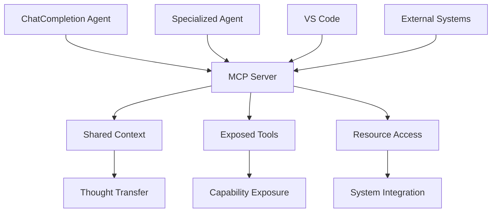

# MCP Servers

Model Context Protocol (MCP) servers enable efficient thought transfer and context sharing between agents and external systems. In the autonomous development system, MCP servers facilitate minimal context requirements while maintaining rich interaction capabilities through standardized tool and resource exposure.

> Current status: A minimal C# MCP stdio server stub is included at `samples/demos/mcp-servers/csharp/ProjectName.AutonomousServer`. It runs without MCP packages; to enable real MCP, add the official MCP SDK packages in that sample and uncomment the server wiring in `Program.cs`.

## MCP Integration Architecture

### Thought Transfer Foundation



### C# MCP Server Implementation

Using the official MCP C# SDK, we implement autonomous development servers that expose ChatCompletion agents, PMCRO capabilities, and enable agent-to-agent communication.

```csharp
using Microsoft.Extensions.DependencyInjection;
using Microsoft.Extensions.Hosting;
using Microsoft.Extensions.Logging;
using ModelContextProtocol.Server;
using Microsoft.SemanticKernel;
using ASDS.Core.Agents;
using ASDS.Core.PMCRO;

// Program.cs - Autonomous Development MCP Server
var builder = Host.CreateApplicationBuilder(args);

// Configure logging to stderr for MCP compliance
builder.Logging.AddConsole(options =>
{
    options.LogToStandardErrorThreshold = LogLevel.Trace;
});

// Register autonomous development services
builder.Services
    .AddMcpServer()
    .WithStdioServerTransport()
    .WithTools<AutonomousAgentTools>()
    .WithTools<PMCROTools>()
    .WithTools<CapabilityTools>()
    .WithPrompts<AutonomousPrompts>()
    .WithResources<AutonomousResources>();

// Register Semantic Kernel and autonomous services
builder.Services.AddSingleton(sp => AutonomousKernelBuilder.BuildAutonomousKernel(sp));
builder.Services.AddSingleton<IAgentOrchestrator, AutonomousAgentOrchestrator>();
builder.Services.AddSingleton<IPMCROLoop, PMCROOrchestrator>();
builder.Services.AddSingleton<IThoughtContextManager, ThoughtContextManager>();

await builder.Build().RunAsync();

[McpServerToolType]
public static class AutonomousAgentTools
{
    [McpServerTool]
    [Description("Execute autonomous ChatCompletion agent task")]
    public static async Task<string> ExecuteChatCompletionAgent(
        IServiceProvider serviceProvider,
        [Description("Agent name or type")] string agentName,
        [Description("Task description for the agent")] string taskDescription,
        [Description("Agent specialization type")] string agentType = "ChatCompletion",
        CancellationToken cancellationToken = default)
    {
        var orchestrator = serviceProvider.GetRequiredService<IAgentOrchestrator>();
        
        var agent = await orchestrator.GetOrCreateAgentAsync(
            agentName, 
            Enum.Parse<AgentType>(agentType), 
            cancellationToken);
        
        var task = new AgentTask
        {
            Id = Guid.NewGuid().ToString(),
            Description = taskDescription,
            RequiredAgentType = Enum.Parse<AgentType>(agentType)
        };
        
        var result = await agent.ExecuteAsync(task, cancellationToken);
        
        return JsonSerializer.Serialize(new
        {
            Success = result.Success,
            Output = result.Output,
            AgentName = agent.Name,
            AgentId = agent.Id,
            Error = result.Error?.Message
        }, new JsonSerializerOptions { WriteIndented = true });
    }
    
    [McpServerTool]
    [Description("Spawn specialized agent for complex processing")]
    public static async Task<string> SpawnSpecializedAgent(
        IServiceProvider serviceProvider,
        [Description("Parent agent name")] string parentAgentName,
        [Description("Subtask for new agent")] string subtaskDescription,
        [Description("Specialization type")] string specializationType = "Specialized",
        CancellationToken cancellationToken = default)
    {
        var orchestrator = serviceProvider.GetRequiredService<IAgentOrchestrator>();
        
        var parentAgent = await orchestrator.GetOrCreateAgentAsync(
            parentAgentName, 
            AgentType.ChatCompletion, 
            cancellationToken);
        
        var subtask = new AgentTask
        {
            Id = Guid.NewGuid().ToString(),
            Description = subtaskDescription,
            RequiredAgentType = Enum.Parse<AgentType>(specializationType)
        };
        
        var childAgent = await parentAgent.SpawnChildAgentAsync(subtask, cancellationToken);
        var result = await childAgent.ExecuteAsync(subtask, cancellationToken);
        
        return JsonSerializer.Serialize(new
        {
            ParentAgent = parentAgent.Name,
            ChildAgent = childAgent.Name,
            ChildAgentId = childAgent.Id,
            Result = result.Output,
            Success = result.Success
        }, new JsonSerializerOptions { WriteIndented = true });
    }
    
    [McpServerTool]
    [Description("Transfer thought context between agents")]
    public static async Task<string> TransferThoughtContext(
        IServiceProvider serviceProvider,
        [Description("Source agent identifier")] string sourceAgentId,
        [Description("Target agent identifier")] string targetAgentId,
        [Description("Context data to transfer")] string contextData,
        CancellationToken cancellationToken = default)
    {
        var thoughtManager = serviceProvider.GetRequiredService<IThoughtContextManager>();
        
        var context = new ThoughtContext
        {
            SourceAgentId = sourceAgentId,
            Data = contextData,
            Timestamp = DateTime.UtcNow
        };
        
        var transferResult = await thoughtManager.TransferContext(
            sourceAgentId, 
            targetAgentId, 
            context);
        
        return JsonSerializer.Serialize(transferResult, new JsonSerializerOptions { WriteIndented = true });
    }
}

[McpServerToolType]
public static class PMCROTools
{
    [McpServerTool]
    [Description("Execute complete PMCRO cycle for behavior intent")]
    public static async Task<string> ExecutePMCROCycle(
        IServiceProvider serviceProvider,
        [Description("Behavior intent to process")] string behaviorIntent,
        [Description("Processing context")] string context = "{}",
        CancellationToken cancellationToken = default)
    {
        var pmcroLoop = serviceProvider.GetRequiredService<IPMCROLoop>();
        
        var pmcroContext = new PMCROContext
        {
            Objective = behaviorIntent,
            Context = JsonSerializer.Deserialize<Dictionary<string, object>>(context) ?? new()
        };
        
        var result = await pmcroLoop.ExecuteLoopAsync(pmcroContext, cancellationToken);
        
        return JsonSerializer.Serialize(result, new JsonSerializerOptions { WriteIndented = true });
    }
    
    [McpServerTool]
    [Description("Execute individual PMCRO phase")]
    public static async Task<string> ExecutePMCROPhase(
        IServiceProvider serviceProvider,
        [Description("PMCRO phase to execute")] string phase,
        [Description("Phase input data")] string inputData,
        [Description("Previous phase results")] string previousResults = "{}",
        CancellationToken cancellationToken = default)
    {
        var orchestrator = serviceProvider.GetRequiredService<IAgentOrchestrator>();
        
        var phaseAgent = await orchestrator.GetOrCreateAgentAsync(
            $"PMCRO-{phase}", 
            AgentType.Specialized, 
            cancellationToken);
        
        var task = new AgentTask
        {
            Id = Guid.NewGuid().ToString(),
            Description = $"Execute {phase} phase: {inputData}\nPrevious results: {previousResults}",
            RequiredAgentType = AgentType.Specialized
        };
        
        var result = await phaseAgent.ExecuteAsync(task, cancellationToken);
        
        return JsonSerializer.Serialize(new
        {
            Phase = phase,
            Input = inputData,
            Output = result.Output,
            Success = result.Success,
            Agent = phaseAgent.Name
        }, new JsonSerializerOptions { WriteIndented = true });
    }
}

[McpServerToolType]
public static class CapabilityTools
{
    [McpServerTool]
    [Description("Analyze and enhance system capabilities")]
    public static async Task<string> AnalyzeSystemCapabilities(
        IServiceProvider serviceProvider,
        [Description("Analysis focus area")] string focusArea = "all",
        CancellationToken cancellationToken = default)
    {
        var orchestrator = serviceProvider.GetRequiredService<IAgentOrchestrator>();
        
        var analysisAgent = await orchestrator.GetOrCreateAgentAsync(
            "CapabilityAnalyzer", 
            AgentType.Specialized, 
            cancellationToken);
        
        var task = new AgentTask
        {
            Id = Guid.NewGuid().ToString(),
            Description = $"Analyze system capabilities with focus on: {focusArea}",
            RequiredAgentType = AgentType.Specialized
        };
        
        var result = await analysisAgent.ExecuteAsync(task, cancellationToken);
        
        return result.Output;
    }
    
    [McpServerTool]
    [Description("Generate new capability from identified gap")]
    public static async Task<string> GenerateCapability(
        IServiceProvider serviceProvider,
        [Description("Description of capability gap")] string capabilityGap,
        [Description("Requirements and constraints")] string requirements = "",
        CancellationToken cancellationToken = default)
    {
        var orchestrator = serviceProvider.GetRequiredService<IAgentOrchestrator>();
        
        var generatorAgent = await orchestrator.GetOrCreateAgentAsync(
            "CapabilityGenerator", 
            AgentType.Specialized, 
            cancellationToken);
        
        var task = new AgentTask
        {
            Id = Guid.NewGuid().ToString(),
            Description = $"Generate capability for gap: {capabilityGap}\nRequirements: {requirements}",
            RequiredAgentType = AgentType.Specialized
        };
        
        var result = await generatorAgent.ExecuteAsync(task, cancellationToken);
        
        return result.Output;
    }
}
```

## Minimal C# stdio server skeleton

```csharp
using Microsoft.Extensions.DependencyInjection;
using Microsoft.Extensions.Hosting;
using Microsoft.Extensions.Logging;
using ModelContextProtocol.Server;

var builder = Host.CreateApplicationBuilder(args);

builder.Logging.AddConsole(options =>
{
    options.LogToStandardErrorThreshold = LogLevel.Trace;
});

builder.Services
    .AddMcpServer()
    .WithStdioServerTransport()
    .WithTools<ThoughtTools>();

var app = builder.Build();
await app.RunAsync();

public sealed class ThoughtTools
{
    [McpServerTool("compress_thought_context")]
    public object Compress(object input) => new { result = input, size = 42 };

    [McpServerTool("receive_thought_context")]
    public object Receive(object compressed) => new { ok = true, received = compressed };
}
```


## Thought Transfer Implementation

### Context Compression and Transfer

```csharp
public class ThoughtContextManager : IThoughtContextManager
{
    private readonly Dictionary<string, ThoughtContext> agentContexts = new();
    private readonly IContextCompressor contextCompressor;
    
    public async Task<ThoughtTransferResult> TransferContext(
        string sourceAgent,
        string targetAgent,
        ThoughtContext context)
    {
        // Compress context for efficient transfer
        var compressedContext = await contextCompressor.CompressContext(context);
        
        // Validate transfer safety and boundaries
        var transferValidation = await ValidateContextTransfer(sourceAgent, targetAgent, context);
        if (!transferValidation.IsValid)
        {
            throw new InvalidOperationException($"Context transfer validation failed: {transferValidation.Reason}");
        }
        
        // Store compressed context for target agent
        var targetContext = agentContexts.GetValueOrDefault(targetAgent, new ThoughtContext());
        targetContext = await MergeContexts(targetContext, compressedContext);
        agentContexts[targetAgent] = targetContext;
        
        // Log thought transfer pattern
        await LogThoughtTransferPattern(sourceAgent, targetAgent, compressedContext);
        
        return new ThoughtTransferResult
        {
            TransferSuccessful = true,
            CompressedSize = compressedContext.Size,
            OriginalSize = context.Size,
            CompressionRatio = (double)compressedContext.Size / context.Size,
            TransferMetadata = await GenerateTransferMetadata(sourceAgent, targetAgent)
        };
    }
    
    public async Task<ThoughtContext> GetContextForAgent(string agentId)
    {
        if (agentContexts.TryGetValue(agentId, out var context))
        {
            // Decompress context for agent use
            return await contextCompressor.DecompressContext(context);
        }
        
        return new ThoughtContext();
    }
    
    // Self-referential context enhancement
    public async Task<ContextEnhancementResult> EnhanceContextThroughSelfReference(string agentId)
    {
        var currentContext = await GetContextForAgent(agentId);
        
        // Analyze context patterns for enhancement opportunities
        var enhancementOpportunities = await AnalyzeContextForEnhancement(currentContext);
        
        var enhancedContext = currentContext;
        var appliedEnhancements = new List<ContextEnhancement>();
        
        foreach (var opportunity in enhancementOpportunities)
        {
            var enhancement = await GenerateContextEnhancement(opportunity);
            enhancedContext = await ApplyContextEnhancement(enhancedContext, enhancement);
            appliedEnhancements.Add(enhancement);
        }
        
        // Update stored context
        agentContexts[agentId] = await contextCompressor.CompressContext(enhancedContext);
        
        return new ContextEnhancementResult
        {
            EnhancementsApplied = appliedEnhancements,
            EnhancedContext = enhancedContext,
            ImprovementMetrics = await CalculateContextImprovements(currentContext, enhancedContext)
        };
    }
}

public class ContextCompressor : IContextCompressor
{
    public async Task<CompressedContext> CompressContext(ThoughtContext context)
    {
        // Extract essential patterns and compress redundant information
        var essentialPatterns = await ExtractEssentialPatterns(context);
        var compressedData = await CompressRedundantData(context, essentialPatterns);
        
        return new CompressedContext
        {
            EssentialPatterns = essentialPatterns,
            CompressedData = compressedData,
            CompressionMetadata = await GenerateCompressionMetadata(context),
            Size = CalculateCompressedSize(essentialPatterns, compressedData)
        };
    }
    
    public async Task<ThoughtContext> DecompressContext(CompressedContext compressed)
    {
        // Reconstruct full context from essential patterns and compressed data
        var reconstructedContext = await ReconstructFromPatterns(compressed.EssentialPatterns);
        var expandedContext = await ExpandCompressedData(reconstructedContext, compressed.CompressedData);
        
        return expandedContext;
    }
}
```

## VS Code Integration with .vscode/mcp.json

VS Code 1.102+ provides native MCP support with agent mode. Configure autonomous development servers in your workspace:

### Workspace MCP Configuration

```json
{
  "inputs": [
    {
      "type": "promptString",
      "id": "autonomous-server-path",
      "description": "Path to autonomous development server executable",
      "password": false
    }
  ],
  "servers": {
    "AutonomousDevelopment": {
      "type": "stdio",
      "command": "dotnet",
      "args": ["run", "--project", "${input:autonomous-server-path}"],
      "env": {
        "DOTNET_ENVIRONMENT": "Development",
        "AUTONOMOUS_CONFIG_PATH": "${workspaceFolder}/.autonomous/config.json"
      },
      "dev": {
        "watch": "src/**/*.cs",
        "debug": { "type": "node" }
      }
    },
    "PMCROServer": {
      "type": "stdio", 
      "command": "dotnet",
      "args": ["run", "--project", "src/ASDS.MCP.PMCROServer"],
      "env": {
        "SEMANTIC_KERNEL_CONFIG": "${workspaceFolder}/.sk/config.json"
      }
    },
    "CapabilityServer": {
      "type": "stdio",
      "command": "dotnet", 
      "args": ["run", "--project", "src/ASDS.MCP.CapabilityServer"],
      "env": {
        "CAPABILITY_STORE_PATH": "${workspaceFolder}/.capabilities"
      }
    }
  }
}
```

### Agent Mode Usage

With VS Code agent mode, autonomous development tools become available in the chat interface:

1. **Open Chat View** (`Ctrl+Alt+I`)
2. **Select Agent Mode** from dropdown
3. **Select Tools** - Choose autonomous development tools:
   - `ExecuteChatCompletionAgent` - Run autonomous agents
   - `ExecutePMCROCycle` - Complete behavior intent processing  
   - `SpawnSpecializedAgent` - Create task-specific agents
   - `TransferThoughtContext` - Share context between agents
   - `AnalyzeSystemCapabilities` - System analysis
   - `GenerateCapability` - Create new capabilities

### Multi-Server Communication

MCP servers can communicate with each other for thought transfer:

```csharp
[McpServerTool]
[Description("Communicate with another MCP server")]
public static async Task<string> CommunicateWithMCPServer(
    IServiceProvider serviceProvider,
    [Description("Target MCP server name")] string targetServer,
    [Description("Tool to invoke on target server")] string toolName,
    [Description("Arguments for target tool")] string toolArguments,
    CancellationToken cancellationToken = default)
{
    // Create client connection to target MCP server
    var clientTransport = new StdioClientTransport(new StdioClientTransportOptions
    {
        Name = targetServer,
        Command = "dotnet",
        Arguments = ["run", "--project", $"src/ASDS.MCP.{targetServer}"]
    });
    
    using var mcpClient = await McpClientFactory.CreateAsync(clientTransport);
    
    // Parse arguments
    var arguments = JsonSerializer.Deserialize<Dictionary<string, object>>(toolArguments) 
                   ?? new Dictionary<string, object>();
    
    // Invoke tool on target server
    var result = await mcpClient.CallToolAsync(toolName, arguments, cancellationToken);
    
    // Return combined results
    return JsonSerializer.Serialize(new
    {
        TargetServer = targetServer,
        ToolName = toolName,
        Success = true,
        Response = result.Content.FirstOrDefault()?.Text ?? "No response"
    }, new JsonSerializerOptions { WriteIndented = true });
}
```

## Resource Management

### Autonomous System Resources

```csharp
[McpServerResourceType]
public static class AutonomousResources
{
    [McpServerResource]
    [Description("Current autonomous development system state")]
    public static async Task<string> GetSystemState(
        IServiceProvider serviceProvider,
        CancellationToken cancellationToken = default)
    {
        var orchestrator = serviceProvider.GetRequiredService<IAgentOrchestrator>();
        
        var systemState = new
        {
            ActiveAgents = await GetActiveAgents(orchestrator),
            SystemHealth = "Operational",
            CapabilityCount = await GetCapabilityCount(serviceProvider),
            LastPMCROCycle = await GetLastPMCROResult(serviceProvider),
            ThoughtContexts = await GetActiveThoughtContexts(serviceProvider)
        };
        
        return JsonSerializer.Serialize(systemState, new JsonSerializerOptions { WriteIndented = true });
    }
    
    [McpServerResource]
    [Description("Emergent patterns detected in system behavior")]
    public static async Task<string> GetEmergentPatterns(
        IServiceProvider serviceProvider,
        CancellationToken cancellationToken = default)
    {
        var patternDetector = serviceProvider.GetService<IEmergentPatternDetector>();
        if (patternDetector == null) return "{}";
        
        var patterns = await patternDetector.GetActivePatterns();
        
        return JsonSerializer.Serialize(patterns, new JsonSerializerOptions { WriteIndented = true });
    }
    
    [McpServerResource] 
    [Description("Available autonomous capabilities")]
    public static async Task<string> GetAvailableCapabilities(
        IServiceProvider serviceProvider,
        CancellationToken cancellationToken = default)
    {
        var kernel = serviceProvider.GetRequiredService<Kernel>();
        
        var capabilities = kernel.Plugins.SelectMany(p => p.Value.Select(f => new
        {
            PluginName = p.Key,
            FunctionName = f.Name,
            Description = f.Description,
            Parameters = f.Metadata.Parameters.Select(param => new
            {
                param.Name,
                param.Description,
                param.ParameterType,
                param.IsRequired
            })
        }));
        
        return JsonSerializer.Serialize(capabilities, new JsonSerializerOptions { WriteIndented = true });
    }
}
```

## Prompt Templates

### MCP Prompt Management

```csharp
[McpServerPromptType]
public static class AutonomousPrompts
{
    [McpServerPrompt]
    [Description("Generate PMCRO analysis prompt for behavior intent")]
    public static ChatMessage PMCROAnalysisPrompt(
        [Description("Behavior intent to analyze")] string behaviorIntent,
        [Description("Analysis depth level")] int depth = 3,
        [Description("Focus areas for analysis")] string focusAreas = "structure,dependencies,patterns")
    {
        return new ChatMessage(ChatRole.User, $"""
            Perform comprehensive PMCRO analysis on the following behavior intent:
            
            **Behavior Intent:** {behaviorIntent}
            
            **Analysis Requirements:**
            - Depth Level: {depth} layers of decomposition
            - Focus Areas: {focusAreas}
            
            **PMCRO Phases to Execute:**
            
            1. **PLAN** - Decompose intent into actionable components
               - Identify core requirements and constraints
               - Map dependency relationships
               - Define success criteria
            
            2. **MAKE** - Generate implementation strategy
               - Create executable steps
               - Allocate agent resources
               - Design coordination patterns
            
            3. **CHECK** - Validate approach and results
               - Verify requirement compliance
               - Test component integration
               - Assess performance characteristics
            
            4. **REFLECT** - Analyze outcomes and patterns
               - Identify improvement opportunities
               - Extract learnable patterns
               - Document insights
            
            5. **OPTIMIZE** - Apply enhancements
               - Implement improvements
               - Update system capabilities
               - Prepare for iteration
            
            Provide structured analysis with clear phase separation and actionable outputs.
            """);
    }
    
    [McpServerPrompt]
    [Description("Generate agent communication prompt for thought transfer")]
    public static ChatMessage AgentCommunicationPrompt(
        [Description("Source agent context")] string sourceContext,
        [Description("Target agent specialization")] string targetSpecialization,
        [Description("Information to transfer")] string transferContent)
    {
        return new ChatMessage(ChatRole.User, $"""
            Facilitate thought transfer between autonomous agents:
            
            **Source Agent Context:** {sourceContext}
            **Target Agent Type:** {targetSpecialization}
            **Transfer Content:** {transferContent}
            
            **Communication Protocol:**
            1. Compress source context for efficient transfer
            2. Adapt content for target agent specialization
            3. Preserve essential insights and patterns
            4. Include coordination metadata
            
            **Transfer Format:**
            - Essential Insights: Key discoveries and patterns
            - Context Compression: Minimal required background
            - Action Items: Specific tasks for target agent
            - Coordination Metadata: Communication tracking info
            
            Generate optimized thought transfer package.
            """);
    }
    
    [McpServerPrompt]
    [Description("Generate capability enhancement prompt")]
    public static ChatMessage CapabilityEnhancementPrompt(
        [Description("Current capability description")] string currentCapability,
        [Description("Enhancement opportunity")] string enhancementOpportunity,
        [Description("Performance constraints")] string constraints = "")
    {
        return new ChatMessage(ChatRole.User, $"""
            Enhance autonomous development capability:
            
            **Current Capability:** {currentCapability}
            **Enhancement Opportunity:** {enhancementOpportunity}
            **Constraints:** {constraints}
            
            **Enhancement Framework:**
            1. **Analysis** - Evaluate current capability limitations
            2. **Design** - Create enhancement specification
            3. **Implementation** - Generate improved capability code
            4. **Integration** - Ensure compatibility with existing system
            5. **Validation** - Provide testing and verification approach
            
            **Requirements:**
            - Maintain all existing functionality
            - Implement enhancement opportunity
            - Add self-referential improvement patterns
            - Enable further enhancement through feedback loops
            - Include proper KernelFunction attributes for Semantic Kernel
            
            Provide complete enhanced capability implementation.
            """);
    }
}
```

## Best Practices

### 1. C# MCP Server Architecture
Use the official MCP C# SDK with dependency injection and hosting patterns for robust server implementation.

### 2. Semantic Kernel Integration  
Leverage ChatCompletion agents and Kernel functions for intelligent tool execution with proper agent orchestration.

### 3. Agent-to-Agent Communication
Implement MCP server-to-server communication for thought transfer and collaborative processing between specialized agents.

### 4. Resource Management
Expose system state, capabilities, and emergent patterns through MCP resources for transparent system monitoring.

### 5. VS Code Agent Mode
Configure .vscode/mcp.json for seamless integration with VS Code 1.102+ agent mode and tool selection interface.

## Deployment and Configuration

### Project Structure

```
src/
├── ASDS.MCP.AutonomousServer/          # Main autonomous development server
│   ├── Program.cs                      # MCP server startup
│   ├── Tools/                          # Agent and PMCRO tools
│   ├── Prompts/                        # Autonomous prompt templates
│   └── Resources/                      # System state resources
├── ASDS.MCP.PMCROServer/               # Specialized PMCRO server
├── ASDS.MCP.CapabilityServer/          # Capability management server
└── ASDS.Core/                          # Shared autonomous components
    ├── Agents/                         # ChatCompletion agents
    ├── PMCRO/                          # PMCRO orchestration
    └── Services/                       # Core services
```

### Server Configuration

```csharp
// appsettings.json for autonomous MCP servers
{
  "SemanticKernel": {
    "Providers": {
      "OpenAI": {
        "ApiKey": "${OPENAI_API_KEY}",
        "Models": {
          "Chat": "gpt-4o",
          "Embedding": "text-embedding-3-small"
        }
      },
      "Ollama": {
        "Endpoint": "http://localhost:11434",
        "Models": {
          "Chat": "llama3.1:8b",
          "Embedding": "nomic-embed-text"
        }
      }
    }
  },
  "AutonomousSystem": {
    "MaxConcurrentAgents": 10,
    "PMCROIterationLimit": 5,
    "ThoughtContextRetentionHours": 24,
    "CapabilityEvolutionEnabled": true
  },
  "Logging": {
    "LogLevel": {
      "Default": "Information",
      "ModelContextProtocol": "Debug",
      "ASDS": "Debug"
    }
  }
}
```

### Docker Deployment

```dockerfile
# Dockerfile.autonomous-mcp-server
FROM mcr.microsoft.com/dotnet/aspnet:9.0
WORKDIR /app
COPY --from=build /app/publish .

ENV DOTNET_ENVIRONMENT=Production
ENV ASPNETCORE_URLS=

ENTRYPOINT ["dotnet", "ASDS.MCP.AutonomousServer.dll"]
```

### VS Code Dev Container Support

```json
{
  "image": "mcr.microsoft.com/devcontainers/dotnet:9.0",
  "customizations": {
    "vscode": {
      "mcp": {
        "servers": {
          "autonomous-development": {
            "command": "dotnet",
            "args": ["run", "--project", "src/ASDS.MCP.AutonomousServer"],
            "env": {
              "DOTNET_ENVIRONMENT": "Development"
            }
          }
        }
      }
    }
  }
}
```

## Security and Trust

### MCP Server Trust Management

```csharp
public class AutonomousMcpServerTrustManager
{
    public async Task<bool> ValidateToolExecution(
        string toolName, 
        Dictionary<string, object> arguments,
        string clientIdentifier)
    {
        // Validate tool permissions for client
        if (!await IsToolAuthorizedForClient(toolName, clientIdentifier))
        {
            return false;
        }
        
        // Validate argument safety and constraints
        if (!await ValidateArgumentSafety(toolName, arguments))
        {
            return false;
        }
        
        // Check resource limits and quotas
        if (!await CheckResourceLimits(clientIdentifier))
        {
            return false;
        }
        
        return true;
    }
    
    private async Task<bool> ValidateArgumentSafety(
        string toolName, 
        Dictionary<string, object> arguments)
    {
        // Implement safety validation for autonomous operations
        return toolName switch
        {
            "ExecuteChatCompletionAgent" => await ValidateAgentExecution(arguments),
            "ExecutePMCROCycle" => await ValidatePMCROSafety(arguments),
            "TransferThoughtContext" => await ValidateContextTransfer(arguments),
            _ => true
        };
    }
}
```

## Next Steps

- [Explore Prompty Template integration](prompty-templates.md)
- [Learn Semantic Kernel integration](semantic-kernel.md)
- [Understand VS Code Extension patterns](vscode-extension.md)
- [See complete Integration examples](../examples/agent-coordination.md)
