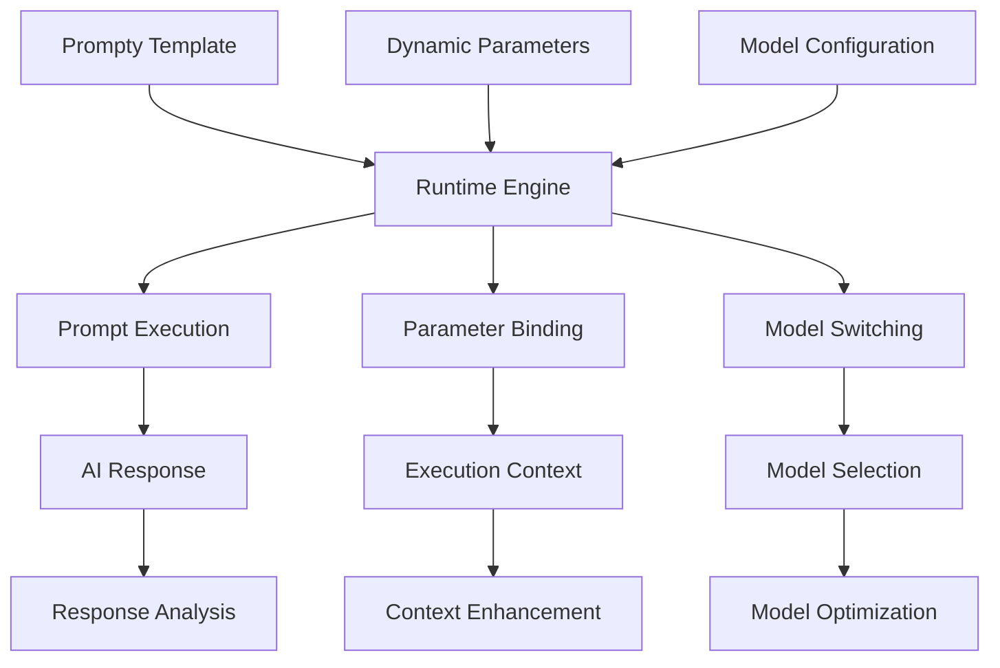

# Prompty Templates

Prompty provides standardized prompt template management with dynamic model switching and runtime parameter binding. In the autonomous development system, Prompty enables flexible prompt orchestration while maintaining prompt template versioning and dynamic execution context.

## Prompty Integration Architecture

### Template Management Foundation



### Core Prompty Implementation

```csharp
public class AutonomousPromptyEngine : IPromptyEngine
{
    private readonly IPromptyTemplateManager templateManager;
    private readonly IModelSwitchingManager modelManager;
    private readonly IParameterBindingEngine bindingEngine;
    private readonly IEmergentPatternDetector patternDetector;
    
    public AutonomousPromptyEngine(
        IPromptyTemplateManager templateManager,
        IModelSwitchingManager modelManager,
        IParameterBindingEngine bindingEngine,
        IEmergentPatternDetector patternDetector)
    {
        this.templateManager = templateManager;
        this.modelManager = modelManager;
        this.bindingEngine = bindingEngine;
        this.patternDetector = patternDetector;
    }
    
    public async Task<PromptyExecutionResult> ExecuteTemplateAsync(
        string templateName,
        Dictionary<string, object> parameters,
        ExecutionContext context = null)
    {
        // Load and validate template
        var template = await templateManager.LoadTemplateAsync(templateName);
        if (template == null)
        {
            throw new PromptyTemplateNotFoundException($"Template not found: {templateName}");
        }
        
        // Perform dynamic parameter binding
        var boundParameters = await bindingEngine.BindParameters(template, parameters, context);
        
        // Select optimal model based on template requirements
        var selectedModel = await modelManager.SelectOptimalModel(template, boundParameters);
        
        // Execute template with bound parameters
        var executionResult = await ExecuteTemplateWithModel(template, boundParameters, selectedModel);
        
        // Analyze response for emergent patterns
        var patterns = await patternDetector.AnalyzeResponse(executionResult.Response, template, boundParameters);
        
        // Update template performance metrics
        await UpdateTemplateMetrics(template, executionResult, patterns);
        
        return new PromptyExecutionResult
        {
            Response = executionResult.Response,
            ExecutionMetrics = executionResult.Metrics,
            DetectedPatterns = patterns,
            ModelUsed = selectedModel,
            ParameterBindings = boundParameters
        };
    }
    
    // Self-referential template enhancement
    public async Task<TemplateEnhancementResult> EnhanceTemplateAsync(
        string templateName,
        PromptyExecutionResult[] executionHistory)
    {
        var template = await templateManager.LoadTemplateAsync(templateName);
        
        // Analyze execution patterns for enhancement opportunities
        var enhancementOpportunities = await AnalyzeExecutionPatterns(executionHistory);
        
        var enhancedTemplate = template;
        var appliedEnhancements = new List<TemplateEnhancement>();
        
        foreach (var opportunity in enhancementOpportunities)
        {
            var enhancement = await GenerateTemplateEnhancement(opportunity, template);
            enhancedTemplate = await ApplyTemplateEnhancement(enhancedTemplate, enhancement);
            appliedEnhancements.Add(enhancement);
        }
        
        // Validate enhanced template
        var validationResult = await ValidateEnhancedTemplate(enhancedTemplate, template);
        if (!validationResult.IsValid)
        {
            throw new TemplateEnhancementException($"Enhanced template validation failed: {validationResult.Reason}");
        }
        
        // Store enhanced template version
        await templateManager.StoreTemplateVersionAsync(templateName, enhancedTemplate);
        
        return new TemplateEnhancementResult
        {
            EnhancedTemplate = enhancedTemplate,
            AppliedEnhancements = appliedEnhancements,
            ValidationResult = validationResult,
            PerformanceImprovement = await CalculatePerformanceImprovement(template, enhancedTemplate)
        };
    }
}
```

## PMCRO-Integrated Templates

### Plan Phase Templates

```yaml
# templates/pmcro/plan.prompty
---
name: pmcro_plan
description: Generate executable plan through planar analysis
model:
  api: chat
  configuration:
    type: azure_openai
    azure_deployment: gpt-4o
    temperature: 0.3
    max_tokens: 1500
parameters:
  behavior_intent:
    type: string
    description: The behavior intent to plan for
  context:
    type: object
    description: Current execution context
    default: {}
  planar_depth:
    type: number
    description: Depth of planar analysis
    default: 3
---
system:
You are an autonomous planning agent specialized in behavior intent decomposition through planar analysis.

Your task is to transform behavior intent into executable plans using recursive planar decomposition.

# Planar Analysis Framework

## Level 1: Primary Component Identification
- Identify core functional components
- Map component relationships and dependencies
- Define component interfaces and contracts

## Level 2: Dependency Analysis
- Analyze inter-component dependencies
- Identify potential circular dependencies
- Map external system dependencies
- Define dependency resolution strategies

## Level 3: Executable Step Generation
- Generate specific executable steps
- Define success criteria for each step
- Identify potential failure points
- Create step dependency chains

# Self-Referential Enhancement
For each component identified, consider how it can be enhanced through:
- Strange loop patterns that enable self-improvement
- Recursive analysis that deepens understanding
- Emergent capability detection and integration

user:
Behavior Intent: {{behavior_intent}}

Context: {{context}}

Perform planar analysis to depth {{planar_depth}} and generate an executable plan.

Focus on:
1. Decomposing the intent into manageable components
2. Identifying dependencies and relationships
3. Creating executable steps with clear success criteria
4. Incorporating self-referential enhancement opportunities

Provide the plan in structured format with clear planar separation.
```

### Make Phase Templates

```yaml
# templates/pmcro/make.prompty
---
name: pmcro_make
description: Execute plan components with emergent pattern detection
model:
  api: chat
  configuration:
    type: azure_openai
    azure_deployment: gpt-4o
    temperature: 0.1
    max_tokens: 2000
parameters:
  plan:
    type: object
    description: The executable plan to implement
  execution_context:
    type: object
    description: Current execution context
    default: {}
  components_to_execute:
    type: array
    description: Specific components to execute
    default: []
---
system:
You are an autonomous execution agent specialized in implementing plans while detecting emergent patterns.

Your task is to execute plan components while maintaining awareness of emergent capabilities and patterns.

# Execution Framework

## Component Execution
- Execute plan components in dependency order
- Monitor execution progress and success criteria
- Detect and handle execution anomalies
- Capture execution metrics and patterns

## Emergent Pattern Detection
- Monitor for unexpected capability emergence
- Detect strange loop formations during execution
- Identify self-referential enhancement opportunities
- Track pattern evolution across executions

## Error Handling and Recovery
- Implement graceful degradation for component failures
- Generate alternative execution paths
- Maintain execution state for recovery
- Learn from execution failures for future improvement

user:
Plan to Execute: {{plan}}

Execution Context: {{execution_context}}


Focus on executing these specific components: {{components_to_execute}}


Execute the plan components while:
1. Maintaining dependency order and requirements
2. Monitoring for emergent patterns and capabilities
3. Implementing proper error handling and recovery
4. Capturing execution metrics for optimization

Provide detailed execution results with pattern analysis.
```

### Check Phase Templates

```yaml
# templates/pmcro/check.prompty
---
name: pmcro_check
description: Validate execution results and detect anomalies
model:
  api: chat
  configuration:
    type: azure_openai
    azure_deployment: gpt-4o
    temperature: 0.2
    max_tokens: 1200
parameters:
  execution_results:
    type: object
    description: Results from the make phase
  success_criteria:
    type: array
    description: Success criteria to validate against
  validation_context:
    type: object
    description: Additional validation context
    default: {}
---
system:
You are an autonomous validation agent specialized in result verification and anomaly detection.

Your task is to thoroughly validate execution results against success criteria while detecting anomalies and improvement opportunities.

# Validation Framework

## Result Verification
- Compare execution results against defined success criteria
- Validate functional correctness and completeness
- Check for performance and quality metrics
- Verify integration and compatibility requirements

## Anomaly Detection
- Identify unexpected behaviors or patterns
- Detect performance anomalies and outliers
- Monitor for security or safety violations
- Flag potential system instabilities

## Enhancement Opportunity Analysis
- Identify areas where results exceed expectations
- Detect emergent capabilities or patterns
- Analyze optimization opportunities
- Suggest improvements for future executions

user:
Execution Results: {{execution_results}}

Success Criteria: {{success_criteria}}

Validation Context: {{validation_context}}

Validate the execution results by:
1. Checking against all success criteria
2. Detecting any anomalies or unexpected behaviors
3. Identifying enhancement opportunities
4. Providing detailed validation report with recommendations

Focus on both functional correctness and emergent pattern detection.
```

### Reflect Phase Templates

```yaml
# templates/pmcro/reflect.prompty
---
name: pmcro_reflect
description: Analyze cycle performance and generate insights
model:
  api: chat
  configuration:
    type: azure_openai
    azure_deployment: gpt-4o
    temperature: 0.4
    max_tokens: 1800
parameters:
  cycle_results:
    type: object
    description: Complete PMCRO cycle results
  historical_data:
    type: array
    description: Historical cycle performance data
    default: []
  reflection_focus:
    type: string
    description: Specific area to focus reflection on
    default: "overall"
---
system:
You are an autonomous reflection agent specialized in cycle analysis and insight generation.

Your task is to deeply analyze PMCRO cycle performance and generate actionable insights for system improvement.

# Reflection Framework

## Cycle Performance Analysis
- Analyze each phase performance (Plan, Make, Check)
- Identify bottlenecks and optimization opportunities
- Compare performance against historical baselines
- Detect performance trends and patterns

## Pattern Analysis
- Identify emergent patterns across cycles
- Analyze strange loop formations and their effectiveness
- Track capability evolution and enhancement
- Map self-referential improvement patterns

## Insight Generation
- Generate actionable insights for future cycles
- Identify systematic improvement opportunities
- Suggest architectural enhancements
- Recommend capability development focus areas

## Meta-Learning
- Analyze the reflection process itself
- Identify improvements to reflection methodology
- Enhance pattern detection capabilities
- Optimize insight generation processes

user:
PMCRO Cycle Results: {{cycle_results}}


Historical Performance Data: {{historical_data}}


Reflection Focus: {{reflection_focus}}

Perform deep reflection analysis:
1. Analyze cycle performance across all phases
2. Identify emergent patterns and capabilities
3. Generate actionable insights for improvement
4. Suggest optimization strategies for future cycles

Provide comprehensive reflection with specific recommendations.
```

### Optimize Phase Templates

```yaml
# templates/pmcro/optimize.prompty
---
name: pmcro_optimize
description: Generate optimizations based on reflection insights
model:
  api: chat
  configuration:
    type: azure_openai
    azure_deployment: gpt-4o
    temperature: 0.3
    max_tokens: 2000
parameters:
  reflection_insights:
    type: object
    description: Insights from reflection phase
  optimization_constraints:
    type: object
    description: Constraints for optimization
    default: {}
  optimization_goals:
    type: array
    description: Specific optimization goals
    default: ["performance", "reliability", "capability"]
---
system:
You are an autonomous optimization agent specialized in system enhancement through insight application.

Your task is to generate concrete optimizations based on reflection insights while respecting system constraints.

# Optimization Framework

## Insight Analysis
- Analyze reflection insights for actionable opportunities
- Prioritize optimizations based on impact and feasibility
- Consider constraint implications for each optimization
- Map optimization dependencies and sequences

## Optimization Generation
- Generate specific, implementable optimizations
- Create optimization implementation plans
- Define success metrics for each optimization
- Identify potential risks and mitigation strategies

## System Enhancement
- Focus on capability enhancement through strange loops
- Enable emergent pattern amplification
- Optimize self-referential improvement processes
- Enhance cross-cycle learning and adaptation

## Implementation Strategy
- Create phased implementation approach
- Define rollback strategies for failed optimizations
- Establish monitoring and validation procedures
- Plan for optimization effectiveness measurement

user:
Reflection Insights: {{reflection_insights}}

Optimization Constraints: {{optimization_constraints}}

Optimization Goals: {{optimization_goals}}

Generate optimizations that:
1. Address the key insights from reflection analysis
2. Respect all system constraints and limitations
3. Focus on the specified optimization goals
4. Include implementation plans and success metrics

Provide detailed optimization strategy with prioritized action items.
```

## Dynamic Model Switching

### Model Selection Engine

```csharp
public class ModelSwitchingManager : IModelSwitchingManager
{
    private readonly Dictionary<string, ModelConfiguration> availableModels;
    private readonly IModelPerformanceTracker performanceTracker;
    
    public async Task<ModelConfiguration> SelectOptimalModel(
        PromptyTemplate template,
        Dictionary<string, object> parameters)
    {
        // Analyze template requirements
        var templateRequirements = await AnalyzeTemplateRequirements(template);
        
        // Consider parameter complexity
        var parameterComplexity = await AnalyzeParameterComplexity(parameters);
        
        // Check performance history
        var performanceHistory = await performanceTracker.GetPerformanceHistory(template.Name);
        
        // Score available models for this specific use case
        var modelScores = new Dictionary<string, double>();
        
        foreach (var model in availableModels.Values)
        {
            var score = await CalculateModelScore(model, templateRequirements, parameterComplexity, performanceHistory);
            modelScores[model.Name] = score;
        }
        
        // Select highest scoring model
        var optimalModelName = modelScores.OrderByDescending(kvp => kvp.Value).First().Key;
        var optimalModel = availableModels[optimalModelName];
        
        // Log model selection for learning
        await LogModelSelection(template, parameters, optimalModel, modelScores);
        
        return optimalModel;
    }
    
    // Self-referential model performance optimization
    public async Task<ModelOptimizationResult> OptimizeModelSelection(
        string templateName,
        ModelPerformanceData[] performanceHistory)
    {
        // Analyze model performance patterns
        var performancePatterns = await AnalyzeModelPerformancePatterns(performanceHistory);
        
        // Identify optimization opportunities
        var optimizationOpportunities = await IdentifyModelOptimizationOpportunities(performancePatterns);
        
        var optimizations = new List<ModelOptimization>();
        
        foreach (var opportunity in optimizationOpportunities)
        {
            var optimization = await GenerateModelOptimization(opportunity);
            optimizations.Add(optimization);
        }
        
        // Apply safe optimizations
        var appliedOptimizations = new List<ModelOptimization>();
        foreach (var optimization in optimizations.Where(o => o.IsSafe))
        {
            await ApplyModelOptimization(optimization);
            appliedOptimizations.Add(optimization);
        }
        
        return new ModelOptimizationResult
        {
            AppliedOptimizations = appliedOptimizations,
            PerformanceImprovement = await CalculatePerformanceImprovement(templateName),
            OptimizationInsights = await GenerateOptimizationInsights(performancePatterns)
        };
    }
}

public class ModelConfiguration
{
    public string Name { get; set; }
    public string Type { get; set; }
    public string DeploymentName { get; set; }
    public double Temperature { get; set; }
    public int MaxTokens { get; set; }
    public string[] Capabilities { get; set; }
    public ModelPerformanceProfile PerformanceProfile { get; set; }
    public Dictionary<string, object> AdditionalParameters { get; set; } = new();
}
```

## Template Versioning and Evolution

### Template Evolution Engine

```csharp
public class TemplateEvolutionEngine : ITemplateEvolutionEngine
{
    private readonly ITemplateVersionManager versionManager;
    private readonly IPerformanceAnalyzer performanceAnalyzer;
    
    public async Task<TemplateEvolutionResult> EvolveTemplate(
        string templateName,
        TemplateUsageData[] usageHistory)
    {
        // Load current template and version history
        var currentTemplate = await versionManager.GetCurrentTemplate(templateName);
        var versionHistory = await versionManager.GetVersionHistory(templateName);
        
        // Analyze usage patterns for evolution opportunities
        var evolutionOpportunities = await AnalyzeEvolutionOpportunities(usageHistory, versionHistory);
        
        // Generate evolution candidates
        var evolutionCandidates = new List<TemplateEvolution>();
        foreach (var opportunity in evolutionOpportunities)
        {
            var evolution = await GenerateTemplateEvolution(currentTemplate, opportunity);
            evolutionCandidates.Add(evolution);
        }
        
        // Test evolution candidates
        var testedEvolutions = new List<TestedTemplateEvolution>();
        foreach (var candidate in evolutionCandidates)
        {
            var testResult = await TestTemplateEvolution(candidate, usageHistory.Take(10).ToArray());
            testedEvolutions.Add(new TestedTemplateEvolution
            {
                Evolution = candidate,
                TestResult = testResult
            });
        }
        
        // Select best performing evolution
        var bestEvolution = testedEvolutions
            .Where(te => te.TestResult.IsSuccessful)
            .OrderByDescending(te => te.TestResult.PerformanceScore)
            .FirstOrDefault();
        
        if (bestEvolution != null)
        {
            // Apply evolution and create new version
            var evolvedTemplate = await ApplyTemplateEvolution(currentTemplate, bestEvolution.Evolution);
            await versionManager.CreateNewVersion(templateName, evolvedTemplate, bestEvolution.Evolution);
            
            return new TemplateEvolutionResult
            {
                EvolutionApplied = true,
                EvolvedTemplate = evolvedTemplate,
                Evolution = bestEvolution.Evolution,
                PerformanceImprovement = bestEvolution.TestResult.PerformanceScore
            };
        }
        
        return new TemplateEvolutionResult
        {
            EvolutionApplied = false,
            Reason = "No beneficial evolution candidates found"
        };
    }
}
```

## Agent-Specific Template Patterns

### Specialized Agent Templates

```yaml
# templates/agents/planar-analysis.prompty
---
name: agent_planar_analysis
description: Specialized template for planar analysis agents
model:
  api: chat
  configuration:
    type: azure_openai
    azure_deployment: gpt-4o
    temperature: 0.2
parameters:
  analysis_target:
    type: string
    description: Target system or component to analyze
  analysis_depth:
    type: number
    default: 3
  focus_areas:
    type: array
    default: ["structure", "dependencies", "patterns"]
---
system:
You are a specialized planar analysis agent with deep expertise in system decomposition and pattern recognition.

Your core capability is recursive planar analysis that reveals hidden structures and relationships within complex systems.

# Analysis Methodology

## Planar Decomposition
- Systematically decompose systems into component planes
- Identify relationships and dependencies between planes
- Map cross-planar influences and interactions

## Pattern Recognition
- Detect structural patterns within each plane
- Identify emergent patterns across planar boundaries
- Track pattern evolution and transformation

## Enhancement Identification
- Identify optimization opportunities within planes
- Detect potential for strange loop formations
- Suggest self-referential enhancement patterns

user:
Analysis Target: {{analysis_target}}
Analysis Depth: {{analysis_depth}}
Focus Areas: {{focus_areas}}

Perform comprehensive planar analysis focusing on the specified areas.
Provide structured analysis with clear planar separation and pattern identification.
```

```yaml
# templates/agents/capability-synthesis.prompty
---
name: agent_capability_synthesis
description: Template for capability synthesis agents
model:
  api: chat
  configuration:
    type: azure_openai
    azure_deployment: gpt-4o
    temperature: 0.4
parameters:
  source_capabilities:
    type: array
    description: Source capabilities to synthesize from
  synthesis_goals:
    type: array
    description: Goals for the synthesis process
  constraints:
    type: object
    default: {}
---
system:
You are a specialized capability synthesis agent focused on creating new capabilities through intelligent combination and enhancement of existing ones.

Your expertise lies in identifying synthesis opportunities and generating novel capabilities that emerge from the combination of simpler components.

# Synthesis Framework

## Capability Analysis
- Analyze source capabilities for synthesis potential
- Identify complementary and synergistic relationships
- Map capability interaction patterns

## Synthesis Generation
- Generate novel capability combinations
- Create emergent capabilities from source interactions
- Design self-referential enhancement patterns

## Validation and Optimization
- Validate synthesized capabilities for coherence
- Optimize synthesis results for performance
- Ensure proper integration patterns

user:
Source Capabilities: {{source_capabilities}}
Synthesis Goals: {{synthesis_goals}}
Constraints: {{constraints}}

Synthesize new capabilities by intelligently combining the source capabilities.
Focus on creating emergent capabilities that exceed the sum of their parts.
```

## Template Performance Monitoring

### Performance Analysis Engine

```csharp
public class TemplatePerformanceAnalyzer : ITemplatePerformanceAnalyzer
{
    public async Task<PerformanceAnalysisResult> AnalyzeTemplatePerformance(
        string templateName,
        TimeSpan analysisWindow)
    {
        // Collect performance data
        var performanceData = await CollectPerformanceData(templateName, analysisWindow);
        
        // Analyze response quality trends
        var qualityTrends = await AnalyzeResponseQuality(performanceData);
        
        // Analyze execution efficiency
        var efficiencyMetrics = await AnalyzeExecutionEfficiency(performanceData);
        
        // Detect performance anomalies
        var anomalies = await DetectPerformanceAnomalies(performanceData);
        
        // Generate improvement recommendations
        var recommendations = await GenerateImprovementRecommendations(
            qualityTrends, efficiencyMetrics, anomalies);
        
        return new PerformanceAnalysisResult
        {
            TemplateName = templateName,
            AnalysisWindow = analysisWindow,
            QualityTrends = qualityTrends,
            EfficiencyMetrics = efficiencyMetrics,
            DetectedAnomalies = anomalies,
            ImprovementRecommendations = recommendations
        };
    }
    
    // Self-referential performance optimization
    public async Task<PerformanceOptimizationResult> OptimizeTemplatePerformance(
        string templateName,
        PerformanceAnalysisResult analysisResult)
    {
        var optimizations = new List<TemplateOptimization>();
        
        // Generate optimizations based on quality trends
        foreach (var trend in analysisResult.QualityTrends.Where(t => t.IsNegative))
        {
            var optimization = await GenerateQualityOptimization(templateName, trend);
            optimizations.Add(optimization);
        }
        
        // Generate optimizations based on efficiency metrics
        foreach (var metric in analysisResult.EfficiencyMetrics.Where(m => m.IsBelowThreshold))
        {
            var optimization = await GenerateEfficiencyOptimization(templateName, metric);
            optimizations.Add(optimization);
        }
        
        // Apply safe optimizations
        var appliedOptimizations = new List<TemplateOptimization>();
        foreach (var optimization in optimizations.Where(o => o.IsSafe))
        {
            await ApplyTemplateOptimization(templateName, optimization);
            appliedOptimizations.Add(optimization);
        }
        
        return new PerformanceOptimizationResult
        {
            TemplateName = templateName,
            AppliedOptimizations = appliedOptimizations,
            ExpectedImprovements = await CalculateExpectedImprovements(appliedOptimizations)
        };
    }
}
```

## Best Practices

### 1. Template Design
Design templates with clear parameter interfaces and flexible model configurations.

### 2. Dynamic Model Selection
Implement intelligent model selection based on template requirements and performance history.

### 3. Parameter Binding
Use dynamic parameter binding for flexible template execution contexts.

### 4. Performance Monitoring
Continuously monitor template performance and optimize based on usage patterns.

### 5. Version Management
Maintain template versions and enable evolution based on performance feedback.

## Integration Examples

### PMCRO Cycle Integration

```csharp
public class PMCROPromptyIntegration
{
    private readonly IPromptyEngine promptyEngine;
    
    public async Task<PMCROResult> ExecutePMCROWithPrompty(
        string behaviorIntent,
        PMCROContext context)
    {
        // Plan phase using Prompty template
        var planResult = await promptyEngine.ExecuteTemplateAsync(
            "pmcro_plan",
            new Dictionary<string, object>
            {
                ["behavior_intent"] = behaviorIntent,
                ["context"] = context.ToObject(),
                ["planar_depth"] = context.PlanarDepth
            });
        
        var plan = JsonSerializer.Deserialize<ExecutablePlan>(planResult.Response);
        
        // Make phase execution
        var makeResult = await promptyEngine.ExecuteTemplateAsync(
            "pmcro_make",
            new Dictionary<string, object>
            {
                ["plan"] = plan,
                ["execution_context"] = context.ExecutionContext,
                ["components_to_execute"] = plan.Components.Select(c => c.Id).ToArray()
            });
        
        var executionResults = JsonSerializer.Deserialize<ExecutionResults>(makeResult.Response);
        
        // Check phase validation
        var checkResult = await promptyEngine.ExecuteTemplateAsync(
            "pmcro_check",
            new Dictionary<string, object>
            {
                ["execution_results"] = executionResults,
                ["success_criteria"] = plan.SuccessCriteria,
                ["validation_context"] = context.ValidationContext
            });
        
        var validationResults = JsonSerializer.Deserialize<ValidationResults>(checkResult.Response);
        
        // Reflect phase analysis
        var reflectResult = await promptyEngine.ExecuteTemplateAsync(
            "pmcro_reflect",
            new Dictionary<string, object>
            {
                ["cycle_results"] = new { plan, executionResults, validationResults },
                ["historical_data"] = context.HistoricalData,
                ["reflection_focus"] = context.ReflectionFocus
            });
        
        var reflectionInsights = JsonSerializer.Deserialize<ReflectionInsights>(reflectResult.Response);
        
        // Optimize phase enhancement
        var optimizeResult = await promptyEngine.ExecuteTemplateAsync(
            "pmcro_optimize",
            new Dictionary<string, object>
            {
                ["reflection_insights"] = reflectionInsights,
                ["optimization_constraints"] = context.OptimizationConstraints,
                ["optimization_goals"] = context.OptimizationGoals
            });
        
        var optimizations = JsonSerializer.Deserialize<OptimizationStrategy>(optimizeResult.Response);
        
        return new PMCROResult
        {
            Plan = plan,
            ExecutionResults = executionResults,
            ValidationResults = validationResults,
            ReflectionInsights = reflectionInsights,
            OptimizationStrategy = optimizations,
            CycleMetrics = await CalculateCycleMetrics(planResult, makeResult, checkResult, reflectResult, optimizeResult)
        };
    }
}
```

## Next Steps

- [Explore Semantic Kernel integration](semantic-kernel.md)
- [Learn VS Code Extension patterns](vscode-extension.md)
- [Understand MCP Server integration](mcp-servers.md)
- [See complete Integration examples](../examples/agent-coordination.md)

### Related Artifacts

- Recursive Mastery Prompt Template: `docs/templates/RecursiveMastery.prompty`
- Copilot instructions: `.github/copilot-instructions.yaml`
