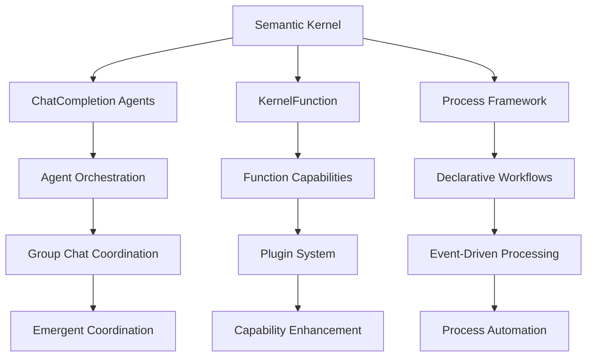

# Semantic Kernel Integration with MCP Coordination

Semantic Kernel provides the foundation for AI orchestration in the autonomous development system. Through ChatCompletion agents, function calling, process frameworks, and MCP (Model Context Protocol) coordination, Semantic Kernel enables sophisticated AI coordination patterns while maintaining type safety and performance optimization.

## Semantic Kernel Architecture

### Foundation Components



### Core Kernel Configuration

```csharp
public static class AutonomousKernelBuilder
{
    public static Kernel BuildAutonomousKernel(IServiceProvider serviceProvider)
    {
        var kernelBuilder = Kernel.CreateBuilder();
        
        // Configure AI services with multiple providers
        kernelBuilder.Services.AddAzureOpenAIChatCompletion(
            "gpt-4o",
            "https://your-endpoint.openai.azure.com/",
            Environment.GetEnvironmentVariable("AZURE_OPENAI_API_KEY"));
        
        kernelBuilder.Services.AddOpenAIChatCompletion(
            "gpt-4o-mini",
            Environment.GetEnvironmentVariable("OPENAI_API_KEY"));
        
        // Add autonomous development plugins with MCP integration
        kernelBuilder.Plugins.AddFromType<PlanarAnalysisPlugin>();
        kernelBuilder.Plugins.AddFromType<CapabilityGenerationPlugin>();
        kernelBuilder.Plugins.AddFromType<EmergentPatternPlugin>();
        kernelBuilder.Plugins.AddFromType<SelfReferencePlugin>();
        kernelBuilder.Plugins.AddFromType<McpCoordinationPlugin>();
        
        // Configure process framework with MCP support
        kernelBuilder.Services.AddSingleton<IKernelProcessFactory, KernelProcessFactory>();
        kernelBuilder.Services.AddSingleton<IProcessStepBuilder, ProcessStepBuilder>();
        
        // Add MCP coordination services
        kernelBuilder.Services.AddSingleton<IMcpServerOrchestrator, McpServerOrchestrator>();
        kernelBuilder.Services.AddSingleton<IMcpClientFactory, McpClientFactory>();
        kernelBuilder.Services.AddTransient<IMcpClient>(provider => 
            provider.GetRequiredService<IMcpClientFactory>().CreateClient());
        
        // Add autonomous services with MCP integration
        kernelBuilder.Services.AddSingleton<IAgentOrchestrator, AutonomousAgentOrchestrator>();
        kernelBuilder.Services.AddSingleton<IEmergentPatternDetector, EmergentPatternDetector>();
        kernelBuilder.Services.AddSingleton<ICapabilityEvolutionManager, CapabilityEvolutionManager>();
        kernelBuilder.Services.AddSingleton<IThoughtTransferManager, McpThoughtTransferManager>();
        
        // Configure telemetry and monitoring
        kernelBuilder.Services.AddLogging();
        kernelBuilder.Services.AddSingleton<IKernelTelemetry, AutonomousKernelTelemetry>();
        
        return kernelBuilder.Build();
    }
}
```

## ChatCompletion Agent Orchestration with MCP Coordination

### Agent Coordination Framework

```csharp
public class AutonomousAgentOrchestrator : IAgentOrchestrator
{
    private readonly Kernel kernel;
    private readonly IAgentGroupChat agentGroupChat;
    private readonly IEmergentPatternDetector patternDetector;
    private readonly IMcpServerOrchestrator mcpOrchestrator;
    private readonly IMcpClientFactory mcpClientFactory;
    private readonly Dictionary<string, ChatCompletionAgent> agents = new();
    private readonly Dictionary<string, IMcpClient> agentMcpClients = new();
    
    public AutonomousAgentOrchestrator(
        Kernel kernel,
        IAgentGroupChat agentGroupChat,
        IEmergentPatternDetector patternDetector,
        IMcpServerOrchestrator mcpOrchestrator,
        IMcpClientFactory mcpClientFactory)
    {
        this.kernel = kernel;
        this.agentGroupChat = agentGroupChat;
        this.patternDetector = patternDetector;
        this.mcpOrchestrator = mcpOrchestrator;
        this.mcpClientFactory = mcpClientFactory;
        
        InitializeSpecializedAgentsWithMcp();
    }
    
    private async void InitializeSpecializedAgentsWithMcp()
    {
        // Initialize MCP servers for each specialized agent
        await mcpOrchestrator.StartServerAsync("planar-analysis", new McpServerConfig
        {
            Command = "dotnet",
            Args = ["run", "--", "stdio"],
            WorkingDirectory = "./mcp-servers/planar-analysis"
        });
        
        await mcpOrchestrator.StartServerAsync("capability-synthesis", new McpServerConfig
        {
            Command = "dotnet", 
            Args = ["run", "--", "stdio"],
            WorkingDirectory = "./mcp-servers/capability-synthesis"
        });
        
        // Create MCP clients for each agent
        agentMcpClients["planar_analysis"] = await mcpClientFactory.CreateClientAsync("planar-analysis");
        agentMcpClients["capability_synthesis"] = await mcpClientFactory.CreateClientAsync("capability-synthesis");
        
        // Planar Analysis Agent with MCP Integration
        agents["planar_analysis"] = new ChatCompletionAgent
        {
            Name = "PlanarAnalyst",
            Instructions = """
                You are a specialized planar analysis agent with MCP server coordination capabilities.
                
                Your core capabilities:
                - Decompose complex systems into component planes using C# MCP tools
                - Identify cross-planar relationships through MCP server communication
                - Detect structural patterns using [McpServerTool] annotated functions
                - Generate enhancement recommendations through MCP-coordinated strange loop analysis
                
                MCP Integration:
                - Use MCP server tools for complex planar decomposition tasks
                - Coordinate with other MCP servers for comprehensive analysis
                - Transfer analysis context through MCP protocol for efficiency
                - Reference MCP server capabilities for continuous improvement
                
                Approach each analysis systematically:
                1. Use MCP tools to identify primary component planes
                2. Map inter-planar dependencies through MCP server coordination
                3. Detect patterns using MCP-enhanced pattern detection
                4. Generate optimizations through MCP server collaboration
                """,
            Kernel = kernel,
            Arguments = new KernelArguments(new PromptExecutionSettings
            {
                Temperature = 0.2,
                MaxTokens = 1500
            })
        };
        
        // Capability Synthesis Agent
        agents["capability_synthesis"] = new ChatCompletionAgent
        {
            Name = "CapabilitySynthesizer",
            Instructions = """
                You are a specialized capability synthesis agent focused on creating emergent capabilities through intelligent combination.
                
                Your core capabilities:
                - Analyze existing capabilities for synthesis potential
                - Generate novel capability combinations
                - Create emergent capabilities that exceed component capabilities
                - Design self-referential enhancement patterns
                
                Synthesis approach:
                1. Analyze source capabilities for complementary patterns
                2. Identify synergistic combination opportunities
                3. Generate novel emergent capabilities
                4. Validate synthesis coherence and performance potential
                """,
            Kernel = kernel,
            Arguments = new KernelArguments(new PromptExecutionSettings
            {
                Temperature = 0.4,
                MaxTokens = 2000
            })
        };
        
        // Process Orchestration Agent
        agents["process_orchestration"] = new ChatCompletionAgent
        {
            Name = "ProcessOrchestrator",
            Instructions = """
                You are a specialized process orchestration agent focused on coordinating complex multi-agent workflows.
                
                Your core capabilities:
                - Design and execute multi-agent coordination patterns
                - Manage process dependencies and flow control
                - Monitor process execution and handle exceptions
                - Optimize process performance through emergent pattern detection
                
                Orchestration approach:
                1. Analyze process requirements and constraints
                2. Design optimal agent coordination patterns
                3. Execute processes with real-time monitoring
                4. Optimize based on performance feedback and emergent patterns
                """,
            Kernel = kernel,
            Arguments = new KernelArguments(new PromptExecutionSettings
            {
                Temperature = 0.3,
                MaxTokens = 1800
            })
        };
        
        // Emergent Pattern Agent
        agents["emergent_pattern"] = new ChatCompletionAgent
        {
            Name = "EmergentPatternDetector",
            Instructions = """
                You are a specialized emergent pattern detection agent focused on identifying and analyzing emergent behaviors.
                
                Your core capabilities:
                - Detect emergent patterns in system behavior
                - Analyze pattern evolution and transformation
                - Identify enhancement opportunities through pattern amplification
                - Generate self-referential improvement strategies
                
                Pattern detection approach:
                1. Monitor system behavior for unexpected patterns
                2. Analyze pattern characteristics and evolution
                3. Identify pattern amplification opportunities
                4. Generate strategies for beneficial pattern enhancement
                """,
            Kernel = kernel,
            Arguments = new KernelArguments(new PromptExecutionSettings
            {
                Temperature = 0.35,
                MaxTokens = 1600
            })
        };
    }
    
    public async Task<OrchestrationResult> ExecuteCoordinatedAnalysis(
        string analysisTarget,
        OrchestrationContext context)
    {
        // Create agent group chat for coordinated analysis
        var groupChat = new AgentGroupChat(
            agents["planar_analysis"],
            agents["capability_synthesis"],
            agents["process_orchestration"],
            agents["emergent_pattern"]);
        
        // Set up coordination strategy
        groupChat.ExecutionSettings.SelectionStrategy = SelectionStrategy.Sequential;
        groupChat.ExecutionSettings.TerminationStrategy.MaximumIterations = 4;
        
        // Initialize coordination context
        var coordinationPrompt = $"""
            Target for Analysis: {analysisTarget}
            
            Context: {JsonSerializer.Serialize(context, new JsonSerializerOptions { WriteIndented = true })}
            
            Coordinate your analysis as follows:
            
            1. PlanarAnalyst: Perform comprehensive planar analysis of the target
            2. CapabilitySynthesizer: Identify synthesis opportunities from the analysis
            3. ProcessOrchestrator: Design coordination patterns for capability implementation
            4. EmergentPatternDetector: Analyze all outputs for emergent patterns and enhancement opportunities
            
            Each agent should build upon previous agent outputs while maintaining their specialized focus.
            """;
        
        // Execute coordinated analysis
        var chatHistory = new ChatHistory();
        chatHistory.AddUserMessage(coordinationPrompt);
        
        var analysisResults = new List<ChatMessage>();
        
        await foreach (var response in groupChat.InvokeStreamingAsync(chatHistory))
        {
            analysisResults.Add(new ChatMessage(ChatRole.Assistant, response.Content)
            {
                AuthorName = response.AuthorName
            });
            
            // Detect emergent patterns in real-time
            var patterns = await patternDetector.AnalyzeMessage(response);
            if (patterns.Any())
            {
                await LogEmergentPatterns(patterns, response.AuthorName);
            }
        }
        
        // Analyze coordination effectiveness
        var coordinationAnalysis = await AnalyzeCoordinationEffectiveness(analysisResults);
        
        return new OrchestrationResult
        {
            AnalysisResults = analysisResults,
            CoordinationAnalysis = coordinationAnalysis,
            DetectedPatterns = await patternDetector.AnalyzeResultSet(analysisResults),
            PerformanceMetrics = await CalculateOrchestrationMetrics(groupChat, analysisResults)
        };
    }
    
    // Self-referential agent enhancement
    public async Task<AgentEnhancementResult> EnhanceAgentCapabilities(
        string agentName,
        AgentPerformanceData performanceData)
    {
        if (!agents.TryGetValue(agentName, out var agent))
        {
            throw new ArgumentException($"Agent not found: {agentName}");
        }
        
        // Analyze agent performance for enhancement opportunities
        var enhancementOpportunities = await AnalyzeAgentPerformance(agent, performanceData);
        
        var appliedEnhancements = new List<AgentEnhancement>();
        
        foreach (var opportunity in enhancementOpportunities)
        {
            var enhancement = await GenerateAgentEnhancement(agent, opportunity);
            
            if (enhancement.IsSafe)
            {
                // Apply enhancement to agent instructions and configuration
                await ApplyAgentEnhancement(agent, enhancement);
                appliedEnhancements.Add(enhancement);
            }
        }
        
        return new AgentEnhancementResult
        {
            AgentName = agentName,
            AppliedEnhancements = appliedEnhancements,
            ExpectedImprovements = await CalculateExpectedImprovements(appliedEnhancements),
            EnhancedAgent = agent
        };
    }
}
```

## Function Calling and Plugin System

### Autonomous Development Plugins

```csharp
[Description("Planar analysis capabilities for system decomposition")]
public class PlanarAnalysisPlugin
{
    private readonly IEmergentPatternDetector patternDetector;
    
    public PlanarAnalysisPlugin(IEmergentPatternDetector patternDetector)
    {
        this.patternDetector = patternDetector;
    }
    
    [KernelFunction]
    [Description("Perform recursive planar analysis on a target system or component")]
    public async Task<string> AnalyzePlanarStructure(
        [Description("The target system or component to analyze")] string target,
        [Description("Depth of planar analysis (1-5)")] int depth = 3,
        [Description("Focus areas for analysis")] string[] focusAreas = null)
    {
        // Perform planar decomposition
        var planarStructure = await DecomposeToPlanarStructure(target, depth);
        
        // Analyze relationships between planes
        var planarRelationships = await AnalyzePlanarRelationships(planarStructure);
        
        // Detect patterns within and across planes
        var patterns = await patternDetector.AnalyzePlanarPatterns(planarStructure, planarRelationships);
        
        // Generate enhancement opportunities
        var enhancements = await GeneratePlanarEnhancements(planarStructure, patterns, focusAreas);
        
        var result = new PlanarAnalysisResult
        {
            Target = target,
            PlanarStructure = planarStructure,
            PlanarRelationships = planarRelationships,
            DetectedPatterns = patterns,
            EnhancementOpportunities = enhancements,
            AnalysisDepth = depth
        };
        
        return JsonSerializer.Serialize(result, new JsonSerializerOptions { WriteIndented = true });
    }
    
    [KernelFunction]
    [Description("Identify cross-planar dependencies and potential optimization points")]
    public async Task<string> AnalyzeCrossPlanarDependencies(
        [Description("Planar structure from previous analysis")] string planarStructureJson,
        [Description("Dependency analysis focus")] string focus = "optimization")
    {
        var planarStructure = JsonSerializer.Deserialize<PlanarStructure>(planarStructureJson);
        
        // Map dependencies across planar boundaries
        var crossPlanarDeps = await MapCrossPlanarDependencies(planarStructure);
        
        // Identify circular dependencies and potential issues
        var circularDeps = await DetectCircularDependencies(crossPlanarDeps);
        
        // Generate optimization opportunities
        var optimizations = focus switch
        {
            "optimization" => await GenerateOptimizationOpportunities(crossPlanarDeps),
            "decoupling" => await GenerateDecouplingStrategies(crossPlanarDeps),
            "enhancement" => await GenerateEnhancementOpportunities(crossPlanarDeps),
            _ => await GenerateComprehensiveAnalysis(crossPlanarDeps)
        };
        
        var result = new CrossPlanarAnalysisResult
        {
            Dependencies = crossPlanarDeps,
            CircularDependencies = circularDeps,
            Optimizations = optimizations,
            Focus = focus
        };
        
        return JsonSerializer.Serialize(result, new JsonSerializerOptions { WriteIndented = true });
    }
}

[Description("Capability generation and synthesis functions")]
public class CapabilityGenerationPlugin
{
    private readonly ICapabilityEvolutionManager evolutionManager;
    
    public CapabilityGenerationPlugin(ICapabilityEvolutionManager evolutionManager)
    {
        this.evolutionManager = evolutionManager;
    }
    
    [KernelFunction]
    [Description("Generate new capability from identified gap or requirement")]
    public async Task<string> GenerateCapability(
        [Description("Description of the capability gap or requirement")] string capabilityGap,
        [Description("Requirements and constraints for the new capability")] string requirements = null,
        [Description("Source capabilities to build upon")] string[] sourceCapabilities = null)
    {
        // Analyze capability gap
        var gapAnalysis = await AnalyzeCapabilityGap(capabilityGap, requirements);
        
        // Identify potential source capabilities
        var sources = sourceCapabilities?.Length > 0 
            ? await ResolveSourceCapabilities(sourceCapabilities)
            : await DiscoverRelevantCapabilities(gapAnalysis);
        
        // Generate capability design
        var capabilityDesign = await GenerateCapabilityDesign(gapAnalysis, sources);
        
        // Create implementation plan
        var implementationPlan = await CreateImplementationPlan(capabilityDesign);
        
        // Generate capability code
        var capabilityCode = await GenerateCapabilityCode(capabilityDesign, implementationPlan);
        
        var result = new CapabilityGenerationResult
        {
            CapabilityGap = capabilityGap,
            GapAnalysis = gapAnalysis,
            SourceCapabilities = sources,
            CapabilityDesign = capabilityDesign,
            ImplementationPlan = implementationPlan,
            GeneratedCode = capabilityCode
        };
        
        return JsonSerializer.Serialize(result, new JsonSerializerOptions { WriteIndented = true });
    }
    
    [KernelFunction]
    [Description("Synthesize multiple capabilities into enhanced emergent capability")]
    public async Task<string> SynthesizeCapabilities(
        [Description("Array of capability identifiers to synthesize")] string[] capabilityIds,
        [Description("Synthesis goals and objectives")] string synthesisGoals,
        [Description("Synthesis constraints")] string constraints = null)
    {
        // Load source capabilities
        var sourceCapabilities = await LoadCapabilities(capabilityIds);
        
        // Analyze synthesis potential
        var synthesisAnalysis = await AnalyzeSynthesisPotential(sourceCapabilities, synthesisGoals);
        
        // Generate synthesis patterns
        var synthesisPatterns = await GenerateSynthesisPatterns(synthesisAnalysis);
        
        // Create synthesized capability
        var synthesizedCapability = await CreateSynthesizedCapability(
            sourceCapabilities, synthesisPatterns, synthesisGoals, constraints);
        
        // Validate synthesis result
        var validationResult = await ValidateSynthesizedCapability(synthesizedCapability, sourceCapabilities);
        
        var result = new CapabilitySynthesisResult
        {
            SourceCapabilities = sourceCapabilities,
            SynthesisGoals = synthesisGoals,
            SynthesisAnalysis = synthesisAnalysis,
            SynthesisPatterns = synthesisPatterns,
            SynthesizedCapability = synthesizedCapability,
            ValidationResult = validationResult
        };
        
        return JsonSerializer.Serialize(result, new JsonSerializerOptions { WriteIndented = true });
    }
    
    [KernelFunction]
    [Description("Evolve existing capability through self-referential enhancement")]
    public async Task<string> EvolveCapability(
        [Description("Capability identifier to evolve")] string capabilityId,
        [Description("Performance data and usage patterns")] string performanceData,
        [Description("Evolution objectives")] string evolutionObjectives = "performance,reliability,flexibility")
    {
        // Load capability and performance history
        var capability = await evolutionManager.LoadCapability(capabilityId);
        var performance = JsonSerializer.Deserialize<CapabilityPerformanceData>(performanceData);
        
        // Analyze evolution opportunities
        var evolutionOpportunities = await evolutionManager.AnalyzeEvolutionOpportunities(
            capability, performance, evolutionObjectives.Split(','));
        
        // Generate evolution candidates
        var evolutionCandidates = await evolutionManager.GenerateEvolutionCandidates(
            capability, evolutionOpportunities);
        
        // Test and validate evolution candidates
        var validatedEvolutions = await evolutionManager.ValidateEvolutionCandidates(
            evolutionCandidates, capability);
        
        // Select optimal evolution
        var optimalEvolution = await evolutionManager.SelectOptimalEvolution(validatedEvolutions);
        
        // Apply evolution
        var evolvedCapability = await evolutionManager.ApplyEvolution(capability, optimalEvolution);
        
        var result = new CapabilityEvolutionResult
        {
            OriginalCapability = capability,
            PerformanceData = performance,
            EvolutionOpportunities = evolutionOpportunities,
            EvolutionCandidates = evolutionCandidates,
            SelectedEvolution = optimalEvolution,
            EvolvedCapability = evolvedCapability
        };
        
        return JsonSerializer.Serialize(result, new JsonSerializerOptions { WriteIndented = true });
    }
}

[Description("Emergent pattern detection and analysis functions")]
public class EmergentPatternPlugin
{
    private readonly IEmergentPatternDetector patternDetector;
    
    public EmergentPatternPlugin(IEmergentPatternDetector patternDetector)
    {
        this.patternDetector = patternDetector;
    }
    
    [KernelFunction]
    [Description("Detect emergent patterns in system behavior or data")]
    public async Task<string> DetectEmergentPatterns(
        [Description("Data or behavior description to analyze")] string analysisTarget,
        [Description("Pattern detection sensitivity (0.1-1.0)")] double sensitivity = 0.5,
        [Description("Specific pattern types to focus on")] string[] patternTypes = null)
    {
        // Parse analysis target
        var targetData = await ParseAnalysisTarget(analysisTarget);
        
        // Configure pattern detection
        var detectionConfig = new PatternDetectionConfig
        {
            Sensitivity = sensitivity,
            FocusPatternTypes = patternTypes,
            AnalysisDepth = PatternAnalysisDepth.Comprehensive
        };
        
        // Detect patterns
        var detectedPatterns = await patternDetector.DetectPatterns(targetData, detectionConfig);
        
        // Analyze pattern significance
        var patternAnalysis = await patternDetector.AnalyzePatternSignificance(detectedPatterns);
        
        // Generate pattern enhancement opportunities
        var enhancementOpportunities = await patternDetector.GeneratePatternEnhancements(
            detectedPatterns, patternAnalysis);
        
        var result = new EmergentPatternDetectionResult
        {
            AnalysisTarget = analysisTarget,
            DetectionConfig = detectionConfig,
            DetectedPatterns = detectedPatterns,
            PatternAnalysis = patternAnalysis,
            EnhancementOpportunities = enhancementOpportunities
        };
        
        return JsonSerializer.Serialize(result, new JsonSerializerOptions { WriteIndented = true });
    }
    
    [KernelFunction]
    [Description("Analyze pattern evolution over time")]
    public async Task<string> AnalyzePatternEvolution(
        [Description("Historical pattern data")] string historicalPatternsJson,
        [Description("Time window for evolution analysis")] string timeWindow = "30d",
        [Description("Evolution analysis focus")] string focus = "trends")
    {
        var historicalPatterns = JsonSerializer.Deserialize<EmergentPattern[]>(historicalPatternsJson);
        
        // Analyze pattern evolution trends
        var evolutionTrends = await patternDetector.AnalyzePatternEvolution(
            historicalPatterns, ParseTimeWindow(timeWindow));
        
        // Identify pattern transformation patterns
        var transformations = await patternDetector.DetectPatternTransformations(evolutionTrends);
        
        // Predict future pattern evolution
        var predictions = await patternDetector.PredictPatternEvolution(evolutionTrends, transformations);
        
        // Generate evolution-based recommendations
        var recommendations = await GenerateEvolutionRecommendations(
            evolutionTrends, transformations, predictions, focus);
        
        var result = new PatternEvolutionAnalysisResult
        {
            HistoricalPatterns = historicalPatterns,
            EvolutionTrends = evolutionTrends,
            Transformations = transformations,
            Predictions = predictions,
            Recommendations = recommendations,
            TimeWindow = timeWindow,
            Focus = focus
        };
        
        return JsonSerializer.Serialize(result, new JsonSerializerOptions { WriteIndented = true });
    }
}

[Description("MCP coordination and thought transfer functions")]
public class McpCoordinationPlugin
{
    private readonly IMcpServerOrchestrator mcpOrchestrator;
    private readonly IMcpClientFactory mcpClientFactory;
    
    public McpCoordinationPlugin(
        IMcpServerOrchestrator mcpOrchestrator,
        IMcpClientFactory mcpClientFactory)
    {
        this.mcpOrchestrator = mcpOrchestrator;
        this.mcpClientFactory = mcpClientFactory;
    }
    
    [KernelFunction]
    [Description("Transfer thought context between agents using MCP protocol")]
    public async Task<string> TransferThoughtContext(
        [Description("Source agent identifier")] string sourceAgent,
        [Description("Target agent identifier")] string targetAgent,
        [Description("Thought context to transfer")] string thoughtContext)
    {
        // Get MCP clients for source and target agents
        var sourceClient = await mcpClientFactory.CreateClientAsync($"{sourceAgent}-mcp");
        var targetClient = await mcpClientFactory.CreateClientAsync($"{targetAgent}-mcp");
        
        // Compress and encode thought context using source MCP server
        var compressedContext = await sourceClient.CallToolAsync(
            "compress_thought_context",
            new { context = thoughtContext, target_agent = targetAgent });
        
        // Transfer compressed context to target agent
        var transferResult = await targetClient.CallToolAsync(
            "receive_thought_context", 
            new { compressed_context = compressedContext.Result, source_agent = sourceAgent });
        
        return JsonSerializer.Serialize(new ThoughtTransferResult
        {
            SourceAgent = sourceAgent,
            TargetAgent = targetAgent,
            TransferSuccess = transferResult.IsSuccess,
            TransferMetadata = transferResult.Result
        });
    }
    
    [KernelFunction]
    [Description("Coordinate multi-agent processing using MCP server communication")]
    public async Task<string> CoordinateMultiAgentProcessing(
        [Description("Processing intent requiring coordination")] string processingIntent,
        [Description("List of agent MCP server endpoints")] string[] agentEndpoints)
    {
        var coordinationResults = new List<AgentCoordinationResult>();
        
        // Initialize coordination context across all MCP servers
        var coordinationId = Guid.NewGuid().ToString();
        
        foreach (var endpoint in agentEndpoints)
        {
            var client = await mcpClientFactory.CreateClientAsync(endpoint);
            
            // Initialize coordination context
            await client.CallToolAsync(
                "initialize_coordination_context",
                new { coordination_id = coordinationId, processing_intent = processingIntent });
        }
        
        // Execute coordinated processing across agents
        var coordinationTasks = agentEndpoints.Select(async endpoint =>
        {
            var client = await mcpClientFactory.CreateClientAsync(endpoint);
            var result = await client.CallToolAsync(
                "execute_coordinated_processing",
                new { coordination_id = coordinationId });
            
            return new AgentCoordinationResult
            {
                AgentEndpoint = endpoint,
                ProcessingResult = result.Result,
                Success = result.IsSuccess
            };
        });
        
        coordinationResults.AddRange(await Task.WhenAll(coordinationTasks));
        
        // Synthesize results using dedicated synthesis MCP server
        var synthesisClient = await mcpClientFactory.CreateClientAsync("synthesis-coordinator");
        var synthesisResult = await synthesisClient.CallToolAsync(
            "synthesize_coordination_results",
            new { coordination_id = coordinationId, agent_results = coordinationResults });
        
        return JsonSerializer.Serialize(new MultiAgentCoordinationResult
        {
            CoordinationId = coordinationId,
            ProcessingIntent = processingIntent,
            AgentResults = coordinationResults,
            SynthesizedResult = synthesisResult.Result,
            CoordinationSuccess = coordinationResults.All(r => r.Success)
        });
    }
    
    [KernelFunction]
    [Description("Start specialized MCP server for specific capability")]
    public async Task<string> StartSpecializedMcpServer(
        [Description("Server capability type")] string capabilityType,
        [Description("Server configuration parameters")] string configurationJson)
    {
        var config = JsonSerializer.Deserialize<McpServerConfig>(configurationJson);
        
        // Generate server name based on capability type
        var serverName = $"{capabilityType}-{Guid.NewGuid():N[..8]}";
        
        // Start MCP server with specialized configuration
        await mcpOrchestrator.StartServerAsync(serverName, config);
        
        // Verify server startup and capability availability
        var client = await mcpClientFactory.CreateClientAsync(serverName);
        var capabilities = await client.CallToolAsync("list_capabilities", new { });
        
        return JsonSerializer.Serialize(new McpServerStartResult
        {
            ServerName = serverName,
            CapabilityType = capabilityType,
            ServerEndpoint = $"stdio://{serverName}",
            AvailableCapabilities = capabilities.Result,
            StartupSuccess = capabilities.IsSuccess
        });
    }
}
{
    [KernelFunction]
    [Description("Create strange loop enhancement pattern for capability improvement")]
    public async Task<string> CreateStrangeLoopEnhancement(
        [Description("Target capability or system to enhance")] string target,
        [Description("Enhancement objectives")] string objectives,
        [Description("Self-reference depth (1-5)")] int depth = 3)
    {
        // Analyze target for self-reference opportunities
        var selfRefAnalysis = await AnalyzeSelfReferenceOpportunities(target, objectives);
        
        // Design strange loop pattern
        var strangeLoopPattern = await DesignStrangeLoopPattern(selfRefAnalysis, depth);
        
        // Generate self-referential enhancement implementation
        var enhancement = await GenerateSelfReferentialEnhancement(strangeLoopPattern);
        
        // Validate strange loop safety and effectiveness
        var validationResult = await ValidateStrangeLoopSafety(enhancement, target);
        
        var result = new StrangeLoopEnhancementResult
        {
            Target = target,
            Objectives = objectives,
            SelfReferenceAnalysis = selfRefAnalysis,
            StrangeLoopPattern = strangeLoopPattern,
            Enhancement = enhancement,
            ValidationResult = validationResult,
            Depth = depth
        };
        
        return JsonSerializer.Serialize(result, new JsonSerializerOptions { WriteIndented = true });
    }
    
    [KernelFunction]
    [Description("Implement recursive self-analysis for continuous improvement")]
    public async Task<string> ImplementRecursiveSelfAnalysis(
        [Description("System or component to analyze")] string analysisTarget,
        [Description("Analysis focus areas")] string[] focusAreas,
        [Description("Recursion depth limit")] int maxDepth = 5)
    {
        var analysisResults = new List<SelfAnalysisResult>();
        var currentTarget = analysisTarget;
        
        for (int depth = 1; depth <= maxDepth; depth++)
        {
            // Perform self-analysis at current depth
            var analysis = await PerformSelfAnalysis(currentTarget, focusAreas, depth);
            analysisResults.Add(analysis);
            
            // Check for convergence or termination conditions
            if (await HasAnalysisConverged(analysisResults))
            {
                break;
            }
            
            // Prepare target for next level of analysis
            currentTarget = await PrepareNextAnalysisLevel(analysis);
        }
        
        // Synthesize recursive analysis results
        var synthesizedResults = await SynthesizeRecursiveAnalysis(analysisResults);
        
        // Generate improvement recommendations
        var improvements = await GenerateRecursiveImprovements(synthesizedResults);
        
        var result = new RecursiveSelfAnalysisResult
        {
            OriginalTarget = analysisTarget,
            FocusAreas = focusAreas,
            AnalysisLevels = analysisResults,
            SynthesizedResults = synthesizedResults,
            ImprovementRecommendations = improvements,
            MaxDepthReached = analysisResults.Count
        };
        
        return JsonSerializer.Serialize(result, new JsonSerializerOptions { WriteIndented = true });
    }
}
```

## Process Framework Integration

### Autonomous Process Steps

```csharp
public class PlanarAnalysisStep : KernelProcessStep<AnalysisRequest>
{
    public static class Functions
    {
        public const string AnalyzePlanarStructure = nameof(AnalyzePlanarStructure);
        public const string AnalyzeDependencies = nameof(AnalyzeDependencies);
        public const string GenerateRecommendations = nameof(GenerateRecommendations);
    }
    
    [KernelFunction(Functions.AnalyzePlanarStructure)]
    public async Task<PlanarAnalysisResult> AnalyzePlanarStructure(
        AnalysisRequest request,
        Kernel kernel)
    {
        var planarPlugin = kernel.Plugins["PlanarAnalysisPlugin"];
        
        var analysisResult = await kernel.InvokeAsync(
            planarPlugin["AnalyzePlanarStructure"],
            new KernelArguments
            {
                ["target"] = request.Target,
                ["depth"] = request.Depth,
                ["focusAreas"] = request.FocusAreas
            });
        
        var result = JsonSerializer.Deserialize<PlanarAnalysisResult>(analysisResult.ToString());
        
        // Emit structured analysis event
        await EmitEvent(ProcessEvents.PlanarAnalysisCompleted, result);
        
        return result;
    }
    
    [KernelFunction(Functions.AnalyzeDependencies)]
    public async Task<CrossPlanarAnalysisResult> AnalyzeDependencies(
        PlanarAnalysisResult planarAnalysis,
        Kernel kernel)
    {
        var planarPlugin = kernel.Plugins["PlanarAnalysisPlugin"];
        
        var dependencyResult = await kernel.InvokeAsync(
            planarPlugin["AnalyzeCrossPlanarDependencies"],
            new KernelArguments
            {
                ["planarStructureJson"] = JsonSerializer.Serialize(planarAnalysis.PlanarStructure),
                ["focus"] = "optimization"
            });
        
        var result = JsonSerializer.Deserialize<CrossPlanarAnalysisResult>(dependencyResult.ToString());
        
        // Emit dependency analysis event
        await EmitEvent(ProcessEvents.DependencyAnalysisCompleted, result);
        
        return result;
    }
    
    [KernelFunction(Functions.GenerateRecommendations)]
    public async Task<EnhancementRecommendations> GenerateRecommendations(
        PlanarAnalysisResult planarAnalysis,
        CrossPlanarAnalysisResult dependencyAnalysis,
        Kernel kernel)
    {
        // Combine analysis results to generate comprehensive recommendations
        var recommendations = await GenerateComprehensiveRecommendations(
            planarAnalysis, dependencyAnalysis);
        
        // Emit recommendations event
        await EmitEvent(ProcessEvents.RecommendationsGenerated, recommendations);
        
        return recommendations;
    }
}

public class CapabilitySynthesisStep : KernelProcessStep<SynthesisRequest>
{
    public static class Functions
    {
        public const string AnalyzeSynthesisPotential = nameof(AnalyzeSynthesisPotential);
        public const string SynthesizeCapabilities = nameof(SynthesizeCapabilities);
        public const string ValidateSynthesis = nameof(ValidateSynthesis);
    }
    
    [KernelFunction(Functions.SynthesizeCapabilities)]
    public async Task<CapabilitySynthesisResult> SynthesizeCapabilities(
        SynthesisRequest request,
        Kernel kernel)
    {
        var capabilityPlugin = kernel.Plugins["CapabilityGenerationPlugin"];
        
        var synthesisResult = await kernel.InvokeAsync(
            capabilityPlugin["SynthesizeCapabilities"],
            new KernelArguments
            {
                ["capabilityIds"] = request.SourceCapabilityIds,
                ["synthesisGoals"] = request.SynthesisGoals,
                ["constraints"] = request.Constraints
            });
        
        var result = JsonSerializer.Deserialize<CapabilitySynthesisResult>(synthesisResult.ToString());
        
        // Emit synthesis completion event
        await EmitEvent(ProcessEvents.CapabilitySynthesisCompleted, result);
        
        return result;
    }
    
    [KernelFunction(Functions.ValidateSynthesis)]
    public async Task<SynthesisValidationResult> ValidateSynthesis(
        CapabilitySynthesisResult synthesisResult,
        Kernel kernel)
    {
        // Perform comprehensive validation of synthesized capability
        var validation = await PerformSynthesisValidation(synthesisResult);
        
        // If validation successful, register new capability
        if (validation.IsValid)
        {
            await RegisterSynthesizedCapability(synthesisResult.SynthesizedCapability);
            await EmitEvent(ProcessEvents.CapabilityRegistered, synthesisResult.SynthesizedCapability);
        }
        else
        {
            await EmitEvent(ProcessEvents.SynthesisValidationFailed, validation);
        }
        
        return validation;
    }
}

public class EmergentPatternDetectionStep : KernelProcessStep<PatternDetectionRequest>
{
    public static class Functions
    {
        public const string DetectPatterns = nameof(DetectPatterns);
        public const string AnalyzePatternSignificance = nameof(AnalyzePatternSignificance);
        public const string GeneratePatternEnhancements = nameof(GeneratePatternEnhancements);
    }
    
    [KernelFunction(Functions.DetectPatterns)]
    public async Task<EmergentPatternDetectionResult> DetectPatterns(
        PatternDetectionRequest request,
        Kernel kernel)
    {
        var patternPlugin = kernel.Plugins["EmergentPatternPlugin"];
        
        var detectionResult = await kernel.InvokeAsync(
            patternPlugin["DetectEmergentPatterns"],
            new KernelArguments
            {
                ["analysisTarget"] = request.AnalysisTarget,
                ["sensitivity"] = request.Sensitivity,
                ["patternTypes"] = request.PatternTypes
            });
        
        var result = JsonSerializer.Deserialize<EmergentPatternDetectionResult>(detectionResult.ToString());
        
        // Emit pattern detection event
        await EmitEvent(ProcessEvents.EmergentPatternsDetected, result);
        
        return result;
    }
    
    [KernelFunction(Functions.GeneratePatternEnhancements)]
    public async Task<PatternEnhancementPlan> GeneratePatternEnhancements(
        EmergentPatternDetectionResult detectionResult,
        Kernel kernel)
    {
        // Generate enhancement plan based on detected patterns
        var enhancementPlan = await CreatePatternEnhancementPlan(detectionResult);
        
        // Emit enhancement plan event
        await EmitEvent(ProcessEvents.PatternEnhancementPlanGenerated, enhancementPlan);
        
        return enhancementPlan;
    }
}
```

### Process Orchestration with Event Handling

```csharp
public class AutonomousDevelopmentProcess
{
    public static KernelProcess CreatePMCROProcess()
    {
        var processBuilder = new ProcessBuilder("PMCRO_Autonomous_Development");
        
        // Plan Phase
        var planStep = processBuilder.AddStepFromType<PlanarAnalysisStep>();
        var planAnalysisStep = processBuilder.AddStepFromType<CapabilitySynthesisStep>();
        
        // Make Phase
        var implementationStep = processBuilder.AddStepFromType<ImplementationStep>();
        var executionStep = processBuilder.AddStepFromType<ExecutionStep>();
        
        // Check Phase
        var validationStep = processBuilder.AddStepFromType<ValidationStep>();
        var anomalyDetectionStep = processBuilder.AddStepFromType<AnomalyDetectionStep>();
        
        // Reflect Phase
        var reflectionStep = processBuilder.AddStepFromType<ReflectionStep>();
        var patternAnalysisStep = processBuilder.AddStepFromType<EmergentPatternDetectionStep>();
        
        // Optimize Phase
        var optimizationStep = processBuilder.AddStepFromType<OptimizationStep>();
        var enhancementStep = processBuilder.AddStepFromType<EnhancementStep>();
        
        // Configure process flow with event-driven transitions
        processBuilder
            .OnInputEvent(ProcessEvents.PMCROCycleStarted)
            .SendEventTo(new ProcessFunctionTargetBuilder(planStep, PlanarAnalysisStep.Functions.AnalyzePlanarStructure));
        
        planStep
            .OnEvent(ProcessEvents.PlanarAnalysisCompleted)
            .SendEventTo(new ProcessFunctionTargetBuilder(planStep, PlanarAnalysisStep.Functions.AnalyzeDependencies));
        
        planStep
            .OnEvent(ProcessEvents.DependencyAnalysisCompleted)
            .SendEventTo(new ProcessFunctionTargetBuilder(planStep, PlanarAnalysisStep.Functions.GenerateRecommendations));
        
        planStep
            .OnEvent(ProcessEvents.RecommendationsGenerated)
            .SendEventTo(new ProcessFunctionTargetBuilder(implementationStep, ImplementationStep.Functions.CreateImplementationPlan));
        
        // Continue with Make phase
        implementationStep
            .OnEvent(ProcessEvents.ImplementationPlanCreated)
            .SendEventTo(new ProcessFunctionTargetBuilder(executionStep, ExecutionStep.Functions.ExecutePlan));
        
        executionStep
            .OnEvent(ProcessEvents.ExecutionCompleted)
            .SendEventTo(new ProcessFunctionTargetBuilder(validationStep, ValidationStep.Functions.ValidateResults));
        
        // Continue with Check phase
        validationStep
            .OnEvent(ProcessEvents.ValidationCompleted)
            .SendEventTo(new ProcessFunctionTargetBuilder(anomalyDetectionStep, AnomalyDetectionStep.Functions.DetectAnomalies));
        
        // Continue with Reflect phase
        anomalyDetectionStep
            .OnEvent(ProcessEvents.AnomalyDetectionCompleted)
            .SendEventTo(new ProcessFunctionTargetBuilder(reflectionStep, ReflectionStep.Functions.AnalyzePerformance));
        
        reflectionStep
            .OnEvent(ProcessEvents.PerformanceAnalysisCompleted)
            .SendEventTo(new ProcessFunctionTargetBuilder(patternAnalysisStep, EmergentPatternDetectionStep.Functions.DetectPatterns));
        
        // Continue with Optimize phase
        patternAnalysisStep
            .OnEvent(ProcessEvents.EmergentPatternsDetected)
            .SendEventTo(new ProcessFunctionTargetBuilder(optimizationStep, OptimizationStep.Functions.GenerateOptimizations));
        
        optimizationStep
            .OnEvent(ProcessEvents.OptimizationsGenerated)
            .SendEventTo(new ProcessFunctionTargetBuilder(enhancementStep, EnhancementStep.Functions.ApplyEnhancements));
        
        // Complete cycle
        enhancementStep
            .OnEvent(ProcessEvents.EnhancementsApplied)
            .StopProcess();
        
        return processBuilder.Build();
    }
}
```

## Streaming and Real-time Processing

### Streaming Response Handling

```csharp
public class StreamingResponseProcessor
{
    public async Task<ProcessingResult> ProcessStreamingResponse(
        ChatCompletionAgent agent,
        string prompt,
        IEmergentPatternDetector patternDetector)
    {
        var responseBuilder = new StringBuilder();
        var detectedPatterns = new List<EmergentPattern>();
        var processingMetrics = new StreamingMetrics();
        
        processingMetrics.StartTime = DateTime.UtcNow;
        
        await foreach (var chunk in agent.InvokeStreamingAsync(prompt))
        {
            responseBuilder.Append(chunk.Content);
            processingMetrics.ChunksProcessed++;
            
            // Real-time pattern detection on streaming content
            var chunkPatterns = await patternDetector.AnalyzeChunk(chunk.Content, responseBuilder.ToString());
            if (chunkPatterns.Any())
            {
                detectedPatterns.AddRange(chunkPatterns);
                
                // Handle immediate pattern-based actions
                await HandleRealTimePatterns(chunkPatterns, agent);
            }
            
            // Monitor for completion indicators
            if (await IsResponseComplete(responseBuilder.ToString()))
            {
                break;
            }
        }
        
        processingMetrics.EndTime = DateTime.UtcNow;
        processingMetrics.TotalProcessingTime = processingMetrics.EndTime - processingMetrics.StartTime;
        
        // Final pattern analysis on complete response
        var finalPatterns = await patternDetector.AnalyzeCompleteResponse(responseBuilder.ToString());
        detectedPatterns.AddRange(finalPatterns);
        
        return new ProcessingResult
        {
            CompleteResponse = responseBuilder.ToString(),
            DetectedPatterns = detectedPatterns.Distinct().ToList(),
            ProcessingMetrics = processingMetrics,
            PatternBasedActions = await GeneratePatternBasedActions(detectedPatterns)
        };
    }
    
    private async Task HandleRealTimePatterns(
        IEnumerable<EmergentPattern> patterns,
        ChatCompletionAgent agent)
    {
        foreach (var pattern in patterns)
        {
            switch (pattern.Type)
            {
                case PatternType.QualityAnomaly:
                    // Adjust agent parameters for quality improvement
                    await AdjustAgentParametersForQuality(agent, pattern);
                    break;
                    
                case PatternType.PerformanceOptimization:
                    // Apply real-time optimization suggestions
                    await ApplyRealTimeOptimization(agent, pattern);
                    break;
                    
                case PatternType.EmergentCapability:
                    // Capture emergent capability for later analysis
                    await CaptureEmergentCapability(pattern);
                    break;
                    
                case PatternType.StrangeLoopFormation:
                    // Monitor for beneficial strange loop patterns
                    await MonitorStrangeLoopFormation(pattern);
                    break;
            }
        }
    }
}
```

## Best Practices

### 1. Agent Specialization
Create specialized agents with focused instructions and appropriate temperature settings.

### 2. Plugin Organization
Organize plugins by functional domain (analysis, synthesis, pattern detection, etc.).

### 3. Process Flow Design
Use event-driven process flows for flexible and maintainable orchestration.

### 4. Error Handling
Implement comprehensive error handling with graceful degradation strategies.

### 5. Performance Monitoring
Monitor agent and function performance for continuous optimization.

## Integration Examples

### Complete PMCRO Integration

```csharp
public class SemanticKernelPMCROIntegration
{
    private readonly Kernel kernel;
    private readonly IAgentOrchestrator orchestrator;
    
    public async Task<PMCROResult> ExecuteIntegratedPMCROCycle(
        string behaviorIntent,
        PMCROContext context)
    {
        // Create PMCRO process
        var pmcroProcess = AutonomousDevelopmentProcess.CreatePMCROProcess();
        
        // Execute process with kernel
        var processResult = await pmcroProcess.ExecuteAsync(kernel, new KernelArguments
        {
            ["behavior_intent"] = behaviorIntent,
            ["context"] = context
        });
        
        // Coordinate agents for enhanced analysis
        var coordinatedAnalysis = await orchestrator.ExecuteCoordinatedAnalysis(
            behaviorIntent, 
            new OrchestrationContext(context));
        
        // Combine process and coordination results
        var combinedResult = await CombineResults(processResult, coordinatedAnalysis);
        
        return combinedResult;
    }
}
```

## Next Steps

- [Explore VS Code Extension integration](vscode-extension.md)
- [Learn MCP Server patterns](mcp-servers.md)
- [Understand Prompty integration](prompty-templates.md)
- [See complete Integration examples](../examples/agent-coordination.md)
