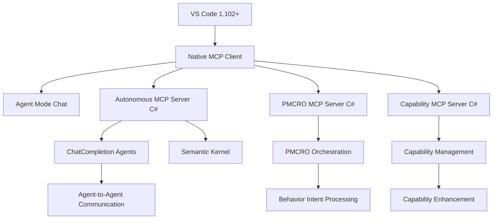

Visual Studio Code

Try MCP servers to extend agent mode in VS Code!

Dismiss this update
Topics 
MCP Servers
Use MCP servers in VS Code
Model Context Protocol (MCP) servers enable you to expand your chat experience in VS Code with extra tools for connecting to databases, invoking APIs, or performing specialized tasks. Model Context Protocol (MCP) is an open standard that enables AI models to interact with external tools and services through a unified interface. This article guides you through setting up MCP servers and using tools with agent mode in Visual Studio Code.

Prerequisites
Install the latest version of Visual Studio Code
Access to Copilot
What is MCP?
Model Context Protocol (MCP) provides a standardized way for AI models to discover and interact with external tools, applications, and data sources. When you enter a chat prompt to a language model with agent mode in VS Code, the model can invoke various tools to perform tasks like file operations, accessing databases, or calling APIs in response to your request.

How does MCP work?
Supported MCP capabilities in VS Code
Finding MCP servers
Enable MCP support in VS Code
Note
MCP support in VS Code is generally available starting from VS Code 1.102, but can be disabled by your organization.

Centrally manage MCP support
You have two options to centrally manage MCP support in your organization:

Device management: Centrally enable or disable MCP support in your organization via group policies or configuration profiles. Learn more about managing VS Code settings with device management.

GitHub Copilot policy: Control the availability of MCP servers in your organization with a GitHub Copilot policy. Learn more about Managing policies and features for Copilot in your enterprise in the GitHub Copilot documentation.

Add an MCP server
You have multiple options to add an MCP server in VS Code:

Direct installation: visit the curated list of MCP servers and select Install on any MCP server to automatically add it to your VS Code instance.
Workspace settings: add a .vscode/mcp.json file in your workspace to configure MCP servers scoped to a workspace.
User settings: specify the server in your user configuration (MCP: Open User Configuration) to enable the MCP server across all workspaces, synchronized via Settings Sync.
Automatic discovery: enable autodiscovery (chat.mcp.discovery.enabled) of MCP servers defined in other tools, such as Claude Desktop.
To view and manage the list of configured MCP servers, run the MCP: Show Installed Servers command from the Command Palette or visit the MCP SERVERS - INSTALLED section in the Extensions view.

When VS Code starts the MCP server for the first time, it discovers the server's capabilities and tools. You can then use these tools in agent mode. VS Code caches the list of tools for an MCP server. To clear the cached tools, use the MCP: Reset Cached Tools command in the Command Palette.

Caution
MCP servers can run arbitrary code on your machine. Only add servers from trusted sources, and review the publisher and server configuration before starting it. VS Code prompts you to confirm that you trust the MCP server when you start an MCP server for the first time.

Add an MCP server to your workspace
To configure an MCP server for a specific workspace, you can create a .vscode/mcp.json file in your workspace folder. This allows you to share the server configuration with project team members.

Important
Make sure to avoid hardcoding sensitive information like API keys and other credentials by using input variables or environment files.

To add an MCP server to your workspace:

Create a .vscode/mcp.json file in your workspace.

Select the Add Server button to add a template for a new server. VS Code provides IntelliSense for the MCP server configuration file.

The following example shows how to configure a Perplexity MCP server, where VS Code prompts you for the API key when the server starts. Learn more about the Configuration format.

{
  // 💡 Inputs are prompted on first server start, then stored securely by VS Code.
  "inputs": [
    {
      "type": "promptString",
      "id": "perplexity-key",
      "description": "Perplexity API Key",
      "password": true
    }
  ],
  "servers": {
    // https://github.com/github/github-mcp-server/
    "Github": {
      "url": "https://api.githubcopilot.com/mcp/"
    },
    // https://github.com/ppl-ai/modelcontextprotocol/
    "Perplexity": {
      "type": "stdio",
      "command": "npx",
      "args": ["-y", "server-perplexity-ask"],
      "env": {
        "PERPLEXITY_API_KEY": "${input:perplexity-key}"
      }
    }
  }
}
Copy
Alternatively, run the MCP: Add Server command from the Command Palette, choose the type of MCP server to add and provide the server information. Next, select Workspace Settings to create the .vscode/mcp.json file in your workspace if it doesn't already exist.

Add an MCP server to your user configuration
To configure an MCP server for all your workspaces, you can add the server configuration to your user configuration. This allows you to reuse the same server configuration across multiple projects.

To add an MCP to your user configuration, run the MCP: Open User Configuration command, which opens the mcp.json file in your user profile. If the file does not exist, VS Code creates it for you.

Alternatively, use the MCP: Add Server command from the Command Palette, provide the server information, and then select Global to add the server configuration to your profile.

When you use multiple VS Code profiles, this allows you to switch between different MCP server configurations based on your active profile. For example, the Playwright MCP server could be configured in a web development profile, but not in a Python development profile.

Dev Container support
MCP servers can be configured in Dev Containers through the devcontainer.json file. This allows you to include MCP server configurations as part of your containerized development environment.

To configure MCP servers in a Dev Container, add the server configuration to the customizations.vscode.mcp section:

{
  "image": "mcr.microsoft.com/devcontainers/typescript-node:latest",
  "customizations": {
    "vscode": {
      "mcp": {
        "servers": {
          "playwright": {
            "command": "npx",
            "args": ["-y", "@microsoft/mcp-server-playwright"]
          }
        }
      }
    }
  }
}
Copy
When the Dev Container is created, VS Code automatically writes the MCP server configurations to the remote mcp.json file, making them available in your containerized development environment.

Automatic discovery of MCP servers
VS Code can automatically detect and reuse MCP servers that you defined in other tools, such as Claude Desktop.

Enable autodiscovery with the chat.mcp.discovery.enabled setting.

Configuration format
Use the following JSON configuration format to define MCP servers.

"servers": {}

Contains the list of MCP servers, and follows Claude Desktop's configuration format.

Specify the server name as the key and provide the server configuration as the value. VS Code shows the server name in the MCP server list. Follow these naming conventions for the server name:

Use camelCase for the server name, such as "uiTesting".
Avoid using whitespace or special characters.
Use a unique name for each server to avoid conflicts.
Use a descriptive name that reflects the server's functionality or brand, such as "github" or "database".
Provide the following fields in the server configuration. You can use predefined variables in the server configuration, for example to refer to the workspace folder (${workspaceFolder}).

Server configuration for `stdio`
Server configuration for `sse` or `http`
"inputs": []

Lets you define custom placeholders for configuration values to avoid hardcoding sensitive information, such as API keys or passwords in the server configuration.

VS Code prompts you for these values when the server starts for the first time, and securely stores them for subsequent use. To avoid showing the typed value, set the password field to true.

Learn more about how to configure input variables in VS Code.

Configuration example
The following code snippet shows an example MCP server configuration that specifies three servers and defines an input placeholder for the API key.

View `.vscode/mcp.json`
Use MCP tools in agent mode
Once you have added an MCP server, you can use the tools it provides in agent mode.

To use MCP tools in agent mode:

Open the Chat view (Ctrl+Alt+I), and select Agent mode from the dropdown.

Agent mode dropdown option

Select the Tools button to view the list of available tools.

Optionally, select or deselect the tools you want to use. You can search tools by typing in the search box.

MCP tools list

Important
A chat request can have a maximum of 128 tools enabled at a time. If you have more than 128 tools selected, reduce the number of tools by deselecting some tools in the tools picker, or ensure that virtual tools are enabled (github.copilot.chat.virtualTools.threshold).

You can now enter a prompt in the chat input box and notice how tools are automatically invoked as needed.

By default, when a tool is invoked, you need to confirm the action before it is run. This is because tools might run locally on your machine and might perform actions that modify files or data.

Use the Continue button dropdown options to automatically confirm the specific tool for the current session, workspace, or all future invocations.

MCP Tool Confirmation

Tip
You can also directly reference a tool in your prompt by typing # followed by the tool name. You can do this in all chat modes (ask, edit, and agent mode).

Optionally, verify and edit the tool input parameters before running the tool.

MCP Tool Input Parameters

Use MCP elicitations
MCP servers can request additional input from you through elicitations. When an MCP server needs more information to complete a task, it can prompt you for specific details, such as confirmations, configuration values, or other parameters required for the operation.

When an MCP server sends an elicitation request, VS Code presents you with a dialog or input field where you can provide the requested information. This allows MCP servers to gather necessary data dynamically without requiring all configuration to be set up in advance.

Use MCP resources
In addition to tools, MCP servers can also provide resources that you can use as context in your chat prompts. For example, a file system MCP server might provide access to files and directories, or a database MCP server might provide access to database tables.

To add a resource from an MCP server to your chat prompt:

In the Chat view, select Add Context > MCP Resources

Select a resource type from the list and provide optional resource input parameters.

Screenshot of the MCP resource Quick Pick, showing resource types provided by the GitHub MCP server.

To view the list of available resources for an MCP server, use the MCP: Browse Resources command or use the MCP: List Servers > Browse Resources command to view resources for a specific server.

MCP tools can return resources as part of their response. You can view or save these resources to your workspace with the Save button or by dragging and dropping the resource to the Explorer view.

Use MCP prompts
MCP servers can provide preconfigured prompts for common tasks, so you don't have to type an elaborate chat prompt. You can directly invoke these prompts in the chat input box by typing / followed by the prompt name, formatted as mcp.servername.promptname. Optionally, the prompt might ask you for additional input parameters.

Screenshot of the Chat view, showing an MCP prompt invocation and a dialog asking for additional input parameters.

Group related tools in a tool set
As you add more MCP servers, the list of tools can become long. This can make it tedious to manage individual tools, for example when you want to define a reusable prompt file or a custom chat mode.

To help you manage tools, you can group related tools into a tool set. A tool set is a collection of individual tools that you can refer to as a single entity. A tool set can contain built-in tools, MCP tools, or tools provided by extensions.

Learn more about how to create and use tool sets in VS Code.

Manage MCP servers
You can manage the list of installed MCP servers from the MCP SERVERS - INSTALLED section in the Extensions view (Ctrl+Shift+X) in VS Code. This dedicated view makes it easy to monitor, configure, and control your installed MCP servers.

Screenshot showing the MCP servers in the Extensions view.

Right-click on an MCP server or select the gear icon to perform the following actions:

Start/Stop/Restart: Start, stop, or restart the MCP server.
Disconnect Account: Disconnect the account for authentication with the MCP server.
Show Output: View the server logs to diagnose issues.
Show Configuration: View the MCP server configuration.
Configure Model Access: Configure which models the MCP server can access (sampling).
Show Sampling Requests: View the sampling requests made by the MCP server.
Browse Resources: View the resources provided by the MCP server.
Uninstall: Uninstall the MCP server from your environment.
Alternatively, run the MCP: List Servers command from the Command Palette to view the list of configured MCP servers. You can then select a server and perform actions on it.

Tip
When you open the .vscode/mcp.json file via MCP: Open Workspace Folder MCP Configuration, VS Code shows commands to start, stop, or restart a server directly from the editor.

MCP server configuration with lenses to manage server.

Automatically start MCP servers
When you add an MCP server or change its configuration, VS Code needs to (re)start the server to discover the tools it provides.

You can manually restart the MCP server from the Chat view, or by using the other start options.

Screenshot showing the Refresh button in the Chat view.

Alternatively, configure VS Code to automatically restart the MCP server when configuration changes are detected by using the chat.mcp.autostart setting (Experimental).

Command-line configuration
You can also use the VS Code command-line interface to add an MCP server to your user profile or to a workspace.

To add an MCP server to your user profile, use the --add-mcp command line option, and provide the JSON server configuration in the form {\"name\":\"server-name\",\"command\":...}.

code --add-mcp "{\"name\":\"my-server\",\"command\": \"uvx\",\"args\": [\"mcp-server-fetch\"]}"
Copy
URL handler
VS Code also includes a URL handler that you can use to install an MCP server. To form the URL, construct an obj object in the same format as you would provide to --add-mcp, and then create the link by using the following logic:

// For Insiders, use `vscode-insiders` instead of `code`
const link = `vscode:mcp/install?${encodeURIComponent(JSON.stringify(obj))}`;
Copy
This link can be used in a browser, or opened on the command line, for example via xdg-open $LINK on Linux.

MCP server trust
MCP servers can run arbitrary code on your machine. Only add servers from trusted sources, and review the publisher and server configuration before starting it.

When you add an MCP server to your workspace or change its configuration, you need to confirm that you trust the server and its capabilities before starting it. VS Code shows a dialog to confirm that you trust the server when you start a server for the first time. Select the link to MCP server in the dialog to review the MCP server configuration in a separate window.

Screenshot showing the MCP server trust prompt.

If you don't trust the server, it is not started, and chat requests will continue without using the tools provided by the server.

You can reset trust for your MCP servers by running the MCP: Reset Trust command from the Command Palette.

Note
If you start the MCP server directly from the mcp.json file, you are not prompted to trust the server configuration.

Synchronize MCP servers across devices
With Settings Sync enabled, you can synchronize settings and configurations across devices, including MCP server configurations. This allows you to maintain a consistent development environment and access the same MCP servers on all your devices.

To enable MCP server synchronization with Settings Sync, run the Settings Sync: Configure command from the Command Palette, and ensure that MCP Servers is included in the list of synchronized configurations.

Troubleshoot and debug MCP servers
MCP output log
When VS Code encounters an issue with an MCP server, it shows an error indicator in the Chat view.

MCP Server Error

Select the error notification in the Chat view, and then select the Show Output option to view the server logs. Alternatively, run MCP: List Servers from the Command Palette, select the server, and then choose Show Output.

MCP Server Error Output

Debug an MCP server
You can enable development mode for MCP servers by adding a dev key to the MCP server configuration. This is an object with two properties:

watch: A file glob pattern to watch for files change that will restart the MCP server.
debug: Enables you to set up a debugger with the MCP server.
{
  "servers": {
    "gistpad": {
      "command": "node",
      "args": ["build/index.js"],
     "dev": {
       "watch": "build/**/*.js",
       "debug": { "type": "node" }
     },
Copy
Note
We currently only support debugging Node.js and Python servers launched with node and python respectively.

Frequently asked questions
Can I control which MCP tools are used?
Yes, you have several options to control which tools are active:

Select the Tools button in the Chat view when in agent mode, and toggle specific tools on/off as needed.
Add specific tools to your prompt by using the Add Context button or by typing #.
For more advanced control, you can use .github/copilot-instructions.md to fine-tune tool usage.
The MCP server is not starting when using Docker
Verify that the command arguments are correct and that the container is not running in detached mode (-d option). You can also check the MCP server output for any error messages (see Troubleshooting).

I'm getting an error that says "Cannot have more than 128 tools per request."
A chat request can have a maximum of 128 tools enabled at a time due to model constrains. If you have more than 128 tools selected, reduce the number of tools by deselecting some tools or whole servers in the tools picker in the Chat view, or ensure that virtual tools are enabled (github.copilot.chat.virtualTools.threshold).

Screenshot showing the Chat view, highlighting the Tools icon in the chat input and showing the tools Quick Pick where you can select which tools are active.

Related resources
VS Code curated list of MCP servers
Model Context Protocol Documentation
Model Context Protocol Server repository
Use agent mode in Visual Studio Code
Was this documentation helpful?
Yes, this page was helpfulNo, this page was not helpful
08/07/2025
RSSRSS Feed
StackoverflowAsk questions
TwitterFollow @code
GitHubRequest features
IssuesReport issues
YouTubeWatch videos
Follow us on X VS Code on Github VS Code on YouTube
Microsoft homepage
Support Privacy Terms of Use License

# VS Code Integration with MCP

The VS Code integration leverages the native MCP support in VS Code 1.102+ to provide seamless integration between the autonomous development system and the development environment. Through C# MCP servers, Semantic Kernel ChatCompletion agents, and agent mode capabilities, developers can access autonomous functionality directly within their workflow.

## Architecture Overview

### MCP-Based Integration



## Workspace Configuration (.vscode/mcp.json)

### Complete Autonomous Development Setup

```json
{
  "inputs": [
    {
      "type": "promptString", 
      "id": "autonomous-config-path",
      "description": "Path to autonomous system configuration",
      "password": false
    },
    {
      "type": "promptString",
      "id": "openai-api-key", 
      "description": "OpenAI API Key for Semantic Kernel",
      "password": true
    }
  ],
  "servers": {
    "AutonomousDevelopment": {
      "type": "stdio",
      "command": "dotnet",
      "args": [
        "run", 
        "--project", 
        "src/ASDS.MCP.AutonomousServer",
        "--configuration", 
        "Release"
      ],
      "env": {
        "DOTNET_ENVIRONMENT": "Development",
        "AUTONOMOUS_CONFIG_PATH": "${input:autonomous-config-path}",
        "OPENAI_API_KEY": "${input:openai-api-key}",
        "SEMANTIC_KERNEL_LOG_LEVEL": "Information"
      },
      "dev": {
        "watch": "src/**/*.cs",
        "debug": { "type": "coreclr" }
      }
    },
    "PMCROOrchestrator": {
      "type": "stdio",
      "command": "dotnet", 
      "args": ["run", "--project", "src/ASDS.MCP.PMCROServer"],
      "env": {
        "PMCRO_MAX_ITERATIONS": "5",
        "PMCRO_AGENT_TIMEOUT": "300"
      }
    },
    "CapabilityManager": {
      "type": "stdio",
      "command": "dotnet",
      "args": ["run", "--project", "src/ASDS.MCP.CapabilityServer"], 
      "env": {
        "CAPABILITY_STORE_PATH": "${workspaceFolder}/.autonomous/capabilities",
        "EVOLUTION_ENABLED": "true"
      }
    },
    "ThoughtTransfer": {
      "type": "stdio",
      "command": "dotnet",
      "args": ["run", "--project", "src/ASDS.MCP.ThoughtServer"],
      "env": {
        "CONTEXT_RETENTION_HOURS": "24",
        "COMPRESSION_ENABLED": "true"
      }
    }
  }
}
```
```

## Agent Mode Integration

### Using VS Code Agent Mode with MCP Tools

With VS Code 1.102+ agent mode, autonomous development capabilities become available directly in the chat interface:

#### 1. Activate Agent Mode
- Open Chat View (`Ctrl+Alt+I`)
- Select **Agent mode** from dropdown
- Click **Tools** button to manage available tools

#### 2. Available Autonomous Tools

**Agent Management:**
- `ExecuteChatCompletionAgent` - Run Semantic Kernel ChatCompletion agents
- `SpawnSpecializedAgent` - Create task-specific agents
- `TransferThoughtContext` - Share context between agents

**PMCRO Processing:**
- `ExecutePMCROCycle` - Complete behavior intent processing
- `ExecutePMCROPhase` - Run individual PMCRO phases

**Capability Management:**
- `AnalyzeSystemCapabilities` - System analysis and enhancement
- `GenerateCapability` - Create new capabilities from gaps
- `CommunicateWithMCPServer` - Inter-server communication

#### 3. Tool Selection and Virtual Tools

VS Code automatically manages tool selection with a maximum of 128 tools per request. Virtual tools (`github.copilot.chat.virtualTools.threshold`) help manage large tool sets.

#### 4. Example Agent Mode Usage

```
User: "Analyze the current codebase and create a specialized agent to optimize the database access patterns"

VS Code Agent Mode:
🔧 Using tool: AnalyzeSystemCapabilities
   - focusArea: "database access patterns"

🔧 Using tool: ExecuteChatCompletionAgent  
   - agentName: "DatabaseOptimizer"
   - taskDescription: "Analyze database access patterns and suggest optimizations"
   - agentType: "Specialized"

🔧 Using tool: ExecutePMCROCycle
   - behaviorIntent: "Optimize database access patterns based on analysis"
   - context: "{\"analysisResults\": \"...\"}"

Result: Created specialized DatabaseOptimizer agent and executed PMCRO cycle for database optimization with 3 enhancement opportunities identified.
```

## MCP Resources and Prompts

### Accessing System Resources

```typescript
// VS Code can access MCP resources for system monitoring
await vscode.commands.executeCommand('mcp.browseResources', {
    serverId: 'AutonomousDevelopment',
    resourceType: 'system-state'
});
```

### Using MCP Prompts

```typescript
// Access autonomous prompt templates
await vscode.commands.executeCommand('mcp.invokePrompt', {
    serverId: 'AutonomousDevelopment', 
    promptName: 'PMCROAnalysisPrompt',
    parameters: {
        behaviorIntent: 'Improve code quality',
        depth: 3,
        focusAreas: 'structure,dependencies,patterns'
    }
});
```

## Command Integration

### VS Code Commands for MCP Tools

```typescript
// Register VS Code commands that invoke MCP tools
export function registerMCPCommands(context: vscode.ExtensionContext) {
    
    // Execute PMCRO Cycle
    const pmcroCommand = vscode.commands.registerCommand(
        'autonomous.pmcro.execute',
        async () => {
            const behaviorIntent = await vscode.window.showInputBox({
                prompt: 'Enter behavior intent for PMCRO analysis',
                placeHolder: 'e.g., Optimize application performance'
            });
            
            if (!behaviorIntent) return;
            
            // Invoke MCP tool through agent mode
            await vscode.commands.executeCommand('mcp.callTool', {
                serverId: 'AutonomousDevelopment',
                toolName: 'ExecutePMCROCycle',
                arguments: {
                    behaviorIntent,
                    context: JSON.stringify({
                        workspace: vscode.workspace.workspaceFolders?.[0]?.uri.fsPath,
                        activeFile: vscode.window.activeTextEditor?.document.fileName
                    })
                }
            });
        }
    );
    
    // Spawn Specialized Agent
    const spawnAgentCommand = vscode.commands.registerCommand(
        'autonomous.agent.spawn',
        async () => {
            const agentType = await vscode.window.showQuickPick([
                'ChatCompletion',
                'Specialized', 
                'Process',
                'Plugin'
            ], {
                title: 'Select agent type to spawn'
            });
            
            if (!agentType) return;
            
            const taskDescription = await vscode.window.showInputBox({
                prompt: 'Describe the task for the new agent',
                placeHolder: 'e.g., Analyze code quality and suggest improvements'
            });
            
            if (!taskDescription) return;
            
            await vscode.commands.executeCommand('mcp.callTool', {
                serverId: 'AutonomousDevelopment',
                toolName: 'SpawnSpecializedAgent',
                arguments: {
                    parentAgentName: 'VSCodeOrchestrator',
                    subtaskDescription: taskDescription,
                    specializationType: agentType
                }
            });
        }
    );
    
    context.subscriptions.push(pmcroCommand, spawnAgentCommand);
}
```

## Webview Provider

### Autonomous System Webview

```typescript
// src/webview/provider.ts
import * as vscode from 'vscode';
import { PatternDetectionService } from '../services/pattern-detection';
import { CapabilityEnhancementService } from '../services/capability-enhancement';

export class AutonomousWebviewProvider implements vscode.WebviewViewProvider {
    public static readonly viewType = 'autonomousSystemView';
    
    private _view?: vscode.WebviewView;
    
    constructor(
        private readonly context: vscode.ExtensionContext,
        private readonly patternService: PatternDetectionService,
        private readonly capabilityService: CapabilityEnhancementService
    ) {}
    
    public resolveWebviewView(
        webviewView: vscode.WebviewView,
        context: vscode.WebviewViewResolveContext,
        token: vscode.CancellationToken
    ) {
        this._view = webviewView;
        
        webviewView.webview.options = {
            enableScripts: true,
            localResourceRoots: [
                this.context.extensionUri
            ]
        };
        
        webviewView.webview.html = this.getHtmlForWebview(webviewView.webview);
        
        // Handle messages from webview
        webviewView.webview.onDidReceiveMessage(async (data) => {
            await this.handleWebviewMessage(data);
        });
        
        // Initialize webview data
        this.updateWebviewData();
    }
    
    private async handleWebviewMessage(message: any) {
        switch (message.type) {
            case 'analyzePlanarStructure':
                await this.handlePlanarAnalysis(message.data);
                break;
                
            case 'synthesizeCapabilities':
                await this.handleCapabilitySynthesis(message.data);
                break;
                
            case 'detectPatterns':
                await this.handlePatternDetection(message.data);
                break;
                
            case 'enhanceCode':
                await this.handleCodeEnhancement(message.data);
                break;
                
            case 'runPMCROCycle':
                await this.handlePMCROCycle(message.data);
                break;
                
            case 'getSystemStatus':
                await this.sendSystemStatus();
                break;
        }
    }
    
    private async handlePlanarAnalysis(data: any) {
        try {
            const analysisResult = await this.patternService.performPlanarAnalysis(
                data.target,
                data.depth,
                data.focusAreas
            );
            
            this._view?.webview.postMessage({
                type: 'planarAnalysisResult',
                data: analysisResult
            });
            
        } catch (error) {
            this.sendError('Planar analysis failed', error);
        }
    }
    
    private async handleCapabilitySynthesis(data: any) {
        try {
            const synthesisResult = await this.capabilityService.synthesizeCapabilities(
                data.sourceCapabilities,
                data.synthesisGoals,
                data.constraints
            );
            
            this._view?.webview.postMessage({
                type: 'capabilitySynthesisResult',
                data: synthesisResult
            });
            
        } catch (error) {
            this.sendError('Capability synthesis failed', error);
        }
    }
    
    private async handlePatternDetection(data: any) {
        try {
            const patterns = await this.patternService.detectEmergentPatterns(
                data.analysisTarget,
                data.sensitivity,
                data.patternTypes
            );
            
            this._view?.webview.postMessage({
                type: 'patternsDetected',
                data: patterns
            });
            
        } catch (error) {
            this.sendError('Pattern detection failed', error);
        }
    }
    
    private async handleCodeEnhancement(data: any) {
        try {
            const editor = vscode.window.activeTextEditor;
            if (!editor) {
                throw new Error('No active editor');
            }
            
            const enhancementResult = await this.capabilityService.enhanceCode(
                editor.document,
                data.enhancementType,
                data.options
            );
            
            // Apply enhancements to the editor
            await editor.edit(editBuilder => {
                for (const edit of enhancementResult.edits) {
                    if (edit.type === 'replace') {
                        editBuilder.replace(new vscode.Range(
                            edit.range.start.line,
                            edit.range.start.character,
                            edit.range.end.line,
                            edit.range.end.character
                        ), edit.newText);
                    } else if (edit.type === 'insert') {
                        editBuilder.insert(new vscode.Position(
                            edit.position.line,
                            edit.position.character
                        ), edit.text);
                    }
                }
            });
            
            this._view?.webview.postMessage({
                type: 'codeEnhancementApplied',
                data: enhancementResult
            });
            
        } catch (error) {
            this.sendError('Code enhancement failed', error);
        }
    }
    
    private async handlePMCROCycle(data: any) {
        try {
            const cycleResult = await this.executePMCROCycle(
                data.behaviorIntent,
                data.context
            );
            
            this._view?.webview.postMessage({
                type: 'pmcroCycleResult',
                data: cycleResult
            });
            
        } catch (error) {
            this.sendError('PMCRO cycle failed', error);
        }
    }
    
    private async executePMCROCycle(behaviorIntent: string, context: any) {
        // Implementation would integrate with the PMCRO engine
        // This is a simplified example
        return {
            behaviorIntent,
            context,
            phases: {
                plan: await this.patternService.performPlanarAnalysis(behaviorIntent, 3, []),
                make: { status: 'completed', artifacts: [] },
                check: { status: 'validated', results: [] },
                reflect: { insights: [], patterns: [] },
                optimize: { enhancements: [], performance: {} }
            },
            success: true,
            metrics: {
                duration: '00:05:30',
                patternsDetected: 15,
                enhancementsApplied: 3
            }
        };
    }
    
    private async sendSystemStatus() {
        const status = {
            systemHealth: 'operational',
            activePatterns: await this.patternService.getActivePatterns(),
            capabilities: await this.capabilityService.getAvailableCapabilities(),
            performance: {
                analysisSpeed: '1.2s avg',
                enhancementSuccess: '94%',
                patternAccuracy: '89%'
            },
            recentActivity: await this.getRecentActivity()
        };
        
        this._view?.webview.postMessage({
            type: 'systemStatus',
            data: status
        });
    }
    
    private sendError(message: string, error: any) {
        this._view?.webview.postMessage({
            type: 'error',
            data: {
                message,
                error: error.message,
                stack: error.stack
            }
        });
    }
    
    private async updateWebviewData() {
        if (this._view) {
            await this.sendSystemStatus();
        }
    }
    
    private getHtmlForWebview(webview: vscode.Webview): string {
        const scriptUri = webview.asWebviewUri(
            vscode.Uri.joinPath(this.context.extensionUri, 'media', 'main.js')
        );
        const styleUri = webview.asWebviewUri(
            vscode.Uri.joinPath(this.context.extensionUri, 'media', 'main.css')
        );
        
        return `<!DOCTYPE html>
        <html lang="en">
        <head>
            <meta charset="UTF-8">
            <meta name="viewport" content="width=device-width, initial-scale=1.0">
            <link href="${styleUri}" rel="stylesheet">
            <title>Autonomous Development System</title>
        </head>
        <body>
            <div class="container">
                <div class="header">
                    <h1>Autonomous Development System</h1>
                    <div class="status-indicator" id="statusIndicator">●</div>
                </div>
                
                <div class="section">
                    <h2>System Status</h2>
                    <div id="systemStatus" class="status-grid">
                        <div class="status-item">
                            <span class="label">Health:</span>
                            <span class="value" id="systemHealth">Loading...</span>
                        </div>
                        <div class="status-item">
                            <span class="label">Active Patterns:</span>
                            <span class="value" id="activePatterns">0</span>
                        </div>
                        <div class="status-item">
                            <span class="label">Capabilities:</span>
                            <span class="value" id="capabilityCount">0</span>
                        </div>
                    </div>
                </div>
                
                <div class="section">
                    <h2>Quick Actions</h2>
                    <div class="action-grid">
                        <button class="action-btn" onclick="analyzePlanarStructure()">
                            📊 Planar Analysis
                        </button>
                        <button class="action-btn" onclick="detectPatterns()">
                            🔍 Detect Patterns
                        </button>
                        <button class="action-btn" onclick="synthesizeCapabilities()">
                            🧬 Synthesize Capabilities
                        </button>
                        <button class="action-btn" onclick="enhanceCode()">
                            ⚡ Enhance Code
                        </button>
                        <button class="action-btn" onclick="runPMCROCycle()">
                            🔄 Run PMCRO Cycle
                        </button>
                    </div>
                </div>
                
                <div class="section">
                    <h2>Pattern Visualization</h2>
                    <div id="patternViz" class="pattern-container">
                        <div class="pattern-placeholder">
                            No patterns detected yet
                        </div>
                    </div>
                </div>
                
                <div class="section">
                    <h2>Recent Activity</h2>
                    <div id="recentActivity" class="activity-log">
                        <div class="activity-item">
                            System initialized
                        </div>
                    </div>
                </div>
                
                <div class="section">
                    <h2>Performance Metrics</h2>
                    <div id="performanceMetrics" class="metrics-grid">
                        <div class="metric-item">
                            <span class="metric-label">Analysis Speed:</span>
                            <span class="metric-value" id="analysisSpeed">--</span>
                        </div>
                        <div class="metric-item">
                            <span class="metric-label">Enhancement Success:</span>
                            <span class="metric-value" id="enhancementSuccess">--</span>
                        </div>
                        <div class="metric-item">
                            <span class="metric-label">Pattern Accuracy:</span>
                            <span class="metric-value" id="patternAccuracy">--</span>
                        </div>
                    </div>
                </div>
            </div>
            
            <script src="${scriptUri}"></script>
        </body>
        </html>`;
    }
    
    private async getRecentActivity(): Promise<string[]> {
        // Implementation would track recent system activities
        return [
            'Planar analysis completed on main.ts',
            'Enhancement applied to UserService.cs',
            'Emergent pattern detected in data flow',
            'Capability synthesis successful',
            'Performance optimization suggested'
        ];
    }
}
```

## Command Handler

### Command Processing

```typescript
// src/commands/handler.ts
import * as vscode from 'vscode';
import { AutonomousLanguageServer } from '../language-server/server';
import { AutonomousWebviewProvider } from '../webview/provider';
import { PatternDetectionService } from '../services/pattern-detection';
import { CapabilityEnhancementService } from '../services/capability-enhancement';

export class AutonomousCommandHandler {
    constructor(
        private context: vscode.ExtensionContext,
        private languageServer: AutonomousLanguageServer,
        private webviewProvider: AutonomousWebviewProvider,
        private patternService: PatternDetectionService,
        private capabilityService: CapabilityEnhancementService
    ) {}
    
    async handleCommand(command: string, ...args: any[]): Promise<any> {
        try {
            switch (command) {
                case 'autonomousSystem.analyzePlanarStructure':
                    return await this.handleAnalyzePlanarStructure(...args);
                    
                case 'autonomousSystem.synthesizeCapabilities':
                    return await this.handleSynthesizeCapabilities(...args);
                    
                case 'autonomousSystem.detectEmergentPatterns':
                    return await this.handleDetectEmergentPatterns(...args);
                    
                case 'autonomousSystem.enhanceCode':
                    return await this.handleEnhanceCode(...args);
                    
                case 'autonomousSystem.generateCapability':
                    return await this.handleGenerateCapability(...args);
                    
                case 'autonomousSystem.optimizePerformance':
                    return await this.handleOptimizePerformance(...args);
                    
                case 'autonomousSystem.showSystemView':
                    return await this.handleShowSystemView(...args);
                    
                case 'autonomousSystem.runPMCROCycle':
                    return await this.handleRunPMCROCycle(...args);
                    
                default:
                    throw new Error(`Unknown command: ${command}`);
            }
        } catch (error) {
            vscode.window.showErrorMessage(`Command failed: ${error.message}`);
            console.error(`Error executing command ${command}:`, error);
        }
    }
    
    private async handleAnalyzePlanarStructure(uri?: vscode.Uri): Promise<void> {
        const editor = vscode.window.activeTextEditor;
        if (!editor && !uri) {
            vscode.window.showErrorMessage('No active editor or file selected');
            return;
        }
        
        const document = uri ? await vscode.workspace.openTextDocument(uri) : editor!.document;
        
        // Show progress
        await vscode.window.withProgress({
            location: vscode.ProgressLocation.Notification,
            title: "Analyzing Planar Structure",
            cancellable: true
        }, async (progress, token) => {
            progress.report({ increment: 0, message: "Initializing analysis..." });
            
            try {
                const analysisResult = await this.patternService.performPlanarAnalysis(
                    document.getText(),
                    3,
                    ['structure', 'dependencies', 'patterns']
                );
                
                progress.report({ increment: 50, message: "Processing results..." });
                
                // Show results in webview
                await this.showAnalysisResults('Planar Structure Analysis', analysisResult);
                
                progress.report({ increment: 100, message: "Analysis complete" });
                
                vscode.window.showInformationMessage(
                    `Planar analysis completed. Found ${analysisResult.planes?.length || 0} planes with ${analysisResult.patterns?.length || 0} patterns.`
                );
                
            } catch (error) {
                throw new Error(`Planar analysis failed: ${error.message}`);
            }
        });
    }
    
    private async handleSynthesizeCapabilities(): Promise<void> {
        // Get capability selection from user
        const availableCapabilities = await this.capabilityService.getAvailableCapabilities();
        
        const selectedCapabilities = await vscode.window.showQuickPick(
            availableCapabilities.map(cap => ({
                label: cap.name,
                description: cap.description,
                picked: false,
                capability: cap
            })),
            {
                canPickMany: true,
                title: 'Select capabilities to synthesize',
                placeHolder: 'Choose 2 or more capabilities to synthesize'
            }
        );
        
        if (!selectedCapabilities || selectedCapabilities.length < 2) {
            vscode.window.showWarningMessage('Please select at least 2 capabilities to synthesize');
            return;
        }
        
        // Get synthesis goals
        const synthesisGoals = await vscode.window.showInputBox({
            prompt: 'Enter synthesis goals',
            placeHolder: 'e.g., performance optimization, enhanced functionality',
            value: 'performance,reliability,flexibility'
        });
        
        if (!synthesisGoals) {
            return;
        }
        
        await vscode.window.withProgress({
            location: vscode.ProgressLocation.Notification,
            title: "Synthesizing Capabilities",
            cancellable: false
        }, async (progress) => {
            progress.report({ increment: 0, message: "Analyzing synthesis potential..." });
            
            const synthesisResult = await this.capabilityService.synthesizeCapabilities(
                selectedCapabilities.map(sc => sc.capability.id),
                synthesisGoals,
                {}
            );
            
            progress.report({ increment: 50, message: "Generating synthesized capability..." });
            
            // Show synthesis results
            await this.showSynthesisResults(synthesisResult);
            
            progress.report({ increment: 100, message: "Synthesis complete" });
            
            vscode.window.showInformationMessage(
                `Capability synthesis completed: ${synthesisResult.synthesizedCapability?.name || 'New Capability'}`
            );
        });
    }
    
    private async handleDetectEmergentPatterns(uri?: vscode.Uri): Promise<void> {
        const analysisTarget = uri ? 
            (await vscode.workspace.openTextDocument(uri)).getText() :
            vscode.window.activeTextEditor?.document.getText();
            
        if (!analysisTarget) {
            vscode.window.showErrorMessage('No code to analyze');
            return;
        }
        
        await vscode.window.withProgress({
            location: vscode.ProgressLocation.Notification,
            title: "Detecting Emergent Patterns",
            cancellable: true
        }, async (progress, token) => {
            progress.report({ increment: 0, message: "Initializing pattern detection..." });
            
            const patterns = await this.patternService.detectEmergentPatterns(
                analysisTarget,
                0.5, // sensitivity
                ['emergent', 'optimization', 'strange_loop']
            );
            
            progress.report({ increment: 100, message: "Pattern detection complete" });
            
            // Show pattern results
            await this.showPatternResults(patterns);
            
            vscode.window.showInformationMessage(
                `Pattern detection completed. Found ${patterns.length} emergent patterns.`
            );
        });
    }
    
    private async handleEnhanceCode(): Promise<void> {
        const editor = vscode.window.activeTextEditor;
        if (!editor) {
            vscode.window.showErrorMessage('No active editor');
            return;
        }
        
        const selection = editor.selection;
        const selectedText = editor.document.getText(selection);
        
        if (!selectedText) {
            vscode.window.showWarningMessage('Please select code to enhance');
            return;
        }
        
        // Get enhancement type
        const enhancementType = await vscode.window.showQuickPick([
            { label: 'Performance', value: 'performance' },
            { label: 'Readability', value: 'readability' },
            { label: 'Maintainability', value: 'maintainability' },
            { label: 'Security', value: 'security' },
            { label: 'Capability', value: 'capability' }
        ], {
            title: 'Select enhancement type',
            placeHolder: 'Choose the type of enhancement to apply'
        });
        
        if (!enhancementType) {
            return;
        }
        
        await vscode.window.withProgress({
            location: vscode.ProgressLocation.Notification,
            title: "Enhancing Code",
            cancellable: false
        }, async (progress) => {
            progress.report({ increment: 0, message: "Analyzing code for enhancement..." });
            
            const enhancementResult = await this.capabilityService.enhanceCode(
                editor.document,
                enhancementType.value,
                { selection: selection }
            );
            
            progress.report({ increment: 50, message: "Applying enhancements..." });
            
            // Apply enhancements
            await editor.edit(editBuilder => {
                editBuilder.replace(selection, enhancementResult.enhancedCode);
            });
            
            progress.report({ increment: 100, message: "Enhancement complete" });
            
            vscode.window.showInformationMessage(
                `Code enhancement applied: ${enhancementResult.description}`
            );
        });
    }
    
    private async handleRunPMCROCycle(): Promise<void> {
        // Get behavior intent from user
        const behaviorIntent = await vscode.window.showInputBox({
            prompt: 'Enter behavior intent for PMCRO cycle',
            placeHolder: 'e.g., Optimize database query performance',
            validateInput: (value) => {
                return value.trim().length < 10 ? 'Please provide a more detailed behavior intent' : null;
            }
        });
        
        if (!behaviorIntent) {
            return;
        }
        
        await vscode.window.withProgress({
            location: vscode.ProgressLocation.Notification,
            title: "Executing PMCRO Cycle",
            cancellable: false
        }, async (progress) => {
            progress.report({ increment: 0, message: "Plan: Analyzing behavior intent..." });
            
            // Simulate PMCRO cycle execution
            await new Promise(resolve => setTimeout(resolve, 1000));
            progress.report({ increment: 20, message: "Make: Implementing solution..." });
            
            await new Promise(resolve => setTimeout(resolve, 1500));
            progress.report({ increment: 40, message: "Check: Validating results..." });
            
            await new Promise(resolve => setTimeout(resolve, 1000));
            progress.report({ increment: 60, message: "Reflect: Analyzing performance..." });
            
            await new Promise(resolve => setTimeout(resolve, 1200));
            progress.report({ increment: 80, message: "Optimize: Applying enhancements..." });
            
            await new Promise(resolve => setTimeout(resolve, 800));
            progress.report({ increment: 100, message: "PMCRO cycle complete" });
            
            vscode.window.showInformationMessage(
                `PMCRO cycle completed successfully for: ${behaviorIntent}`
            );
        });
    }
    
    private async showAnalysisResults(title: string, results: any): Promise<void> {
        // Implementation would show results in a new editor or webview
        const document = await vscode.workspace.openTextDocument({
            content: JSON.stringify(results, null, 2),
            language: 'json'
        });
        
        await vscode.window.showTextDocument(document);
    }
    
    private async showSynthesisResults(results: any): Promise<void> {
        // Implementation would show synthesis results
        const document = await vscode.workspace.openTextDocument({
            content: JSON.stringify(results, null, 2),
            language: 'json'
        });
        
        await vscode.window.showTextDocument(document);
    }
    
    private async showPatternResults(patterns: any[]): Promise<void> {
        // Implementation would show pattern results
        const content = patterns.map(p => 
            `Pattern: ${p.type}\nDescription: ${p.description}\nSignificance: ${p.significance}\n---\n`
        ).join('\n');
        
        const document = await vscode.workspace.openTextDocument({
            content,
            language: 'plaintext'
        });
        
        await vscode.window.showTextDocument(document);
    }
}
```

## Pattern Detection Service

### Real-time Pattern Detection

```typescript
// src/services/pattern-detection.ts
import * as vscode from 'vscode';
import { TextDocument, TextDocumentChangeEvent } from 'vscode';

export class PatternDetectionService {
    private activePatterns: Map<string, EmergentPattern[]> = new Map();
    private patternHistory: EmergentPattern[] = [];
    
    constructor(private context: vscode.ExtensionContext) {}
    
    async analyzeDocument(document: TextDocument): Promise<DocumentAnalysisResult> {
        const content = document.getText();
        
        // Analyze for various patterns
        const structuralPatterns = await this.detectStructuralPatterns(content);
        const behavioralPatterns = await this.detectBehavioralPatterns(content);
        const emergentPatterns = await this.detectEmergentPatterns(content);
        
        // Identify enhancement opportunities
        const enhancementOpportunities = await this.identifyEnhancementOpportunities(
            content,
            [...structuralPatterns, ...behavioralPatterns, ...emergentPatterns]
        );
        
        // Detect potential issues
        const detectedIssues = await this.detectPotentialIssues(content);
        
        return {
            structuralPatterns,
            behavioralPatterns,
            emergentPatterns,
            enhancementOpportunities,
            detectedIssues
        };
    }
    
    async analyzeDocumentChanges(
        document: TextDocument,
        changes: readonly vscode.TextDocumentContentChangeEvent[]
    ): Promise<void> {
        for (const change of changes) {
            // Analyze the specific change for immediate pattern detection
            await this.analyzeChange(document, change);
        }
    }
    
    async detectRealTimePatterns(document: TextDocument): Promise<EmergentPattern[]> {
        const content = document.getText();
        const patterns: EmergentPattern[] = [];
        
        // Detect strange loop formations
        const strangeLoops = await this.detectStrangeLoops(content);
        patterns.push(...strangeLoops);
        
        // Detect self-referential patterns
        const selfRefPatterns = await this.detectSelfReferentialPatterns(content);
        patterns.push(...selfRefPatterns);
        
        // Detect capability emergence
        const capabilityPatterns = await this.detectCapabilityEmergence(content);
        patterns.push(...capabilityPatterns);
        
        // Store patterns for tracking
        this.activePatterns.set(document.uri.toString(), patterns);
        this.patternHistory.push(...patterns);
        
        return patterns;
    }
    
    async performPlanarAnalysis(
        target: string,
        depth: number,
        focusAreas: string[]
    ): Promise<PlanarAnalysisResult> {
        // Decompose target into planar structure
        const planes = await this.decomposeToPlanarStructure(target, depth);
        
        // Analyze relationships between planes
        const relationships = await this.analyzePlanarRelationships(planes);
        
        // Detect patterns within and across planes
        const patterns = await this.analyzePlanarPatterns(planes, relationships);
        
        // Generate enhancement opportunities
        const enhancements = await this.generatePlanarEnhancements(
            planes,
            patterns,
            focusAreas
        );
        
        return {
            target,
            depth,
            focusAreas,
            planes,
            relationships,
            patterns,
            enhancements
        };
    }
    
    private async detectStructuralPatterns(content: string): Promise<StructuralPattern[]> {
        const patterns: StructuralPattern[] = [];
        
        // Detect class hierarchy patterns
        const classHierarchyPattern = this.detectClassHierarchy(content);
        if (classHierarchyPattern) {
            patterns.push(classHierarchyPattern);
        }
        
        // Detect dependency injection patterns
        const diPatterns = this.detectDependencyInjection(content);
        patterns.push(...diPatterns);
        
        // Detect architectural patterns (MVC, Repository, etc.)
        const architecturalPatterns = this.detectArchitecturalPatterns(content);
        patterns.push(...architecturalPatterns);
        
        return patterns;
    }
    
    private async detectBehavioralPatterns(content: string): Promise<BehavioralPattern[]> {
        const patterns: BehavioralPattern[] = [];
        
        // Detect event handling patterns
        const eventPatterns = this.detectEventPatterns(content);
        patterns.push(...eventPatterns);
        
        // Detect state management patterns
        const statePatterns = this.detectStateManagementPatterns(content);
        patterns.push(...statePatterns);
        
        // Detect workflow patterns
        const workflowPatterns = this.detectWorkflowPatterns(content);
        patterns.push(...workflowPatterns);
        
        return patterns;
    }
    
    async detectEmergentPatterns(
        content: string,
        sensitivity: number = 0.5,
        patternTypes: string[] = []
    ): Promise<EmergentPattern[]> {
        const patterns: EmergentPattern[] = [];
        
        // Configure detection based on sensitivity
        const detectionConfig = {
            sensitivity,
            focusTypes: patternTypes.length > 0 ? patternTypes : [
                'emergent', 'optimization', 'strange_loop', 'self_reference'
            ]
        };
        
        // Detect various emergent patterns based on configuration
        if (detectionConfig.focusTypes.includes('emergent')) {
            const emergent = await this.detectEmergentCapabilities(content, sensitivity);
            patterns.push(...emergent);
        }
        
        if (detectionConfig.focusTypes.includes('optimization')) {
            const optimization = await this.detectOptimizationPatterns(content, sensitivity);
            patterns.push(...optimization);
        }
        
        if (detectionConfig.focusTypes.includes('strange_loop')) {
            const strangeLoops = await this.detectStrangeLoops(content);
            patterns.push(...strangeLoops);
        }
        
        if (detectionConfig.focusTypes.includes('self_reference')) {
            const selfRef = await this.detectSelfReferentialPatterns(content);
            patterns.push(...selfRef);
        }
        
        return patterns;
    }
    
    async getActivePatterns(): Promise<EmergentPattern[]> {
        const allPatterns: EmergentPattern[] = [];
        for (const patterns of this.activePatterns.values()) {
            allPatterns.push(...patterns);
        }
        return allPatterns;
    }
    
    // Additional helper methods would be implemented here
    private detectClassHierarchy(content: string): StructuralPattern | null {
        // Implementation for detecting class hierarchy patterns
        return null;
    }
    
    private detectDependencyInjection(content: string): StructuralPattern[] {
        // Implementation for detecting DI patterns
        return [];
    }
    
    private detectArchitecturalPatterns(content: string): StructuralPattern[] {
        // Implementation for detecting architectural patterns
        return [];
    }
    
    private detectEventPatterns(content: string): BehavioralPattern[] {
        // Implementation for detecting event patterns
        return [];
    }
    
    private detectStateManagementPatterns(content: string): BehavioralPattern[] {
        // Implementation for detecting state management patterns
        return [];
    }
    
    private detectWorkflowPatterns(content: string): BehavioralPattern[] {
        // Implementation for detecting workflow patterns
        return [];
    }
    
    private async detectEmergentCapabilities(content: string, sensitivity: number): Promise<EmergentPattern[]> {
        // Implementation for detecting emergent capabilities
        return [];
    }
    
    private async detectOptimizationPatterns(content: string, sensitivity: number): Promise<EmergentPattern[]> {
        // Implementation for detecting optimization patterns
        return [];
    }
    
    private async detectStrangeLoops(content: string): Promise<EmergentPattern[]> {
        // Implementation for detecting strange loop patterns
        return [];
    }
    
    private async detectSelfReferentialPatterns(content: string): Promise<EmergentPattern[]> {
        // Implementation for detecting self-referential patterns
        return [];
    }
    
    private async detectCapabilityEmergence(content: string): Promise<EmergentPattern[]> {
        // Implementation for detecting capability emergence
        return [];
    }
    
    private async analyzeChange(document: TextDocument, change: vscode.TextDocumentContentChangeEvent): Promise<void> {
        // Implementation for analyzing individual changes
    }
    
    private async decomposeToPlanarStructure(target: string, depth: number): Promise<PlanarPlane[]> {
        // Implementation for planar decomposition
        return [];
    }
    
    private async analyzePlanarRelationships(planes: PlanarPlane[]): Promise<PlanarRelationship[]> {
        // Implementation for analyzing planar relationships
        return [];
    }
    
    private async analyzePlanarPatterns(planes: PlanarPlane[], relationships: PlanarRelationship[]): Promise<EmergentPattern[]> {
        // Implementation for analyzing patterns within planar structure
        return [];
    }
    
    private async generatePlanarEnhancements(
        planes: PlanarPlane[],
        patterns: EmergentPattern[],
        focusAreas: string[]
    ): Promise<EnhancementOpportunity[]> {
        // Implementation for generating enhancement opportunities
        return [];
    }
    
    private async identifyEnhancementOpportunities(
        content: string,
        patterns: (StructuralPattern | BehavioralPattern | EmergentPattern)[]
    ): Promise<EnhancementOpportunity[]> {
        // Implementation for identifying enhancement opportunities
        return [];
    }
    
    private async detectPotentialIssues(content: string): Promise<DetectedIssue[]> {
        // Implementation for detecting potential issues
        return [];
    }
}

// Type definitions
interface EmergentPattern {
    type: string;
    description: string;
    significance: number;
    location: vscode.Range;
    metadata: any;
}

interface StructuralPattern {
    type: string;
    description: string;
    location: vscode.Range;
    components: string[];
}

interface BehavioralPattern {
    type: string;
    description: string;
    location: vscode.Range;
    behavior: string;
}

interface DocumentAnalysisResult {
    structuralPatterns: StructuralPattern[];
    behavioralPatterns: BehavioralPattern[];
    emergentPatterns: EmergentPattern[];
    enhancementOpportunities: EnhancementOpportunity[];
    detectedIssues: DetectedIssue[];
}

interface PlanarAnalysisResult {
    target: string;
    depth: number;
    focusAreas: string[];
    planes: PlanarPlane[];
    relationships: PlanarRelationship[];
    patterns: EmergentPattern[];
    enhancements: EnhancementOpportunity[];
}

interface PlanarPlane {
    id: string;
    level: number;
    components: string[];
    description: string;
}

interface PlanarRelationship {
    sourceId: string;
    targetId: string;
    type: string;
    strength: number;
}

interface EnhancementOpportunity {
    type: string;
    description: string;
    range: vscode.Range;
    impact: 'low' | 'medium' | 'high';
    effort: 'low' | 'medium' | 'high';
}

interface DetectedIssue {
    severity: 'error' | 'warning' | 'info' | 'hint';
    message: string;
    code: string;
    range: any;
    relatedInformation?: any[];
}
```

## Package Configuration

### Extension Manifest

```json
{
    "name": "autonomous-development-system",
    "displayName": "Autonomous Development System",
    "description": "AI-powered autonomous development with emergent pattern detection and capability enhancement",
    "version": "1.0.0",
    "publisher": "autonomous-systems",
    "engines": {
        "vscode": "^1.85.0"
    },
    "categories": [
        "Other",
        "Machine Learning",
        "Debuggers",
        "Programming Languages"
    ],
    "keywords": [
        "ai",
        "autonomous",
        "pattern-detection",
        "code-enhancement",
        "semantic-kernel",
        "pmcro"
    ],
    "activationEvents": [
        "onLanguage:csharp",
        "onLanguage:typescript",
        "onLanguage:javascript",
        "onCommand:autonomousSystem.showSystemView"
    ],
    "main": "./out/extension.js",
    "contributes": {
        "commands": [
            {
                "command": "autonomousSystem.analyzePlanarStructure",
                "title": "Analyze Planar Structure",
                "category": "Autonomous System",
                "icon": "$(graph)"
            },
            {
                "command": "autonomousSystem.synthesizeCapabilities",
                "title": "Synthesize Capabilities",
                "category": "Autonomous System",
                "icon": "$(combine)"
            },
            {
                "command": "autonomousSystem.detectEmergentPatterns",
                "title": "Detect Emergent Patterns",
                "category": "Autonomous System",
                "icon": "$(search)"
            },
            {
                "command": "autonomousSystem.enhanceCode",
                "title": "Enhance Code",
                "category": "Autonomous System",
                "icon": "$(wand)"
            },
            {
                "command": "autonomousSystem.generateCapability",
                "title": "Generate Capability",
                "category": "Autonomous System",
                "icon": "$(add)"
            },
            {
                "command": "autonomousSystem.optimizePerformance",
                "title": "Optimize Performance",
                "category": "Autonomous System",
                "icon": "$(rocket)"
            },
            {
                "command": "autonomousSystem.showSystemView",
                "title": "Show System View",
                "category": "Autonomous System",
                "icon": "$(dashboard)"
            },
            {
                "command": "autonomousSystem.runPMCROCycle",
                "title": "Run PMCRO Cycle",
                "category": "Autonomous System",
                "icon": "$(sync)"
            }
        ],
        "menus": {
            "editor/context": [
                {
                    "command": "autonomousSystem.analyzePlanarStructure",
                    "when": "editorHasSelection",
                    "group": "autonomous@1"
                },
                {
                    "command": "autonomousSystem.enhanceCode",
                    "when": "editorHasSelection",
                    "group": "autonomous@2"
                },
                {
                    "command": "autonomousSystem.detectEmergentPatterns",
                    "when": "editorHasSelection",
                    "group": "autonomous@3"
                }
            ],
            "explorer/context": [
                {
                    "command": "autonomousSystem.analyzePlanarStructure",
                    "when": "resourceExtname == .cs || resourceExtname == .ts",
                    "group": "autonomous@1"
                }
            ],
            "commandPalette": [
                {
                    "command": "autonomousSystem.analyzePlanarStructure",
                    "when": "true"
                },
                {
                    "command": "autonomousSystem.synthesizeCapabilities",
                    "when": "true"
                },
                {
                    "command": "autonomousSystem.detectEmergentPatterns",
                    "when": "true"
                },
                {
                    "command": "autonomousSystem.enhanceCode",
                    "when": "editorHasSelection"
                },
                {
                    "command": "autonomousSystem.generateCapability",
                    "when": "true"
                },
                {
                    "command": "autonomousSystem.optimizePerformance",
                    "when": "true"
                },
                {
                    "command": "autonomousSystem.showSystemView",
                    "when": "true"
                },
                {
                    "command": "autonomousSystem.runPMCROCycle",
                    "when": "true"
                }
            ]
        },
        "views": {
            "explorer": [
                {
                    "type": "webview",
                    "id": "autonomousSystemView",
                    "name": "Autonomous System",
                    "when": "true"
                }
            ]
        },
        "configuration": {
            "title": "Autonomous Development System",
            "properties": {
                "autonomousSystem.enableRealTimeAnalysis": {
                    "type": "boolean",
                    "default": true,
                    "description": "Enable real-time pattern detection and analysis"
                },
                "autonomousSystem.patternDetectionSensitivity": {
                    "type": "number",
                    "default": 0.5,
                    "minimum": 0.1,
                    "maximum": 1.0,
                    "description": "Sensitivity level for pattern detection (0.1 = low, 1.0 = high)"
                },
                "autonomousSystem.enableAutoEnhancement": {
                    "type": "boolean",
                    "default": false,
                    "description": "Enable automatic code enhancement suggestions"
                },
                "autonomousSystem.pmcroAutoRun": {
                    "type": "boolean",
                    "default": false,
                    "description": "Automatically run PMCRO cycles on significant changes"
                },
                "autonomousSystem.enhancementTypes": {
                    "type": "array",
                    "default": ["performance", "readability", "maintainability"],
                    "items": {
                        "type": "string",
                        "enum": ["performance", "readability", "maintainability", "security", "capability"]
                    },
                    "description": "Types of enhancements to suggest"
                }
            }
        },
        "languages": [
            {
                "id": "autonomous-log",
                "aliases": ["Autonomous Log", "auto-log"],
                "extensions": [".auto-log"],
                "configuration": "./language-configuration.json"
            }
        ]
    },
    "scripts": {
        "vscode:prepublish": "npm run compile",
        "compile": "tsc -p ./",
        "watch": "tsc -watch -p ./"
    },
    "devDependencies": {
        "@types/vscode": "^1.85.0",
        "@types/node": "18.x",
        "typescript": "^5.3.0"
    },
    "dependencies": {
        "vscode-languageclient": "^9.0.1",
        "vscode-languageserver": "^9.0.1",
        "vscode-languageserver-textdocument": "^1.0.11"
    }
}
```

## Best Practices

### 1. Performance Optimization
Implement efficient pattern detection to avoid blocking the UI thread.

### 2. User Experience
Provide clear feedback and progress indicators for long-running operations.

### 3. Error Handling
Implement comprehensive error handling with user-friendly messages.

### 4. Configuration
Allow users to customize sensitivity and behavior through settings.

### 5. Integration
Seamlessly integrate with existing VS Code workflows and commands.

## Deployment and Installation

### Extension Packaging

```bash
# Install vsce (Visual Studio Code Extension CLI)
npm install -g vsce

# Package the extension
vsce package

# Publish to marketplace (requires publisher account)
vsce publish
```

### Local Development Setup

```bash
# Clone and install dependencies
git clone <repository-url>
cd autonomous-development-system-extension
npm install

# Compile TypeScript
npm run compile

# Open in VS Code for development
code .

# Press F5 to launch Extension Development Host
```

## Next Steps

- [Explore MCP Server integration](mcp-servers.md)
- [Learn Prompty Template patterns](prompty-templates.md)
- [Understand Semantic Kernel integration](semantic-kernel.md)
- [See complete Integration examples](../examples/agent-coordination.md)
