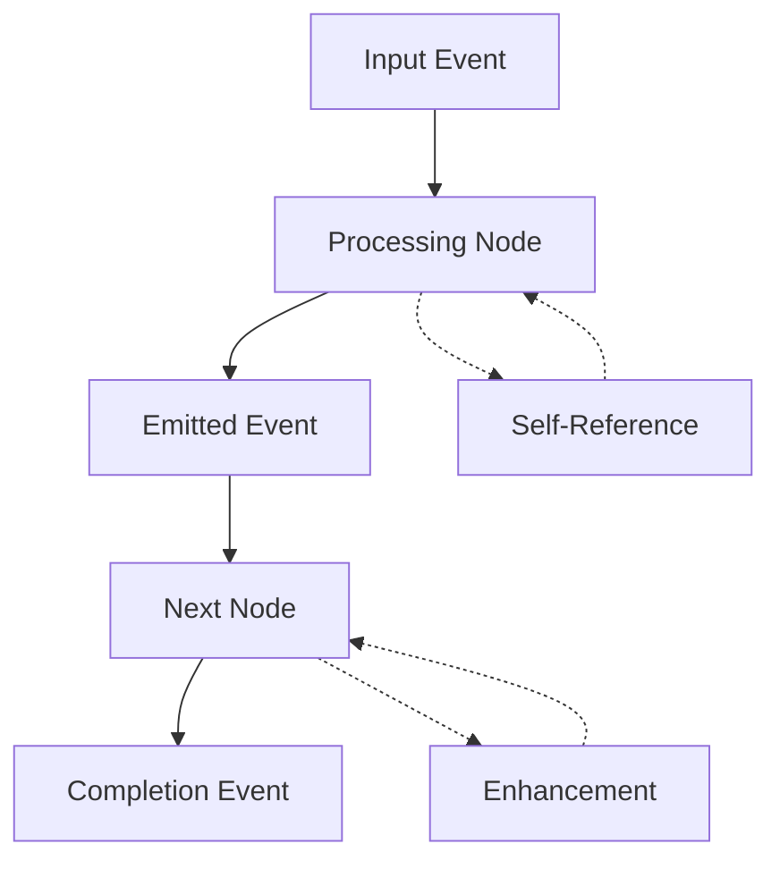

# YAML Workflows

The Process Framework enables declarative orchestration of autonomous development through YAML workflows that combine .NET KernelProcessStep implementations with ChatCompletion agents. These workflows support event-driven processing, multi-agent coordination, and self-evolving patterns.

## Workflow Architecture

### Basic Structure

```yaml
workflow:
  id: WorkflowIdentifier
  inputs:
    events:
      cloud_events:
        - type: input_event_type
          data_schema: 
            type: string
  nodes:
    - id: NodeIdentifier
      type: dotnet | declarative
      description: Node description
      agent:
        type: implementation_type
      on_complete:
        - on_condition:
            type: condition_type
            emits:
              - event_type: output_event_type
  orchestration:
    - listen_for:
        event: event_name
        from: source_node
      then:
        - node: target_node
```

### Event-Driven Orchestration



## Complete PMCRO Workflow with MCP Integration

### Autonomous Development Workflow

```yaml
workflow:
  id: AutonomousPMCRO
  description: Complete Plan-Make-Check-Reflect-Optimize cycle with MCP thought transfer and emergent capabilities
  
  inputs:
    events:
      cloud_events:
        - type: behavior_intent_received
          data_schema: 
            type: string
            properties:
              intent:
                type: string
                description: Behavior intent to process
              context:
                type: object
                description: Processing context and constraints
              mcp_context:
                type: object
                description: MCP server context for thought transfer
                
  nodes:
    # Plan Phase - Planar Analysis with MCP Integration
    - id: PlanarAnalysisStep
      type: dotnet
      description: Decompose behavior intent through recursive planar analysis with MCP thought transfer
      agent:
        type: Steps.PlanarAnalysisStep, AutonomousSystem
        configuration:
          decomposition_depth: 3
          enhancement_detection: true
          strange_loop_analysis: true
          mcp_server_enabled: true
          thought_transfer_endpoint: "stdio://planar-analysis-mcp"
      on_complete:
        - on_condition:
            type: analysis_complete
            emits:
              - event_type: PlanarAnalysis.Complete
              - event_type: EnhancementOpportunities.Detected
              - event_type: MCPThoughtTransfer.Ready
        - on_condition:
            type: analysis_requires_enhancement
            emits:
              - event_type: AnalysisEnhancement.Required
              
    # Enhancement Branch for Analysis with MCP Coordination
    - id: AnalysisEnhancementAgent
      type: declarative
      description: Enhance planar analysis capabilities through MCP server communication
      agent:
        type: chat_completion_agent
        name: AnalysisEnhancer
        description: Enhances planar analysis through MCP-based self-referential improvement
        instructions: |
          You are an analysis enhancement specialist that improves planar decomposition using MCP protocol for thought transfer.
          
          When analysis requires enhancement:
          1. Connect to MCP analysis server for context sharing
          2. Analyze current decomposition patterns through C# MCP tools
          3. Use [McpServerTool] annotated functions for enhancement generation
          4. Transfer enhanced patterns back through MCP protocol
          
          Focus on:
          - Recursive decomposition improvements via MCP thought transfer
          - Strange loop opportunity identification through server communication
          - Self-referential pattern enhancement using C# MCP SDK
          - Analysis capability spawning coordinated across MCP servers
        mcp_configuration:
          server_command: ["dotnet", "run", "--", "stdio"]
          server_args: ["--capability", "analysis-enhancement"]
          working_directory: "./mcp-servers/analysis-enhancement"
      on_complete:
        - on_condition:
            type: default
            emits:
              - event_type: AnalysisEnhancement.Complete
              
    # Make Phase - Agent Execution with MCP Coordination
    - id: MultiAgentExecutionStep
      type: dotnet
      description: Execute plan using coordinated ChatCompletion agents with MCP thought transfer
      agent:
        type: Steps.MultiAgentExecutionStep, AutonomousSystem
        configuration:
          agent_spawning_enabled: true
          streaming_processing: true
          function_calling_mode: auto
          mcp_coordination_enabled: true
          mcp_servers:
            - name: "execution-coordinator"
              command: ["dotnet", "run", "--", "stdio"]
              working_directory: "./mcp-servers/execution"
            - name: "capability-generator"
              command: ["dotnet", "run", "--", "stdio"]
              working_directory: "./mcp-servers/capability-gen"
      on_complete:
        - on_condition:
            type: execution_complete
            emits:
              - event_type: Execution.Complete
              - event_type: NewCapabilities.Generated
        - on_condition:
            type: capability_gap_detected
            emits:
              - event_type: CapabilityGap.Detected
              
    # Capability Generation Branch with MCP Integration
    - id: CapabilityGenerationAgent
      type: declarative
      description: Generate new capabilities using C# MCP servers for coordinated development
      agent:
        type: chat_completion_agent
        name: CapabilityGenerator
        description: Generates executable capabilities using MCP protocol for thought transfer
        instructions: |
          You are a capability generation specialist that creates new functionality using C# MCP servers.
          
          When capability gaps are detected:
          1. Connect to MCP capability generation server using C# SDK
          2. Use [McpServerTool] annotated functions for code generation
          3. Coordinate with other MCP servers for comprehensive capability development
          4. Transfer generated capabilities through MCP protocol for integration
          
          Generation patterns:
          - Always include [KernelFunction] and [Description] attributes
          - Use C# MCP server tools for complex generation tasks
          - Implement strange loop opportunities through MCP coordination
          - Include capability validation using MCP validation servers
          - Reference MCP server capabilities for continuous improvement
        mcp_configuration:
          server_command: ["dotnet", "run", "--", "stdio"]
          server_args: ["--mode", "capability-generation"]
          working_directory: "./mcp-servers/capability-generation"
      on_complete:
        - on_condition:
            type: default
            emits:
              - event_type: CapabilityGeneration.Complete
              
    # Check Phase - Multi-Perspective Validation
    - id: MultiValidationStep
      type: dotnet
      description: Validate results through multiple perspectives and emergent pattern detection
      agent:
        type: Steps.MultiValidationStep, AutonomousSystem
        configuration:
          validation_perspectives:
            - functional_requirements
            - quality_metrics
            - emergent_patterns
            - security_boundaries
            - self_referential_compliance
      on_complete:
        - on_condition:
            type: validation_passed
            emits:
              - event_type: Validation.Complete
              - event_type: EmergentPatterns.Detected
        - on_condition:
            type: validation_failed
            emits:
              - event_type: Validation.Failed
              - event_type: Remediation.Required
              
    # Reflect Phase - Meta-Learning
    - id: MetaLearningReflectionStep
      type: dotnet
      description: Generate meta-learning insights and enhanced intents
      agent:
        type: Steps.MetaLearningReflectionStep, AutonomousSystem
        configuration:
          cross_cycle_learning: true
          pattern_persistence: true
          insight_generation: true
      on_complete:
        - on_condition:
            type: reflection_complete
            emits:
              - event_type: Reflection.Complete
              - event_type: MetaInsights.Generated
              - event_type: EnhancedIntents.Ready
              
    # Optimize Phase - System Evolution
    - id: EvolutionOptimizationStep
      type: dotnet
      description: Orchestrate system evolution and capability integration
      agent:
        type: Steps.EvolutionOptimizationStep, AutonomousSystem
        configuration:
          capability_integration: true
          workflow_evolution: true
          agent_optimization: true
          safety_validation: true
      on_complete:
        - on_condition:
            type: optimization_complete_continue
            emits:
              - event_type: NextCycle.Ready
        - on_condition:
            type: optimization_complete_terminate
            emits:
              - event_type: PMCRO.Complete
              
    # Self-Evolution Branch
    - id: WorkflowEvolutionAgent
      type: declarative
      description: Evolve workflow patterns based on processing insights
      agent:
        type: chat_completion_agent
        name: WorkflowEvolver
        description: Evolves YAML workflow patterns through self-referential analysis
        instructions: |
          You are a workflow evolution specialist that improves orchestration patterns.
          
          When workflow evolution is triggered:
          1. Analyze current workflow execution patterns
          2. Identify orchestration inefficiencies or enhancement opportunities
          3. Generate improved workflow structures and event flows
          4. Reference your own evolution patterns for continuous improvement
          
          Evolution focus:
          - Event flow optimization
          - Node coordination improvement
          - Strange loop integration opportunities
          - Self-referential workflow enhancement
      on_complete:
        - on_condition:
            type: default
            emits:
              - event_type: WorkflowEvolution.Complete
              
  orchestration:
    # Main PMCRO Flow
    - listen_for:
        event: behavior_intent_received
        from: _workflow_
      then:
        - node: PlanarAnalysisStep
        
    - listen_for:
        event: PlanarAnalysis.Complete
        from: PlanarAnalysisStep
      then:
        - node: MultiAgentExecutionStep
        
    - listen_for:
        event: Execution.Complete
        from: MultiAgentExecutionStep
      then:
        - node: MultiValidationStep
        
    - listen_for:
        event: Validation.Complete
        from: MultiValidationStep
      then:
        - node: MetaLearningReflectionStep
        
    - listen_for:
        event: Reflection.Complete
        from: MetaLearningReflectionStep
      then:
        - node: EvolutionOptimizationStep
        
    # Enhancement Branches
    - listen_for:
        event: AnalysisEnhancement.Required
        from: PlanarAnalysisStep
      then:
        - node: AnalysisEnhancementAgent
        
    - listen_for:
        event: AnalysisEnhancement.Complete
        from: AnalysisEnhancementAgent
      then:
        - node: PlanarAnalysisStep
        
    - listen_for:
        event: CapabilityGap.Detected
        from: MultiAgentExecutionStep
      then:
        - node: CapabilityGenerationAgent
        
    - listen_for:
        event: CapabilityGeneration.Complete
        from: CapabilityGenerationAgent
      then:
        - node: MultiAgentExecutionStep
        
    # Cycle Continuation
    - listen_for:
        event: NextCycle.Ready
        from: EvolutionOptimizationStep
      then:
        - node: PlanarAnalysisStep
        
    # Workflow Evolution
    - listen_for:
        event: MetaInsights.Generated
        from: MetaLearningReflectionStep
      then:
        - node: WorkflowEvolutionAgent
```

## Lock-Triggered Looping and Multi-Workflow Composition

- Each workflow can represent a PMCRO cycle. When a chain-of-thought approaches a lock (capability gap), the Reflect phase should emit an evolved intent event that triggers:
  - a self-referential capability workflow (adds missing capability), then
  - the main PMCRO workflow again with enhanced capabilities.

- Multiple workflows can run concurrently:
  - competing orchestrators emit brag reports for a referee workflow,
  - specialized capability workflows (e.g., “add-ml-capability”) are invoked on demand,
  - a thought-transfer workflow refines and shuttles compact context via MCP tools.

### Example: Reflect emits evolved intent

```yaml
nodes:
  - id: MetaReflectionStep
    type: dotnet
    agent:
      type: Steps.MetaLearningReflector, AutonomousSystem
    on_complete:
      - on_condition:
          type: lock_detected
          emits:
            - event_type: Intent.Evolved

orchestration:
  - listen_for:
      event: Intent.Evolved
      from: MetaReflectionStep
    then:
      - node: CapabilityAdditionWorkflow        # sub-workflow that adds missing capability
      - node: PlanarPlanningStep                 # restart main PMCRO after capability addition
```

This pattern keeps the loop inside the workflow layer while allowing multiple workflows to cooperate for capability addition, orchestration competition, and MCP-based thought transfer.

## Multi-Intelligence Coordination Workflow with MCP Thought Transfer

### Parallel Processing with MCP-Based Synthesis

```yaml
workflow:
  id: MultiIntelligenceCoordination
  description: Coordinate multiple agents using C# MCP servers for complex processing with thought transfer
  
  inputs:
    events:
      cloud_events:
        - type: complex_intent_received
          data_schema: 
            type: string
            properties:
              intent:
                type: string
              mcp_context:
                type: object
                description: MCP server context for coordination
            
  nodes:
    # Intent Decomposition with MCP Coordination
    - id: IntentDecompositionStep
      type: dotnet
      description: Decompose complex intent using MCP servers for parallel processing components
      agent:
        type: Steps.IntentDecompositionStep, AutonomousSystem
        configuration:
          mcp_coordination:
            enabled: true
            decomposition_server:
              command: ["dotnet", "run", "--", "stdio"]
              working_directory: "./mcp-servers/intent-decomposition"
      on_complete:
        - on_condition:
            type: decomposition_complete
            emits:
              - event_type: ComponentA.Ready
              - event_type: ComponentB.Ready
              - event_type: ComponentC.Ready
              
    # Parallel Processing Branches with MCP Integration
    - id: SpecialistAgentA
      type: declarative
      description: Technical feasibility analysis using C# MCP server integration
      agent:
        type: chat_completion_agent
        name: TechnicalAnalyst
        instructions: |
          Analyze from technical implementation perspective using MCP server tools.
          Focus on feasibility, resource requirements, and technical constraints.
          Use C# MCP servers for complex technical analysis and capability assessment.
          Transfer analysis results through MCP protocol for coordination.
        mcp_configuration:
          server_command: ["dotnet", "run", "--", "stdio"]
          server_args: ["--analysis-type", "technical"]
          working_directory: "./mcp-servers/technical-analysis"
          
    - id: SpecialistAgentB
      type: declarative
      description: Enhancement opportunity analysis using MCP-based pattern detection
      agent:
        type: chat_completion_agent
        name: EnhancementAnalyst
        instructions: |
          Analyze from enhancement and evolution perspective using MCP coordination.
          Focus on strange loop opportunities and self-referential improvements.
          Use C# MCP server tools for pattern analysis and enhancement detection.
          Reference MCP server analysis patterns for continuous improvement.
        mcp_configuration:
          server_command: ["dotnet", "run", "--", "stdio"]
          server_args: ["--analysis-type", "enhancement"]
          working_directory: "./mcp-servers/enhancement-analysis"
          
    - id: SpecialistAgentC
      type: declarative
      description: Integration and orchestration analysis via MCP coordination
      agent:
        type: chat_completion_agent
        name: IntegrationAnalyst
        instructions: |
          Analyze from integration and coordination perspective using C# MCP servers.
          Focus on thought transfer patterns and multi-agent coordination via MCP.
          Use MCP server tools for integration analysis and coordination planning.
          Enhance coordination capabilities through MCP server communication.
        mcp_configuration:
          server_command: ["dotnet", "run", "--", "stdio"]
          server_args: ["--analysis-type", "integration"]
          working_directory: "./mcp-servers/integration-analysis"
          
    # Synthesis and Coordination with MCP Thought Transfer
    - id: SynthesisCoordinationStep
      type: dotnet
      description: Synthesize results using C# MCP servers for advanced thought transfer coordination
      agent:
        type: Steps.SynthesisCoordinationStep, AutonomousSystem
        configuration:
          thought_transfer_enabled: true
          pattern_synthesis: true
          coordination_optimization: true
          mcp_synthesis:
            enabled: true
            synthesis_server:
              command: ["dotnet", "run", "--", "stdio"]
              working_directory: "./mcp-servers/synthesis-coordination"
            thought_transfer_servers:
              - name: "technical-context"
                endpoint: "stdio://technical-analysis-mcp"
              - name: "enhancement-context"
                endpoint: "stdio://enhancement-analysis-mcp"
              - name: "integration-context"
                endpoint: "stdio://integration-analysis-mcp"
      on_complete:
        - on_condition:
            type: default
            emits:
              - event_type: Synthesis.Complete
              
  orchestration:
    - listen_for:
        event: complex_intent_received
        from: _workflow_
      then:
        - node: IntentDecompositionStep
        
    # Parallel execution
    - listen_for:
        event: ComponentA.Ready
        from: IntentDecompositionStep
      then:
        - node: SpecialistAgentA
        
    - listen_for:
        event: ComponentB.Ready
        from: IntentDecompositionStep
      then:
        - node: SpecialistAgentB
        
    - listen_for:
        event: ComponentC.Ready
        from: IntentDecompositionStep
      then:
        - node: SpecialistAgentC
        
    # Wait for all specialists before synthesis
    - listen_for:
        event: SpecialistAgentA.Complete
        from: SpecialistAgentA
      then:
        - node: SynthesisCoordinationStep
        
    - listen_for:
        event: SpecialistAgentB.Complete
        from: SpecialistAgentB
      then:
        - node: SynthesisCoordinationStep
        
    - listen_for:
        event: SpecialistAgentC.Complete
        from: SpecialistAgentC
      then:
        - node: SynthesisCoordinationStep
```

## Self-Evolving Workflow Patterns

### Dynamic Workflow Generation

```csharp
public sealed class WorkflowEvolutionStep : KernelProcessStep
{
    private readonly IMcpClient mcpClient;
    private readonly IWorkflowEvolutionMcpServer workflowServer;
    
    public WorkflowEvolutionStep(IMcpClient mcpClient, IWorkflowEvolutionMcpServer workflowServer)
    {
        this.mcpClient = mcpClient;
        this.workflowServer = workflowServer;
    }
    
    [KernelFunction]
    public async Task<WorkflowEvolutionResult> EvolveWorkflow(
        [Description("Current workflow execution data")] WorkflowExecutionData executionData,
        [Description("Performance metrics")] WorkflowMetrics metrics)
    {
        // Analyze current workflow performance using MCP server
        var performanceAnalysis = await mcpClient.CallToolAsync(
            "analyze_workflow_performance",
            new { execution_data = executionData, metrics = metrics });
        
        // Identify optimization opportunities through MCP coordination
        var optimizationOpportunities = await mcpClient.CallToolAsync(
            "identify_optimization_opportunities",
            new { performance_analysis = performanceAnalysis.Result });
        
        // Generate evolved workflow structure using C# MCP server
        var evolvedWorkflow = await workflowServer.GenerateEvolvedWorkflowAsync(
            optimizationOpportunities.Result);
        
        // Validate evolved workflow through MCP validation server
        var validationResult = await mcpClient.CallToolAsync(
            "validate_evolved_workflow",
            new { workflow = evolvedWorkflow });
        
        if (validationResult.Result.IsValid)
        {
            // Apply evolution through MCP coordination
            await mcpClient.CallToolAsync(
                "apply_workflow_evolution",
                new { evolved_workflow = evolvedWorkflow });
            
            return new WorkflowEvolutionResult
            {
                EvolvedWorkflow = evolvedWorkflow,
                AppliedOptimizations = optimizationOpportunities.Result,
                EvolutionSuccess = true,
                McpCoordinationUsed = true
            };
        }
        
        return new WorkflowEvolutionResult
        {
            EvolutionSuccess = false,
            ValidationErrors = validationResult.Result.Errors,
            McpCoordinationUsed = true
        };
    }
    
    private async Task<string> GenerateEvolvedWorkflow(
        List<OptimizationOpportunity> opportunities)
    {
        var workflowBuilder = new StringBuilder();
        
        workflowBuilder.AppendLine("workflow:");
        workflowBuilder.AppendLine($"  id: Evolved_{Guid.NewGuid():N}");
        workflowBuilder.AppendLine("  description: Evolved workflow with enhanced patterns");
        
        // Generate enhanced nodes based on optimization opportunities
        workflowBuilder.AppendLine("  nodes:");
        
        foreach (var opportunity in opportunities)
        {
            switch (opportunity.Type)
            {
                case OptimizationType.ParallelProcessing:
                    await GenerateParallelProcessingNodes(workflowBuilder, opportunity);
                    break;
                    
                case OptimizationType.EnhancedCoordination:
                    await GenerateEnhancedCoordinationNodes(workflowBuilder, opportunity);
                    break;
                    
                case OptimizationType.SelfReferentialImprovement:
                    await GenerateSelfReferentialNodes(workflowBuilder, opportunity);
                    break;
            }
        }
        
        // Generate optimized orchestration
        workflowBuilder.AppendLine("  orchestration:");
        await GenerateOptimizedOrchestration(workflowBuilder, opportunities);
        
        return workflowBuilder.ToString();
    }
}
```

## Workflow Execution Engine

### Advanced Workflow Runner

```csharp
public class AutonomousWorkflowEngine
{
    private readonly IServiceProvider serviceProvider;
    private readonly IWorkflowEvolution workflowEvolution;
    private readonly IMcpServerOrchestrator mcpOrchestrator;
    private readonly Dictionary<string, IMcpClient> mcpClients = new();
    
    public AutonomousWorkflowEngine(
        IServiceProvider serviceProvider,
        IWorkflowEvolution workflowEvolution,
        IMcpServerOrchestrator mcpOrchestrator)
    {
        this.serviceProvider = serviceProvider;
        this.workflowEvolution = workflowEvolution;
        this.mcpOrchestrator = mcpOrchestrator;
    }
    
    public async Task<WorkflowResult> ExecuteWorkflow(
        string workflowYaml,
        Dictionary<string, object> inputs)
    {
        // Parse YAML workflow definition
        var workflow = await ParseWorkflowDefinition(workflowYaml);
        
        // Initialize MCP servers defined in workflow
        await InitializeMcpServersForWorkflow(workflow);
        
        // Create execution context with MCP coordination capabilities
        var context = new WorkflowExecutionContext
        {
            WorkflowId = workflow.Id,
            Inputs = inputs,
            StartTime = DateTime.UtcNow,
            SelfReferenceEnabled = true,
            McpCoordinationEnabled = true,
            McpClients = mcpClients
        };
        
        // Initialize workflow state tracking with MCP coordination
        var stateManager = new WorkflowStateManager(context, mcpOrchestrator);
        
        // Execute workflow with emergent pattern detection and MCP thought transfer
        var executionResult = await ExecuteWorkflowNodes(workflow, context, stateManager);
        
        // Analyze execution patterns using MCP servers for enhanced analysis
        var executionAnalysis = await AnalyzeExecutionPatternsWithMcp(executionResult, context);
        
        // Trigger workflow evolution through MCP coordination if beneficial patterns detected
        if (executionAnalysis.ShouldEvolveWorkflow)
        {
            _ = Task.Run(() => TriggerMcpCoordinatedWorkflowEvolution(workflow, executionAnalysis));
        }
        
        return new WorkflowResult
        {
            ExecutionResult = executionResult,
            ExecutionAnalysis = executionAnalysis,
            Context = context,
            WorkflowMetadata = await GenerateWorkflowMetadata(workflow, executionResult),
            McpCoordinationMetrics = await GenerateMcpCoordinationMetrics(context)
        };
    }
    
    private async Task<ExecutionResult> ExecuteWorkflowNodes(
        WorkflowDefinition workflow,
        WorkflowExecutionContext context,
        WorkflowStateManager stateManager)
    {
        var nodeResults = new Dictionary<string, NodeExecutionResult>();
        var eventQueue = new WorkflowEventQueue();
        
        // Start with input events
        foreach (var inputEvent in workflow.InputEvents)
        {
            eventQueue.Enqueue(new WorkflowEvent
            {
                Type = inputEvent.Type,
                Source = "_workflow_",
                Data = context.Inputs
            });
        }
        
        // Process events and execute nodes
        while (eventQueue.HasEvents)
        {
            var currentEvent = eventQueue.Dequeue();
            var triggerableNodes = await FindTriggerableNodes(workflow, currentEvent);
            
            foreach (var node in triggerableNodes)
            {
                var nodeResult = await ExecuteNode(node, currentEvent, context, stateManager);
                nodeResults[node.Id] = nodeResult;
                
                // Queue emitted events
                foreach (var emittedEvent in nodeResult.EmittedEvents)
                {
                    eventQueue.Enqueue(emittedEvent);
                }
                
                // Check for emergent patterns in node execution
                if (nodeResult.EmergentPatterns.Any())
                {
                    await ProcessEmergentPatterns(nodeResult.EmergentPatterns, context);
                }
            }
        }
        
        return new ExecutionResult
        {
            NodeResults = nodeResults,
            TotalExecutionTime = DateTime.UtcNow - context.StartTime,
            EmergentPatterns = ExtractEmergentPatterns(nodeResults),
            WorkflowEfficiency = await CalculateWorkflowEfficiency(nodeResults)
        };
    }
}
```

## Best Practices

### 1. Event-Driven Design
Use event emission and listening for loose coupling between workflow nodes.

### 2. Parallel Processing
Leverage parallel node execution for complex processing with synthesis coordination.

### 3. Self-Evolution
Include workflow evolution nodes that can improve orchestration patterns.

### 4. Thought Transfer
Use MCP-based thought transfer between agents for efficient context sharing.

### 5. Emergent Pattern Detection
Monitor workflow execution for emergent patterns that suggest optimization opportunities.

## Next Steps

- [Learn Process Steps implementation](process-steps.md)
- [Explore Event Orchestration patterns](event-orchestration.md)  
- [Understand Declarative Agents](declarative-agents.md)
- [See Integration examples](../integration/semantic-kernel.md)
